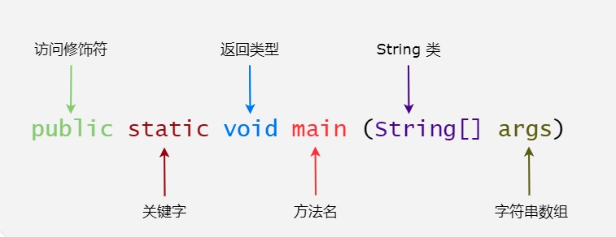
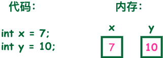

<center><font size="8">JAVA三天速成</font></center>

# Java教程

## 我的第一个Java程序

```java
public class HelloWorld{
    /*
    第一个Java程序
    它将输出字符串 Hello World 
    */
    public static void main(String[] args){
        System.out.pritIn("Hello World");
    }
}
```

**注：** *String args[]* 与 *String[] args* 均可执行，推荐使用*Sting[] args*，可以避免歧义和误读

```shell
$ javac HelloWorld.java
$ java HeloWorld
Hello World
```

**javac** 后面跟着的是java文件的文件名，例如 HelloWorld.java。 该命令用于将 java 源文件编译为 class 字节码文件，如： **javac HelloWorld.java**。

运行javac命令后，如果成功编译没有错误的话，会出现一个 HelloWorld.class 的文件。

**java** 后面跟着的是java文件中的类名,例如 HelloWorld 就是类名，如: java HelloWorld。

**注意**：java命令后面不要加.class。

# Java简介

# Java基础语法

一个Java程序可以认为是一系列对象的集合，而且这些对象通过调用彼此的方法来协同工作。下面简要介绍下类、对象、方法和实例变量的概念。

- **对象：**对象是类的一个实例，有状态和行为。例如一条狗是对象，他的状态有：颜色、名字、品种；行为有：摇尾巴、叫、吃等。
- **类：**类是一个模板，他描述一类对象的行为和状态。
- **方法：**方法就是行为，一个类可以有许多方法。逻辑运算、数据修改以及所有动作都是在方法中完成的。
- **实例变量：**每个对象都有独特的实例变量，对象的状态由这些实例变量的值决定。

## 第一个Java程序

```Java
public class HelloWorld{
    /*
    第一个Java程序
    它将输出字符串 Hello World 
    */
    public static void main(String[] args){
        System.out.pritIn("Hello World");
    }
}
```



## 基本语法

编写Java程序时，应该注意以下几点：

- **大小写敏感：**Java是大小写敏感的，这意味着标识符Hello和hello是不同的。
- **类名：**对于所有类来说，类名的首字母应该大写，类名若由若干单词组成，那么每个单词的首字母都应该大写，例如MyFirstJavaClass。
- **方法名：**所有的方法名都应该以小写字母开头。如果方法名中有若干单词，则后面每个单词首字母大写。
- **源文件名： ** *源文件名必须和类名相同*。当保存文件时，应该使用类名作为文件名保存（切记Java是大小写敏感的），文件名后缀为.java。（如果文件名和类名不相同则会导致编译错误）。
- **主方法入口：**所有的Java程序由 public static void main（String[] args）方法开始执行。

## Java标识符

Java所有的组成部分都需要名字。类名、变量名以及方法名都被称为标识符。

关于Java的标识符，有以下几点需要注意：

- 所有的标识符都应该以字母（A-Z 或者 a-z）,美元符（$）、或者下划线（_）开始
- 首字符之后可以是字母（A-Z 或者 a-z）,美元符（$）、下划线（_）或数字的任何字符组合
- 关键字不能用作标识符
- 标识符是大小写敏感的
- 合法标识符举例：age、$salary、_value、__1_value
- 非法标识符举例：123abc、-salary

## Java修饰符

像其他他预言一样，Java可以使用修饰符来修饰类中的方法和属性。主要有两类修饰符：

- **访问控制修饰符：**default、public、protected、private
- **非访问控制修饰符：**final、abstract、static、synchronized

## Java变量

- 局部变量
- 类变量（静态变量）
- 成员变量（非静态变量）

## Java数组

数组是存储在堆上的对象，可以保存多个同类型变量。

## Java枚举

枚举限制变量只能是预先设定好的值。使用枚举可以减少代码中的 bug。

例如，我们为果汁店设计一个程序，它将限制果汁为小杯、中杯、大杯。这就意味着它不允许顾客点除了这三种尺寸外的果汁。

**实例：**

```Java
class FreshJuice {
   enum FreshJuiceSize{ SMALL, MEDIUM , LARGE }
   FreshJuiceSize size;
}
 
public class FreshJuiceTest {
   public static void main(String[] args){
      FreshJuice juice = new FreshJuice();
      juice.size = FreshJuice.FreshJuiceSize.MEDIUM  ;
   }
}
```

**注意：**枚举可以单独声明或者声明在类里面。方法、变量、构造函数也可以在枚举中定义。

## Java 关键字

下面列出了 Java 关键字。这些保留字不能用于常量、变量、和任何标识符的名称。

<table>
  	<tr>
        <td bgcolor="40,50,60"><strong>类别</strong></td>
        <td bgcolor="40,50,60"><strong>关键字</strong></td>
        <td bgcolor="40,50,60"><strong>说明</strong></td>
	<tr>
    <tr>
		<td rowspan="4">访问控制（访问修饰符）</td>
		<td>private</td>
        <td>私有的</td>
	</tr>
    <tr>
		<td>protected</td>
        <td>受保护的</td>
	</tr>
    <tr>
		<td>public</td>
        <td>公共的</td>
	</tr>
    <tr>
		<td>default</td>
        <td>默认</td>
	</tr>
    <tr>
        <td rowspan="13">类、方法和变量修饰符</td>
        <td>abstract</td>
        <td>声明抽象</td>
    </tr>
    <tr>
        <td>class</td>
        <td>类</td>
    </tr>
    <tr>
        <td>extends</td>
        <td>扩充、继承</td>
    </tr>
    <tr>
        <td>final</td>
        <td>最终值、不可改变的</td>
    </tr>
    <tr>
        <td>implements</td>
        <td>实现（接口）</td>
    </tr>
    <tr>
        <td>interface</td>
        <td>接口</td>
    </tr>
    <tr>
        <td>native</td>
        <td>本地、原生方法（非Java实现）</td>
    </tr>
    <tr>
        <td>new</td>
        <td>新、创建</td>
    </tr>
    <tr>
        <td>static</td>
        <td>静态</td>
    </tr>
    <tr>
        <td>strictfp</td>
        <td>严格，精准</td>
    </tr>
    <tr>
        <td>synchronized</td>
        <td>线程，同步</td>
    </tr>
    <tr>
        <td>transient</td>
        <td>短暂</td>
    </tr>
    <tr>
        <td>volatile</td>
        <td>易失</td>
    </tr>
</table>


**注意：**Java 的 null 不是关键字，类似于 true 和 false，它是一个字面常量，不允许作为标识符使用。

## Java注释

类似于 C/C++、Java 也支持单行以及多行注释。注释中的字符将被 Java 编译器忽略。

```Java
public class HelloWorld {
   /* 这是第一个Java程序
    * 它将输出 Hello World
    * 这是一个多行注释的示例
    */
    public static void main(String[] args){
       // 这是单行注释的示例
       /* 这个也是单行注释的示例 */
       System.out.println("Hello World"); 
    }
}
```

## Java 空行

空白行或者有注释的行，Java 编译器都会忽略掉。

## 继承

在 Java 中，一个类可以由其他类派生。如果你要创建一个类，而且已经存在一个类具有你所需要的属性或方法，那么你可以将新创建的类继承该类。

利用继承的方法，可以重用已存在类的方法和属性，而不用重写这些代码。被继承的类称为超类（super class），派生类称为子类（sub class）。

## 接口

在 Java 中，接口可理解为对象间相互通信的协议。接口在继承中扮演着很重要的角色。

接口只定义派生要用到的方法，但是方法的具体实现完全取决于派生类。

## Java 源程序与编译型运行区别

如下图所示：


# Java对象和类

Java作为一种面向对象的语言，支持以下基本概念：**多态、继承、封装、抽象、类、对象、实例、方法、重载**

本节我们重点研究对象和类的概念。

- **对象**：对象是类的一个实例，有状态和行为。例如，一条狗是一个对象，它的状态有：颜色、名字、品种；行为有：摇尾巴、叫、吃等。
- **类**：类是一个模板，它描述一类对象的行为和状态。

下图中**男孩（boy）**、**女孩（girl）**为**类（class）**，而具体的每个人为该类的**对象（object）**：


下图中**汽车**为**类（class）**，而具体的每辆车为该**汽车**类的**对象（object）**，对象包含了汽车的颜色、品牌、名称等。


## Java中的对象

现在让我们深入了解什么是对象。看看周围真实的世界，会发现身边有很多对象，车，狗，人等等。所有这些对象都有自己的状态和行为。

拿一条狗来举例，它的状态有：名字、品种、颜色，行为有：叫、摇尾巴和跑。

对比现实对象和软件对象，它们之间十分相似。

软件对象也有状态和行为。软件对象的状态就是属性，行为通过方法体现。

在软件开发中，方法操作对象内部状态的改变，对象的相互调用也是通过方法来完成

## Java 中的类

类可以看成是创建 Java 对象的模板。


通过上图创建一个简单的类来理解下 Java 中类的定义：

```java
public class Dog {
    String breed;
    int size;
    String colour;
    int age;
 
    void eat() {
    }
 
    void run() {
    }
 
    void sleep(){
    }
 
    void name(){
    }
}
```

一个类可以包含以下类型变量：

- **局部变量**：在方法、构造方法或者语句块中定义的变量被称为局部变量。变量声明和初始化都是在方法中，方法结束后，变量就会自动销毁。
- **成员变量**：成员变量是定义在类中，方法体之外的变量。这种变量在创建对象的时候实例化。成员变量可以被类中方法、构造方法和特定类的语句块访问。
- **类变量**：类变量也声明在类中，方法体之外，但必须声明为 static 类型

一个类可以拥有多个方法，在上面的例子中：eat()、run()、sleep() 和 name() 都是 Dog 类的方法。

## 构造方法

每个类都有构造方法。如果没有显式地为类定义构造方法，Java 编译器将会为该类提供一个默认构造方法。

在创建一个对象的时候，至少要调用一个构造方法。构造方法的名称必须与类同名，一个类可以有多个构造方法。

下面是一个构造方法示例：

```Java
public class Puppy{
    public Puppy(){
    }
 
    public Puppy(String name){
        // 这个构造器仅有一个参数：name
    }
}
```

## 创建对象

对象是根据类创建的。在Java中，使用关键字 new 来创建一个新的对象。创建对象需要以下三步：

- **声明**：声明一个对象，包括对象名称和对象类型。
- **实例化**：使用关键字 new 来创建一个对象。
- **初始化**：使用 new 创建对象时，会调用构造方法初始化对象。

下面是一个创建对象的例子：

```java
public class Puppy{
   public Puppy(String name){
      //这个构造器仅有一个参数：name
      System.out.println("小狗的名字是 : " + name ); 
   }
   public static void main(String[] args){
      // 下面的语句将创建一个Puppy对象
      Puppy myPuppy = new Puppy( "tommy" );
   }
}
```

编译并运行上面的程序，会打印出下面的结果：

```shell
小狗的名字是 : tommy
```


## 访问实例变量和方法

通过已创建的对象来访问成员变量和成员方法，如下所示：

```java
/* 实例化对象 */
Object referenceVariable = new Constructor();
/* 访问类中的变量 */
referenceVariable.variableName;
/* 访问类中的方法 */
referenceVariable.methodName();
```

## 实例

下面的例子展示如何访问实例变量和调用成员方法：

```java
public class Puppy{
   int puppyAge;
   public Puppy(String name){
      // 这个构造器仅有一个参数：name
      System.out.println("小狗的名字是 : " + name ); 
   }
 
   public void setAge( int age ){
       puppyAge = age;
   }
 
   public int getAge( ){
       System.out.println("小狗的年龄为 : " + puppyAge ); 
       return puppyAge;
   }
 
   public static void main(String[] args){
      /* 创建对象 */
      Puppy myPuppy = new Puppy( "tommy" );
      /* 通过方法来设定age */
      myPuppy.setAge( 2 );
      /* 调用另一个方法获取age */
      myPuppy.getAge( );
      /*你也可以像下面这样访问成员变量 */
      System.out.println("变量值 : " + myPuppy.puppyAge ); 
   }
}
```

编译并运行上面的程序，产生如下结果：

```shell
小狗的名字是 : tommy
小狗的年龄为 : 2
变量值 : 2
```

## 源文件声明规则

当在一个源文件中定义多个类，并且还有import语句和package语句时，要特别注意这些规则。

- 一个源文件中只能有一个 public 类
- 一个源文件可以有多个非 public 类
- 源文件的名称应该和 public 类的类名保持一致。例如：源文件中 public 类的类名是 Employee，那么源文件应该命名为Employee.java。
- 如果一个类定义在某个包中，那么 package 语句应该在源文件的首行。
- 如果源文件包含 import 语句，那么应该放在 package 语句和类定义之间。如果没有 package 语句，那么 import 语句应该在源文件中最前面。
- import 语句和 package 语句对源文件中定义的所有类都有效。在同一源文件中，不能给不同的类不同的包声明。？？？？？？

## Java 包

包主要用来对类和接口进行分类。当开发 Java 程序时，可能编写成百上千的类，因此很有必要对类和接口进行分类。

## import 语句

在 Java 中，如果给出一个完整的限定名，包括包名、类名，那么 Java 编译器就可以很容易地定位到源代码或者类。import 语句就是用来提供一个合理的路径，使得编译器可以找到某个类。

例如，下面的命令行将会命令编译器载入 java_installation/java/io 路径下的所有类

```shell
import java.io.*;
```

## 一个简单的例子

在该例子中，我们创建两个类：**Employee** 和 **EmployeeTest**。

首先打开文本编辑器，把下面的代码粘贴进去。注意将文件保存为 Employee.java。

Employee 类有四个成员变量：name、age、designation 和 salary。该类显式声明了一个构造方法，该方法只有一个参数。

```java
// Employee.java文件代码
import java.io.*;
 
public class Employee{
   String name;
   int age;
   String designation;
   double salary;
   // Employee 类的构造器
   public Employee(String name){
      this.name = name;
   }
   // 设置age的值
   public void empAge(int empAge){
      age =  empAge;
   }
   /* 设置designation的值*/
   public void empDesignation(String empDesig){
      designation = empDesig;
   }
   /* 设置salary的值*/
   public void empSalary(double empSalary){
      salary = empSalary;
   }
   /* 打印信息 */
   public void printEmployee(){
      System.out.println("名字:"+ name );
      System.out.println("年龄:" + age );
      System.out.println("职位:" + designation );
      System.out.println("薪水:" + salary);
   }
}
```

程序都是从main方法开始执行。为了能运行这个程序，必须包含main方法并且创建一个实例对象。

下面给出EmployeeTest类，该类实例化2个 Employee 类的实例，并调用方法设置变量的值。

将下面的代码保存在 EmployeeTest.java文件中。

```java
// EmployeeTest.java 文件代码：
import java.io.*;
public class EmployeeTest{
 
   public static void main(String[] args){
      /* 使用构造器创建两个对象 */
      Employee empOne = new Employee("RUNOOB1");
      Employee empTwo = new Employee("RUNOOB2");
 
      // 调用这两个对象的成员方法
      empOne.empAge(26);
      empOne.empDesignation("高级程序员");
      empOne.empSalary(1000);
      empOne.printEmployee();
 
      empTwo.empAge(21);
      empTwo.empDesignation("菜鸟程序员");
      empTwo.empSalary(500);
      empTwo.printEmployee();
   }
}
```

编译这两个文件并且运行 EmployeeTest 类，可以看到如下结果：

```shell
$ javac EmployeeTest.java
$ java EmployeeTest 
名字:RUNOOB1
年龄:26
职位:高级程序员
薪水:1000.0
名字:RUNOOB2
年龄:21
职位:菜鸟程序员
薪水:500.0
```


# Java 基本数据类型

变量就是申请内存来存储值。也就是说，当创建变量的时候，需要在内存中申请空间。

内存管理系统根据变量的类型为变量分配存储空间，分配的空间只能用来储存该类型数据。



因此，通过定义不同类型的变量，可以在内存中储存整数、小数或者字符。

Java 的两大数据类型:

- 内置数据类型
- 引用数据类型

## 内置数据类型

Java语言提供了八种基本类型。六种数字类型（四个整数型，两个浮点型），一种字符类型，还有一种布尔型。

**byte：**

- byte 数据类型是**8位**、有符号的，以二进制补码表示的整数；
- 最小值是 **-128（-2^7）**；
- 最大值是 **127（2^7-1）**；
- 默认值是 **0**；
- byte 类型用在大型数组中节约空间，主要代替整数，因为 byte 变量占用的空间只有 int 类型的四分之一；
- 例子：byte a = 100，byte b = -50。

**short：**

- short 数据类型是 **16 位**、有符号的以二进制补码表示的整数
- 最小值是 **-32768（-2^15）**；
- 最大值是 **32767（2^15 - 1）**；
- Short 数据类型也可以像 byte 那样节省空间。一个short变量是int型变量所占空间的二分之一；
- 默认值是 **0**；
- 例子：short s = 1000，short r = -20000。

**nt：**

- int 数据类型是**32位**、有符号的以二进制补码表示的整数；
- 最小值是 **-2,147,483,648（-2^31）**；
- 最大值是 **2,147,483,647（2^31 - 1）**；
- 一般地整型变量默认为 int 类型；
- 默认值是 **0** ；
- 例子：int a = 100000, int b = -200000。

**long：**

- long 数据类型是 **64 位**、有符号的以二进制补码表示的整数；
- 最小值是 **-9,223,372,036,854,775,808（-2^63）**；
- 最大值是 **9,223,372,036,854,775,807（2^63 -1）**；
- 这种类型主要使用在需要比较大整数的系统上；
- 默认值是 **0L**；
- 例子： **long a = 100000L**，**long b = -200000L**。
  "L"理论上不分大小写，但是若写成"l"容易与数字"1"混淆，不容易分辩。所以最好大写。

**float：**

- float 数据类型是**单精度、32位**、符合IEEE 754标准的浮点数；
- float 在储存大型浮点数组的时候可节省内存空间；
- 默认值是 **0.0f**；
- 浮点数不能用来表示精确的值，如货币；
- 例子：float f1 = 234.5f。

**double：**

- double 数据类型是**双精度、64 位**、符合 IEEE 754 标准的浮点数；

- 浮点数的默认类型为 double 类型；

- double类型同样不能表示精确的值，如货币；

- 默认值是 **0.0d**；

- 例子：

  ```shell
  double   d1  = 7D ;
  double   d2  = 7.; 
  double   d3  =  8.0; 
  double   d4  =  8.D; 
  double   d5  =  12.9867; 
  ```

  7 是一个 int 字面量，而 7D，7. 和 8.0 是 double 字面量。

**boolean：**

- boolean数据类型**表示一位的信息**；
- 只有两个取值：true 和 false；
- 这种类型只作为一种标志来记录 true/false 情况；
- 默认值是 **false**；
- 例子：boolean one = true。

**char：**

- char 类型是一个单一的 **16 位 Unicode 字符**；
- 最小值是 **\u0000**（十进制等效值为 0）；
- 最大值是 **\uffff**（即为 65535）；
- char 数据类型可以储存任何字符；
- 例子：char letter = 'A';

### 实例

对于数值类型的基本类型的取值范围，我们无需强制去记忆，因为它们的值都已经以常量的形式定义在对应的包装类中了。请看下面的例子：

```java
public class PrimitiveTypeTest {  
    public static void main(String[] args) {  
        // byte  
        System.out.println("基本类型：byte 二进制位数：" + Byte.SIZE);  
        System.out.println("包装类：java.lang.Byte");  
        System.out.println("最小值：Byte.MIN_VALUE=" + Byte.MIN_VALUE);  
        System.out.println("最大值：Byte.MAX_VALUE=" + Byte.MAX_VALUE);  
        System.out.println();  
  
        // short  
        System.out.println("基本类型：short 二进制位数：" + Short.SIZE);  
        System.out.println("包装类：java.lang.Short");  
        System.out.println("最小值：Short.MIN_VALUE=" + Short.MIN_VALUE);  
        System.out.println("最大值：Short.MAX_VALUE=" + Short.MAX_VALUE);  
        System.out.println();  
  
        // int  
        System.out.println("基本类型：int 二进制位数：" + Integer.SIZE);  
        System.out.println("包装类：java.lang.Integer");  
        System.out.println("最小值：Integer.MIN_VALUE=" + Integer.MIN_VALUE);  
        System.out.println("最大值：Integer.MAX_VALUE=" + Integer.MAX_VALUE);  
        System.out.println();  
  
        // long  
        System.out.println("基本类型：long 二进制位数：" + Long.SIZE);  
        System.out.println("包装类：java.lang.Long");  
        System.out.println("最小值：Long.MIN_VALUE=" + Long.MIN_VALUE);  
        System.out.println("最大值：Long.MAX_VALUE=" + Long.MAX_VALUE);  
        System.out.println();  
  
        // float  
        System.out.println("基本类型：float 二进制位数：" + Float.SIZE);  
        System.out.println("包装类：java.lang.Float");  
        System.out.println("最小值：Float.MIN_VALUE=" + Float.MIN_VALUE);  
        System.out.println("最大值：Float.MAX_VALUE=" + Float.MAX_VALUE);  
        System.out.println();  
  
        // double  
        System.out.println("基本类型：double 二进制位数：" + Double.SIZE);  
        System.out.println("包装类：java.lang.Double");  
        System.out.println("最小值：Double.MIN_VALUE=" + Double.MIN_VALUE);  
        System.out.println("最大值：Double.MAX_VALUE=" + Double.MAX_VALUE);  
        System.out.println();  
  
        // char  
        System.out.println("基本类型：char 二进制位数：" + Character.SIZE);  
        System.out.println("包装类：java.lang.Character");  
        // 以数值形式而不是字符形式将Character.MIN_VALUE输出到控制台  
        System.out.println("最小值：Character.MIN_VALUE="  
                + (int) Character.MIN_VALUE);  
        // 以数值形式而不是字符形式将Character.MAX_VALUE输出到控制台  
        System.out.println("最大值：Character.MAX_VALUE="  
                + (int) Character.MAX_VALUE);  
    }  
}
```

编译以上代码输出结果如下所示：

```shell
基本类型：byte 二进制位数：8
包装类：java.lang.Byte
最小值：Byte.MIN_VALUE=-128
最大值：Byte.MAX_VALUE=127

基本类型：short 二进制位数：16
包装类：java.lang.Short
最小值：Short.MIN_VALUE=-32768
最大值：Short.MAX_VALUE=32767

基本类型：int 二进制位数：32
包装类：java.lang.Integer
最小值：Integer.MIN_VALUE=-2147483648
最大值：Integer.MAX_VALUE=2147483647

基本类型：long 二进制位数：64
包装类：java.lang.Long
最小值：Long.MIN_VALUE=-9223372036854775808
最大值：Long.MAX_VALUE=9223372036854775807

基本类型：float 二进制位数：32
包装类：java.lang.Float
最小值：Float.MIN_VALUE=1.4E-45
最大值：Float.MAX_VALUE=3.4028235E38

基本类型：double 二进制位数：64
包装类：java.lang.Double
最小值：Double.MIN_VALUE=4.9E-324
最大值：Double.MAX_VALUE=1.7976931348623157E308

基本类型：char 二进制位数：16
包装类：java.lang.Character
最小值：Character.MIN_VALUE=0
最大值：Character.MAX_VALUE=65535
```

Float和Double的最小值和最大值都是以科学记数法的形式输出的，结尾的"E+数字"表示E之前的数字要乘以10的多少次方。比如3.14E3就是3.14 × 103 =3140，3.14E-3 就是 3.14 x 10-3 =0.00314。

实际上，JAVA中还存在另外一种基本类型 void，它也有对应的包装类 java.lang.Void，不过我们无法直接对它们进行操作。

### 类型默认值

下表列出了 Java 各个类型的默认值：

<table>
    <tr>
        <td bgcolor="40,50,60"><strong>数据类型</strong></td>
        <td bgcolor="40,50,60"><strong>默认值</strong></td>
    </tr>
    <tr>
        <td>byte</td>
    	<td>0</td>
    </tr>
    <tr>
        <td>short</td>
    	<td>0</td>
    </tr>
    <tr>
        <td>int</td>
    	<td>0</td>
    </tr>
    <tr>
        <td>long</td>
    	<td>0L</td>
    </tr>
    <tr>
        <td>float</td>
    	<td>0.0f</td>
    </tr>
    <tr>
        <td>double</td>
    	<td>0.0d</td>
    </tr>
    <tr>
        <td>char</td>
    	<td>'u0000'</td>
    </tr>
    <tr>
        <td>String(or any object)</td>
    	<td>null</td>
    </tr>
    <tr>
        <td>boolean</td>
    	<td>false</td>
    </tr>
</table>

**实例：**

```java
public class Test {
    static boolean bool;
    static byte by;
    static char ch;
    static double d;
    static float f;
    static int i;
    static long l;
    static short sh;
    static String str;
 
    public static void main(String[] args) {
        System.out.println("Bool :" + bool);
        System.out.println("Byte :" + by);
        System.out.println("Character:" + ch);
        System.out.println("Double :" + d);
        System.out.println("Float :" + f);
        System.out.println("Integer :" + i);
        System.out.println("Long :" + l);
        System.out.println("Short :" + sh);
        System.out.println("String :" + str);
    }
}
```

实例输出结果为：

```shell
Bool     :false
Byte     :0
Character:
Double   :0.0
Float    :0.0
Integer  :0
Long     :0
Short    :0
String   :null
```

## 引用类型

- 在Java中，引用类型的变量非常类似于C/C++的指针。引用类型指向一个对象，指向对象的变量是引用变量。这些变量在声明时被指定为一个特定的类型，比如 Employee、Puppy 等。【变量一旦声明后，**类型**就不能被改变了】。
- 对象、数组都是引用数据类型。
- 所有引用类型的默认值都是null。
- 一个引用变量可以用来引用任何与之兼容的类型。
- 例子：Site site = new Site("Runoob")。

## Java常量

常量在程序运行时时不能被修改的。

在Java使用中使用***final关键字来修饰常量***，声明方式和便改良类似。

```java
final double PI = 3.1415926
```

虽然常量名也可以用小写，但为了便于识别，通常使用大写字母表示常量。

字面量可以复制给任何内置类型的变量，例如：

```java
byte a = 68;
char a = "A";
```

byte、int、long和short都可以用十进制、十六进制以及八进制的方式来表示，当使用字面量时，前缀 **0** 表示 8 进制，而前缀 **0x** 代表 16 进制, 例如：

```java
int decimal = 100;
int octal = 0144;
int hexa = 0x64;
```

和其他语言一样，Java的字符串常量也是包含在两个引号之间的字符序列。下面时字符串型字面量的例子：

```java
"Hello World"
"two\nlines"
 "\"This is in quotes\""
```

字符串常量和字符变量打偶可以包含任何Unicode字符。例如：

```java
char a = "\u0001";
String a = "\u0001";
```

Java语言支持的一些特殊转义字符序列：

<table>
    <tr>
        <td bgcolor="40, 50, 60"><Strong>符号</Strong></td>
        <td bgcolor="40, 50, 60"><Strong>字符含义</Strong></td>
    </tr>
    <tr>
        <td>\n</td>
        <td>换行（0x0a）</td>
    </tr>
    <tr>
        <td>\r</td>
        <td>回车（0x0d）</td>
    </tr>
    <tr>
        <td>\f</td>
        <td>换页符（0x0c）</td>
    </tr>
    <tr>
        <td>\f</td>
        <td>换页符（0x0c）</td>
    </tr>
    <tr>
        <td>\b</td>
        <td>退格（0x08）</td>
    </tr>
    <tr>
        <td>\s</td>
        <td>空格（0x20）</td>
    </tr>
    <tr>
        <td>\t</td>
        <td>制表符</td>
    </tr>
    <tr>
        <td>\"</td>
        <td>双引号</td>
    </tr>
    <tr>
        <td>\'</td>
        <td>单引号</td>
    </tr>
    <tr>
        <td>\\</td>
        <td>反斜杠</td>
    </tr>
    <tr>
        <td>\ddd</td>
        <td>八进制字符（ddd）</td>
    </tr>
    <tr>
        <td>\uxxxx</td>
        <td>16进制Unicode字符（xxxx）</td>
    </tr>
</table>

## 自动类型转换

整形、实型（常量）、字符型数据可混合运算。运算中，不同类型的数据先转化为同一类型，然后就行运算。

转化从低级到高级。

```shell
低  ------------------------------------>  高

byte,short,char—> int —> long—> float —> double 
```

数据类型转换必须满足如下规则：

- 不能对boolean类型进行类型转换。
- 不能把对象类型转换成不相关类的对象。
- 在把容量大的类型转换为容量小的类型时必须使用强制类型转换。
- 转换过程中可能导致溢出或损失精度，例如：

```shell
int i =128;   
byte b = (byte)i;
```

- 浮点数到整数的类型转换通过**舍弃小数**得到，而不是四舍五入，例如：

```shell
(int)23.7 == 23;        
(int)-45.89f == -45
```

## 自动类型转换

必须满足转换前的数据类型的位数要低于转换后的数据类型，例如：short数据类型的位数为16位，就可以自动转换为32位的int类型，同样float数据类型的位数位32位，可以自动转换为64位的double类型。

```java
public class ZiDongLeiZhuan{
    public static void main(String[] args){
        char c1 = "a"; // 定义一个char类型
        int i1 = c1; // char自动转换为int
        System.out.printIn("char自动类型转换为int后的值等于: "+i1);
        char c2 = "A";//定义一个char类型
        int i2 = c2+1;//char 类型和 int 类型计算
        System.out.printIn("char类型和int计算后的值等于: "+i2);
}
```

运行结果为:

```shell
char自动类型转换为int后的值等于97
char类型和int计算后的值等于66
```

**解析：**c1 的值为字符 **a** ,查 ASCII 码表可知对应的 int 类型值为 97， A 对应值为 65，所以 **i2=65+1=66**。

## 强制类型转换

- 转换的数据类型必须是兼容的。
- （type）value type是要强制类型转换后的数据类型 实例：

```java
public class QiangZhiZhuanHuan{
    public static void main(String[] args){
        int i1 = 123;
        byte b = (byte)i1; // 强制类型转换为byte
        System.out.printIn("int强制类型转换为byte后的值等于: "+b);
    }
}
```

运行结果：

```shell
int强制类型转换为byte后的值等于123
```

## 隐含强制类型转换

- 整数的默认类型是int。
- 小数的默认类型是double浮点型，在定义float类型时必须在数字后面跟上F或者f。

# Java类型变量

在Java语言中，所有的变量在使用前必须声明。声明变量的基本格式如下：

```java
type identifier [ = value][, identifier [ = value]  ...]
```

格式说明：type位java数据类型，identifier时变量名。可以使用逗号隔开来声明多个同类型变量。

变量声明实例。有些包含了初始化过程。

```java
int a, b, c;
int d = 3, e = 4, f = 5;
byte z = 22;
String s = "runoob";
double pi = 3.14159;
char x = "x";				
```

Java语言支持的变量类型有：

- 类变量：独立于方法之外的变量，**用 static 修饰**。
- 实例变量：独立于方法之外的变量，不过**没有 static 修饰**。
- 局部变量：类的方法中的变量。

```java
public class Variable{
    static int allClicks=0;    // 类变量
 
    String str="hello world";  // 实例变量
 
    public void method(){
 
        int i =0;  // 局部变量
 
    }
}
```

## Java局部变量

- 局部变量声明在方法、构造方法或者语句块中；
- 局部变量在方法、构造方法、或者语句块中被执行的时候创建，当它们执行完成后，变量将会被销毁；
- 访问修饰符不能用于局部变量；？？？
- 局部变量只在声明它的方法、构造方法或者语句块中可见；
- 局部变量是在栈上分配的。
- **局部变量没有默认值**，所有**局部变量被声明后，必须经过初始化才可以使用**。

**实例1**

在以下案例中age是一个局部彬良。定义在pupAge()方法中，他的作用域就局限在这个方法中。

```java
package com.runoob.test;
 
public class Test{ 
   public void pupAge(){
      int age = 0;
      age = age + 7;
      System.out.println("小狗的年龄是: " + age);
   }
   
   public static void main(String[] args){
      Test test = new Test();
      test.pupAge();
   }
}
```

以上实例编译运行的结果如下：

```shell
小狗的年龄是: 7
```

**实例 2**

在下面的例子中 age 变量没有初始化，所以在编译时会出错：

```java
package com.runoob.test;
 
public class Test{ 
   public void pupAge(){
      int age;
      age = age + 7;
      System.out.println("小狗的年龄是 : " + age);
   }
   
   public static void main(String[] args){
      Test test = new Test();
      test.pupAge();
   }
}
```

以上实例编译运行结果如下:

```shell
Test.java:4:variable number might not have been initialized
age = age + 7;
         ^
1 error
```

## 实例变量

- 实例变量声明在一个类中，单在方法、构造方法和语句块之外。
- 当一个对象被实例化之后，每个实例变量的值就跟着确定；
- 实例变量在对象创建的时候创建，在对象被销毁的时候销毁；
- 实例变量的值应该至少被一个方法、构造方法或者语句块引用，使得外部能够通过这些方式获取实例变量信息；
- 实例变量可以声明在使用前或者使用后；
- 访问修饰符可以修饰实例变量；
- 实例变量对于类中的方法、构造方法或者语句块是可见的。一般情况下应该把实例变量设为私有。通过使用访问修饰符可以使实例变量对子类可见；
- **实例变量具有默认值**。数值型变量的默认值是0，布尔型变量的默认值是false，引用类型变量的默认值是null。变量的值可以在声明时指定，也可以在构造方法中指定；
- 实例变量可以直接通过变量名访问。但在静态方法以及其他类中，就应该使用完全限定名：ObjectReference.VariableName。？？？

**实例：**

```java
// Employee.java 文件代码：
import java.io.*;
public class Employee{
   // 这个实例变量对子类可见
   public String name;
   // 私有变量，仅在该类可见
   private double salary;
   //在构造器中对name赋值
   public Employee (String empName){
      name = empName;
   }
   //设定salary的值
   public void setSalary(double empSal){
      salary = empSal;
   }  
   // 打印信息
   public void printEmp(){
      System.out.println("名字 : " + name );
      System.out.println("薪水 : " + salary);
   }
 
   public static void main(String[] args){
      Employee empOne = new Employee("RUNOOB");
      empOne.setSalary(1000.0);
      empOne.printEmp();
   }
}
```

以上实例编译运行结果如下:

```shell
$ javac Employee.java 
$ java Employee
名字 : RUNOOB
薪水 : 1000.0
```

## 类变量（静态变量）

- 类变量也称为静态变量，在类中以 static 关键字声明，但必须在方法之外。
- 无论一个类创建了多少个对象，类只拥有类变量的一份拷贝。
- 静态变量除了被声明为常量外很少使用，静态变量是指声明为 public/private，final 和 static 类型的变量。静态变量初始化后不可改变。
- 静态变量储存在静态存储区。经常被声明为常量，**很少单独使用 static 声明变量**。
- 静态变量在第一次被访问时创建，在程序结束时销毁。
- 与实例变量具有相似的可见性。但为了对类的使用者可见，大多数静态变量声明为 public 类型。
- **类变量存在默认值**和实例变量相似。数值型变量默认值是 0，布尔型默认值是 false，引用类型默认值是 null。变量的值可以在声明的时候指定，也可以在构造方法中指定。此外，静态变量还可以在静态语句块中初始化。
- 静态变量可以通过：*ClassName.VariableName*的方式访问。
- 类变量被声明为 public static final 类型时，类变量名称一般建议使用大写字母。如果静态变量不是 public 和 final 类型，其命名方式与实例变量以及局部变量的命名方式一致。

**实例：**

```java
// Employee.java 文件代码：
import java.io.*;
 
public class Employee {
    //salary是静态的私有变量
    private static double salary;
    // DEPARTMENT是一个常量
    public static final String DEPARTMENT = "开发人员";
    public static void main(String[] args){
    salary = 10000;
        System.out.println(DEPARTMENT+"平均工资:"+salary);
    }
}
```

以上实例编译运行结果如下:

```shell
开发人员平均工资:10000.0
```

【注意】如果其他类想要访问该变量，可以这样访问：**Employee.DEPARTMENT**。

# Java修饰符

Java语言提供了许多修饰符，主要分为以下两类：

- 访问修饰符
- 非访问修饰符

修饰符用来定义类、方法或者变量，通常**放在语句的最前端**。

```java
public class ClassName{
    // ...
}
private boolean myFlag;
static final double weeks = 0.9;
protected static final in BOXWIDTH = 42;
public static void main(String[] args){
    // 方法体
}
```

## 访问控制修饰符

Java中，可以使用访问控制符来保护对类、变量、方法和构造体的访问、Java支持4中不同的访问权限。

- default（默认，什么也不写）：在统一包内可见，不适应任何修饰符。使用对象：类、接口、变量、方法。
- private：在同一类内可见。使用对象：变量、方法。**注意：不能修饰类（外部类）**
- public：在同一类内可见。使用对象：类、端口、变量、方法。
- protected：对同一类和包括所有子类可见。使用对象：变量、方法。**注意：不能修饰类（外部类）**

<table>
    <tr>
    	<td bgcolor="40, 50, 60"><strong>修饰符</strong></td>
        <td bgcolor="40, 50, 60"><strong>当前类</strong></td>
        <td bgcolor="40, 50, 60"><strong>同一包内 </strong></td>
        <td bgcolor="40, 50, 60"><strong>子孙类（同一包）</strong></td>
        <td bgcolor="40, 50, 60"><strong>子孙类（不同包）</strong></td>
        <td bgcolor="40, 50, 60"><strong>其他包</strong></td>
    </tr>
    <tr>
        <td>default</td>
        <td>Y</td>
        <td>Y</td>
        <td>Y</td>
        <td>N</td>
        <td>N</td>
    </tr>
    <tr>
        <td>private</td>
        <td>Y</td>
        <td>N</td>
        <td>N</td>
        <td>N</td>
        <td>N</td>
    </tr>
    <tr>
        <td>public</td>
        <td>Y</td>
        <td>Y</td>
        <td>Y</td>
        <td>Y</td>
        <td>Y</td>
    </tr>
    <tr>
        <td>protected</td>
        <td>Y</td>
        <td>Y</td>
        <td>Y</td>
        <td>Y/N<a href="#受保护的访问修饰符-protected">(说明)</a></td>
        <td>N</td>
    </tr>
</table>

### 默认访问修饰符-default

使用默认访问修饰符声明变量和方法，对同一个包内的类时可见的。接口里的变量都是隐式声明位**public static final**，而接口里的方法默认情况下访问权限为**public**。如下例所示：

```java
String version = "1.5.1";
boolean processOrd(){
    return true;
}
```

### 私有访问修饰符-private

私有防伪码修饰符是**最严格的访问级别**，所有被声明为**private**的方法、变量和构造方法只能被所属类访问，并且类和接口不能声明为private。

**声明为私有访问类型的变量只能通过类中的getter方法被外部类访问。**

private访问修饰符的使用主要用来隐藏类的实现细节和保护类的数据。

如下例所示：

```java
public class Logger{
    private String format;
    public String getFormat(){
        return this.format;
    }
    public void setFormat(String format){
        thisformat = format;
    }
}
```

### 公有访问修饰符-public

被声明为 public 的类、方法、构造方法和接口能够被任何其他类访问。

**如果几个相互访问的 public 类分布在不同的包中，则需要导入相应 public 类所在的包**。由于类的继承性，类所有的公有方法和变量都能被其子类继承。

以下函数使用了公有访问控制：

```java
public static void main(String[] arguments) {
   // ...
}
```

Java 程序的 **main() 方法必须设置成公有的**，否则，Java 解释器将不能运行该类。

### 受保护的访问修饰符-protected

protected 需要从以下两个点来分析说明：

- **子类与基类在同一包中**：被声明为 protected 的变量、方法和构造器能被同一个包中的任何其他类访问；
- **子类与基类不在同一包中**：那么在子类中，【**子类实例可以访问其从基类继承而来的 protected 方法，而不能访问基类实例的protected方法**】。

protected 可以修饰数据成员，构造方法，方法成员，**不能修饰类（内部类除外）**。

**接口及接口的成员变量和成员方法不能声明为 protected。**

例子：父类使用了 protected 访问修饰符，子类重写了父类的 openSpeaker() 方法。

```java
class AudioPlayer {
   protected boolean openSpeaker(Speaker sp) {
      // 实现细节
   }
}
 
class StreamingAudioPlayer extends AudioPlayer {
   protected boolean openSpeaker(Speaker sp) {
      // 实现细节
   }
}
```

如果把 openSpeaker() 方法声明为 private，那么除了 AudioPlayer 外，其他类将不能访问该方法。

如果把 openSpeaker() 声明为 public，那么所有的类都能够访问该方法。

如果我们只想让该方法对其所在类的子类可见，则将该方法声明为 protected。

protected 是最难理解的一种Java类成员范文权限修饰词，更多详细内容查看<a href="https://www.runoob.com/w3cnote/java-protected-keyword-detailed-explanation.html"> Java protected 关键字讲解</a>。

### 访问控制和继承

注意以下方法的继承规则：

- 父类中声明为public的方法在子类中也必须为public。
- 父类中声明为protected的方法在子类中要么声明为protected，要么声明为public，**不能声明为private**。
- 父类中声明为private的方法，不能被子类继承。

## 非访问修饰符

为了实现一些其他的功能，Java 也提供了许多非访问修饰符。

static 修饰符，用来修饰类方法和类变量。

final 修饰符，用来修饰类、方法和变量，**final 修饰的类不能够被继承，修饰的方法不能被继承类重新定义，修饰的变量为常量，是不可修改的。**

abstract 修饰符，用来创建抽象类和抽象方法。

synchronized 和 volatile 修饰符，主要用于线程的编程。

### static修饰符

- **静态变量：**

​	static关键字用来声明【**独立于对象的静态变量**】，无论一个类实例化多少个对象，他的静态变量只有一份拷贝。静态变量也被称为类变量。局部变量不能被声明为static变量。

- **静态方法：**

static关键字用来声明独立于对象的静态方法。【**静态方法不能使用类的非静态变量**】。静态方法从参数列表得到数据，然后计算这些数据。


对类变量和方法的访问可以直接使用 **classname.variablename** 和 **classname.methodname** 的方式访问。如下例所示，static 修饰符用来创建类方法和类变量。

```java
public class InstanceCounter {
   private static int numInstances = 0;
   protected static int getCount() {
      return numInstances;
   }
 
   private static void addInstance() {
      numInstances++;
   }
 
   InstanceCounter() {
      InstanceCounter.addInstance();
   }
 
   public static void main(String[] arguments) {
      System.out.println("Starting with " +
      InstanceCounter.getCount() + " instances");
      for (int i = 0; i < 500; ++i){
         new InstanceCounter();
          }
      System.out.println("Created " +
      InstanceCounter.getCount() + " instances");
   }
}
```

以上实例运行编译结果如下：

```shell
Starting with 0 instances
Created 500 instances
```

### final修饰符

**final变量：**

final表示“最后的、最终的”含义，**变量一旦赋值后，不能被重新赋值**。**被final修饰的实例变量必须显式指定初始值**。

```java
public class Test{
  final int value = 10;
  // 下面是声明常量的实例
  public static final int BOXWIDTH = 6;
  static final String TITLE = "Manager";
 
  public void changeValue(){
     value = 12; //将输出一个错误
  }
}
```

**final方法：**

父类中的final方法**可以被子类继承，但是不能被子类重写**。

声明final方法的主要目的是防止该方法内容被修改。

如下所示，使用final修饰符声明方法。

```java
public class Test{
    public final void changeName(){
       // 方法体
    }
}
```

**final类：**

final 类不能被继承，没有类能够继承 final 类的任何特性。

```java
public final class Test {
   // 类体
}
```

### abstract修饰符

**抽象类：**

**抽象类不能用来实例化对象**，声明抽象类的**唯一目的**是为了**将来对该类进行扩充**。

一个类不能同时被abstract和final修饰。如**果一个类包含抽象方法，那么该类一定要修饰为抽象类**。否则将出现编译错误。

抽象类可以包含抽象方法和非抽象方法。

```java
abstract class Caravan{
   private double price;
   private String model;
   private String year;
   public abstract void goFast(); //抽象方法
   public abstract void changeColor();
}
```

**抽象方法：**

抽象方法是一种没有任何实现的方法，该方法的具体实现由子类提供。

抽象方法不能被声明成 final 和 static。

**任何继承抽象类的子类必须实现父类的所有抽象方法**，除非该子类也是抽象类。

如果一个类包含若干个抽象方法，那么该类必须声明为抽象类。抽象类可以不包含抽象方法。

抽象方法的声明以分号结尾，例如：**public abstract sample();**。

```java
public abstract class SuperClass{
    abstract void m(); //抽象方法
}
 
class SubClass extends SuperClass{
     //实现抽象方法
      void m(){
          .........
      }
}
```

### synchronized修饰符

synchronized 关键字声明的方法同一时间只能被一个线程访问。synchronized 修饰符可以应用于四个访问修饰符。

```java
public synchronized void showDetails(){
.......
}
```

### transient 修饰符

transient关键字只能修饰变量，而不能修饰方法和类。

序列化的对象包含被 transient 修饰的实例变量时，java 虚拟机(JVM)跳过该特定的变量。（**一旦变量被transient修饰，变量将不再是对象持久化的一部分**，该变量内容在序列化后无法获得访问。）

该修饰符包含在定义变量的语句中，用来预处理类和变量的数据类型。

```java
public transient int limit = 55;   // 不会持久化
public int b; // 持久化
```

### volatile 修饰符

volatile 修饰的成员变量在每次被线程访问时，都强制从共享内存中重新读取该成员变量的值。而且，当成员变量发生变化时，会强制线程将变化值回写到共享内存。这样在任何时刻，两个不同的线程总是看到某个成员变量的同一个值。

一个 volatile 对象引用可能是 null。

```java
public class MyRunnable implements Runnable
{
    private volatile boolean active;
    public void run()
    {
        active = true;
        while (active) // 第一行
        {
            // 代码
        }
    }
    public void stop()
    {
        active = false; // 第二行
    }
}
```

通常情况下，在一个线程调用 run() 方法（在 Runnable 开启的线程），在另一个线程调用 stop() 方法。 如果 ***第一行*** 中缓冲区的 active 值被使用，那么在 ***第二行*** 的 active 值为 false 时循环不会停止。

但是以上代码中我们使用了 volatile 修饰 active，所以该循环会停止。

# Java运算符

计算机的最基本用途之一就是执行数学运算，作为一门计算机语言，Java也提供了一套丰富的运算符来操纵变量。我们可以把运算符分成以下几组：

- 算术运算符
- 关系运算符
- 位运算符
- 逻辑运算符
- 赋值运算符
- 其他运算符

## 算数运算符

算术运算符用在数学表达式中，它们的作用和在数学中的作用一样。下表列出了所有的算术运算符。

表格中的实例假设整数变量A的值为10，变量B的值为20：

<table>
    <tr>
        <td bgcolor="40, 50, 60"><strong>操作符</strong></td>
        <td bgcolor="40, 50, 60"><strong>描述</strong></td>
        <td bgcolor="40, 50, 60"><strong>例子</strong></td>
    </tr>
    <tr>
        <td>+</td>
        <td>加法-相加运算符两侧的值</td>
        <td>A + B 等于 30</td>
    </tr>
    <tr>
        <td>-</td>
        <td>减法 - 左操作数减去右操作数</td>
        <td>A – B 等于 -10</td>
    </tr>
    <tr>
        <td>*</td>
        <td>乘法 - 相乘操作符两侧的值</td>
        <td>A * B等于200</td>
    </tr>
    <tr>
        <td>/</td>
        <td>除法 - 左操作数除以右操作数</td>
        <td>B / A等于2</td>
    </tr>
    <tr>
        <td>%</td>
        <td>取余 - 左操作数除以右操作数的余数</td>
        <td>B%A等于0</td>
    </tr>
    <tr>
        <td>++</td>
        <td>自增: 操作数的值增加1</td>
        <td>B++ 或 ++B 等于 21 <a href="#自增自减运算符">(区别)</a></td>
    </tr>
    <tr>
        <td>--</td>
        <td>自减: 操作数的值减少1</td>
        <td>B-- 或 --B 等于 19<a href="#自增自减运算符">(区别)</a></td>
    </tr>
</table>

**实例**

下面的简单示例程序演示了算术运算符。复制并粘贴下面的 Java 程序并保存为 Test.java 文件，然后编译并运行这个程序：

```java
public class Test {
 
  public static void main(String[] args) {
     int a = 10;
     int b = 20;
     int c = 25;
     int d = 25;
     System.out.println("a + b = " + (a + b) );
     System.out.println("a - b = " + (a - b) );
     System.out.println("a * b = " + (a * b) );
     System.out.println("b / a = " + (b / a) );
     System.out.println("b % a = " + (b % a) );
     System.out.println("c % a = " + (c % a) );
     System.out.println("a++   = " +  (a++) );
     System.out.println("a--   = " +  (a--) );
     // 查看  d++ 与 ++d 的不同
     System.out.println("d++   = " +  (d++) );
     System.out.println("++d   = " +  (++d) );
  }
}
```

以上实例编译运行结果如下：

```shell
a + b = 30
a - b = -10
a * b = 200
b / a = 2
b % a = 0
c % a = 5
a++   = 10
a--   = 11
d++   = 25
++d   = 27
```


### 自增自减运算符

**1、自增（++）自减（--）运算符**是一种特殊的算术运算符，在算术运算符中需要两个操作数来进行运算，而自增自减运算符是一个操作数。

```java
实例
public class selfAddMinus{
    public static void main(String[] args){
        int a = 3;//定义一个变量；
        int b = ++a;//自增运算
        int c = 3;
        int d = --c;//自减运算
        System.out.println("进行自增运算后的值等于"+b);
        System.out.println("进行自减运算后的值等于"+d);
    }
}
```

运行结果为：

```shell
进行自增运算后的值等于4
进行自减运算后的值等于2
```

解析：

- int b = ++a; 拆分运算过程为: a=a+1=4; b=a=4, 最后结果为b=4,a=4
- int d = --c; 拆分运算过程为: c=c-1=2; d=c=2, 最后结果为d=2,c=2

**2、前缀自增自减法(++a,--a):** 先进行自增或者自减运算，再进行表达式运算。

**3、后缀自增自减法(a++,a--):** 先进行表达式运算，再进行自增或者自减运算 实例：

```java
public class selfAddMinus{
    public static void main(String[] args){
        int a = 5;//定义一个变量；
        int b = 5;
        int x = 2*++a;
        int y = 2*b++;
        System.out.println("自增运算符前缀运算后a="+a+",x="+x);
        System.out.println("自增运算符后缀运算后b="+b+",y="+y);
    }
}
```

运行结果为：

```java
自增运算符前缀运算后a=6，x=12
自增运算符后缀运算后b=6，y=10
```

## 关系运算符

下表为Java支持的关系运算符

表格中的实例整数变量A的值为10，变量B的值为20：

| 运算符 | 描述                                                         | 例子             |
| :----- | :----------------------------------------------------------- | :--------------- |
| ==     | 检查如果两个操作数的值是否相等，如果相等则条件为真。         | （A == B）为假。 |
| !=     | 检查如果两个操作数的值是否相等，如果值不相等则条件为真。     | (A != B) 为真。  |
| >      | 检查左操作数的值是否大于右操作数的值，如果是那么条件为真。   | （A> B）为假。   |
| <      | 检查左操作数的值是否小于右操作数的值，如果是那么条件为真。   | （A <B）为真。   |
| >=     | 检查左操作数的值是否大于或等于右操作数的值，如果是那么条件为真。 | （A> = B）为假。 |
| <=     | 检查左操作数的值是否小于或等于右操作数的值，如果是那么条件为真。 | （A <= B）为     |

**实例**

下面的简单示例程序演示了关系运算符。复制并粘贴下面的Java程序并保存为Test.java文件，然后编译并运行这个程序：

```java
// Test.java 文件代码：
public class Test {
 
  public static void main(String[] args) {
     int a = 10;
     int b = 20;
     System.out.println("a == b = " + (a == b) );
     System.out.println("a != b = " + (a != b) );
     System.out.println("a > b = " + (a > b) );
     System.out.println("a < b = " + (a < b) );
     System.out.println("b >= a = " + (b >= a) );
     System.out.println("b <= a = " + (b <= a) );
  }
}
```

以上实例编译运行结果如下：

```shell
a == b = false
a != b = true
a > b = false
a < b = true
b >= a = true
b <= a = false
```

## 位运算符

Java定义了位运算符，应用于整数类型(int)，长整型(long)，短整型(short)，字符型(char)，和字节型(byte)等类型。

位运算符作用在所有的位上，并且按位运算。假设a = 60，b = 13;它们的二进制格式表示将如下：

```shell
A = 0011 1100
B = 0000 1101
-----------------
A&B = 0000 1100
A | B = 0011 1101
A ^ B = 0011 0001
~A= 1100 0011
```

下表列出了位运算符的基本运算，假设整数变量 A 的值为 60 和变量 B 的值为 13：

| 操作符 | 描述                                                         | 例子                           |
| :----- | :----------------------------------------------------------- | :----------------------------- |
| ＆     | 如果相对应位都是1，则结果为1，否则为0                        | （A＆B），得到12，即0000 1100  |
| \|     | 如果相对应位都是 0，则结果为 0，否则为 1                     | （A \| B）得到61，即 0011 1101 |
| ^      | 如果相对应位值相同，则结果为0，否则为1                       | （A ^ B）得到49，即 0011 0001  |
| 〜     | 按位取反运算符翻转操作数的每一位，即0变成1，1变成0。         | （〜A）得到-61，即1100 0011    |
| <<     | 按位左移运算符。左操作数按位左移右操作数指定的位数。         | A << 2得到240，即 1111 0000    |
| >>     | 按位右移运算符。左操作数按位右移右操作数指定的位数。         | A >> 2得到15即 1111            |
| >>>    | 按位右移补零操作符。左操作数的值按右操作数指定的位数右移，移动得到的空位以零填充。 | A>>>2得到15即0000 1111         |

**实例**

下面的简单示例程序演示了位运算符。复制并粘贴下面的Java程序并保存为Test.java文件，然后编译并运行这个程序：

```java
// Test.java 文件代码：
public class Test {
  public static void main(String[] args) {
     int a = 60; /* 60 = 0011 1100 */ 
     int b = 13; /* 13 = 0000 1101 */
     int c = 0;
     c = a & b;       /* 12 = 0000 1100 */
     System.out.println("a & b = " + c );
 
     c = a | b;       /* 61 = 0011 1101 */
     System.out.println("a | b = " + c );
 
     c = a ^ b;       /* 49 = 0011 0001 */
     System.out.println("a ^ b = " + c );
 
     c = ~a;          /*-61 = 1100 0011 */
     System.out.println("~a = " + c );
 
     c = a << 2;     /* 240 = 1111 0000 */
     System.out.println("a << 2 = " + c );
 
     c = a >> 2;     /* 15 = 1111 */
     System.out.println("a >> 2  = " + c );
  
     c = a >>> 2;     /* 15 = 0000 1111 */
     System.out.println("a >>> 2 = " + c );
  }
} 
```

以上实例编译运行结果如下：

```shell
a & b = 12
a | b = 61
a ^ b = 49
~a = -61
a << 2 = 240
a >> 2  = 15
a >>> 2 = 15
```

## 逻辑运算符

下表列出了逻辑运算符的基本运算，假设布尔变量A为真，变量B为假

| 操作符 | 描述                                                         |        例子         |
| :----- | :----------------------------------------------------------- | :-----------------: |
| &&     | 称为逻辑与运算符。当且仅当两个操作数都为真，条件才为真。     |  （A && B）为假。   |
| \| \|  | 称为逻辑或操作符。如果任何两个操作数任何一个为真，条件为真。 | （A \| \| B）为真。 |
| ！     | 称为逻辑非运算符。用来反转操作数的逻辑状态。如果条件为true，则逻辑非运算符将得到false。 | ！（A && B）为真。  |

**实例**

下面的简单示例程序演示了逻辑运算符。复制并粘贴下面的Java程序并保存为Test.java文件，然后编译并运行这个程序：

```java
public class Test {
  public static void main(String[] args) {
     boolean a = true;
     boolean b = false;
     System.out.println("a && b = " + (a&&b));
     System.out.println("a || b = " + (a||b) );
     System.out.println("!(a && b) = " + !(a && b));
  }
}
```

以上实例编译运行结果如下：

```shell
a && b = false
a || b = true
!(a && b) = true
```

### 短路逻辑运算符

当使用与逻辑运算符时，在两个操作数都为true时，结果才为true，但是当得到第一个操作为false时，其结果就必定是false，这时候就不会再判断第二个操作了。

```java
public class LuoJi{
    public static void main(String[] args){
        int a = 5;//定义一个变量；
        boolean b = (a<4)&&(a++<10);
        System.out.println("使用短路逻辑运算符的结果为"+b);
        System.out.println("a的结果为"+a);
    }
}
```

运行结果为：

```shell
使用短路逻辑运算符的结果为false
a的结果为5
```

<a> 解析：该程序使用到了短路逻辑运算符(&&)，首先判断 a<4 的结果为 false，则 b 的结果必定是 false，所以不再执行第二个操作 a++<10 的判断，所以 a 的值为 5。</a>

## 赋值运算符

下面是Java语言支持的赋值运算符：

| 操作符  | 描述                                                         | 例子                                     |
| :------ | :----------------------------------------------------------- | :--------------------------------------- |
| =       | 简单的赋值运算符，将右操作数的值赋给左侧操作数               | C = A + B将把A + B得到的值赋给C          |
| + =     | 加和赋值操作符，它把左操作数和右操作数相加赋值给左操作数     | C + = A等价于C = C + A                   |
| - =     | 减和赋值操作符，它把左操作数和右操作数相减赋值给左操作数     | C - = A等价于C = C - A                   |
| * =     | 乘和赋值操作符，它把左操作数和右操作数相乘赋值给左操作数     | C * = A等价于C = C * A                   |
| / =     | 除和赋值操作符，它把左操作数和右操作数相除赋值给左操作数     | C / = A，C 与 A 同类型时等价于 C = C / A |
| （％）= | 取模和赋值操作符，它把左操作数和右操作数取模后赋值给左操作数 | C％= A等价于C = C％A                     |
| << =    | 左移位赋值运算符                                             | C << = 2等价于C = C << 2                 |
| >> =    | 右移位赋值运算符                                             | C >> = 2等价于C = C >> 2                 |
| ＆=     | 按位与赋值运算符                                             | C＆= 2等价于C = C＆2                     |
| ^ =     | 按位异或赋值操作符                                           | C ^ = 2等价于C = C ^ 2                   |
| \| =    | 按位或赋值操作符                                             | C \| = 2等价于C = C \| 2                 |

**实例**

下面的简单示例程序演示了赋值运算符。复制并粘贴下面的Java程序并保存为Test.java文件，然后编译并运行这个程序：

```java
// Test.java 文件代码：
public class Test {
    public static void main(String[] args) {
        int a = 10;
        int b = 20;
        int c = 0;
        c = a + b;
        System.out.println("c = a + b = " + c );
        c += a ;
        System.out.println("c += a  = " + c );
        c -= a ;
        System.out.println("c -= a = " + c );
        c *= a ;
        System.out.println("c *= a = " + c );
        a = 10;
        c = 15;
        c /= a ;
        System.out.println("c /= a = " + c );
        a = 10;
        c = 15;
        c %= a ;
        System.out.println("c %= a  = " + c );
        c <<= 2 ;
        System.out.println("c <<= 2 = " + c );
        c >>= 2 ;
        System.out.println("c >>= 2 = " + c );
        c >>= 2 ;
        System.out.println("c >>= 2 = " + c );
        c &= a ;
        System.out.println("c &= a  = " + c );
        c ^= a ;
        System.out.println("c ^= a   = " + c );
        c |= a ;
        System.out.println("c |= a   = " + c );
    }
}
```

以上实例编译运行结果如下：

```shell
c = a + b = 30
c += a  = 40
c -= a = 30
c *= a = 300
c /= a = 1
c %= a  = 5
c <<= 2 = 20
c >>= 2 = 5
c >>= 2 = 1
c &= a  = 0
c ^= a   = 10
c |= a   = 10
```

## 条件运算符（?:）

条件运算符也被称为三元运算符。该运算符有3个操作数，并且需要判断布尔表达式的值。该运算符的主要是决定哪个值应该赋值给变量。

```shell
variable x = (expression) ? value if true : value if false
```

**实例**

```java
// Test.java 文件代码：
public class Test {
   public static void main(String[] args){
      int a , b;
      a = 10;
      // 如果 a 等于 1 成立，则设置 b 为 20，否则为 30
      b = (a == 1) ? 20 : 30;
      System.out.println( "Value of b is : " +  b );
 
      // 如果 a 等于 10 成立，则设置 b 为 20，否则为 30
      b = (a == 10) ? 20 : 30;
      System.out.println( "Value of b is : " + b );
   }
}
```

以上实例编译运行结果如下：

```shell
Value of b is : 30
Value of b is : 20
```

## instanceof 运算符

该运算符用于操作对象实例，**检查该对象是否是一个特定类型**（类类型或接口类型）。

instanceof运算符使用格式如下：

```shell
( Object reference variable ) instanceof  (class/interface type)
```

如果运算符左侧变量所指的对象，是操作符右侧类或接口(class/interface)的一个对象，那么结果为真。

下面是一个例子：

```java
String name = "James";
boolean result = name instanceof String; // 由于 name 是 String 类型，所以返回真
```

如果被比较的对象兼容于右侧类型，该运算符仍然返回 true。

看下面的例子：

```java
class Vehicle {}
 
public class Car extends Vehicle {
   public static void main(String[] args){
      Vehicle a = new Car();
      boolean result =  a instanceof Car;
      System.out.println( result);
   }
}
```

以上实例编译运行结果如下：

```shell
true
```

## Java运算符优先级

当多个运算符出现在一个表达式中，谁先谁后呢？这就涉及到运算符的优先级别的问题。在一个多运算符的表达式中，运算符优先级不同会导致最后得出的结果差别甚大。

例如，（1+3）＋（3+2）*2，这个表达式如果按加号最优先计算，答案就是 18，如果按照乘号最优先，答案则是 14。

再如，x = 7 + 3 * 2;这里x得到13，而不是20，因为乘法运算符比加法运算符有较高的优先级，所以先计算3 * 2得到6，然后再加7。

下表中具有最高优先级的运算符在的表的最上面，最低优先级的在表的底部。

| 类别     | 操作符                                     | 关联性   |
| :------- | :----------------------------------------- | :------- |
| 后缀     | () [] . (点操作符)                         | 左到右   |
| 一元     | expr++ expr--                              | 从左到右 |
| 一元     | ++expr --expr + - ～ ！                    | 从右到左 |
| 乘性     | * /％                                      | 左到右   |
| 加性     | + -                                        | 左到右   |
| 移位     | >> >>>  <<                                 | 左到右   |
| 关系     | > >= < <=                                  | 左到右   |
| 相等     | == !=                                      | 左到右   |
| 按位与   | ＆                                         | 左到右   |
| 按位异或 | ^                                          | 左到右   |
| 按位或   | \|                                         | 左到右   |
| 逻辑与   | &&                                         | 左到右   |
| 逻辑或   | \| \|                                      | 左到右   |
| 条件     | ？：                                       | 从右到左 |
| 赋值     | = + = - = * = / =％= >> = << =＆= ^ = \| = | 从右到左 |
| 逗号     | ，                                         | 左到右   |

# Java循环结构 -for，while及do...while

顺序结构的程序语句只能被执行一次。

如果您想要同样的操作执行多次，就需要使用循环结构。

Java中有三种主要的循环结构：

- **while** 循环
- **do…while** 循环
- **for** 循环

在 Java5 中引入了一种主要用于数组的增强型 for 循环。

## while 循环

while是最基本的循环，它的结构为：

```java
while( 布尔表达式 ) {
  //循环内容
}
```

只要布尔表达式为 true，循环就会一直执行下去。

**实例**

```java
// Test.java 文件代码：
public class Test {
   public static void main(String[] args) {
      int x = 10;
      while( x < 20 ) {
         System.out.print("value of x : " + x );
         x++;
         System.out.print("\n");
      }
   }
}
```

以上实例编译运行结果如下：

```shell
value of x : 10
value of x : 11
value of x : 12
value of x : 13
value of x : 14
value of x : 15
value of x : 16
value of x : 17
value of x : 18
value of x : 19
```

## do…while 循环

对于 while 语句而言，如果不满足条件，则不能进入循环。但有时候我们需要即使不满足条件，也至少执行一次。

do…while 循环和 while 循环相似，不同的是，do…while 循环至少会执行一次

```java
do {
       //代码语句
}while(布尔表达式);
```

**注意：**布尔表达式在循环体的后面，所以语句块在检测布尔表达式之前已经执行了。 如果布尔表达式的值为 true，则语句块一直执行，直到布尔表达式的值为 false。

**实例**

```java
// Test.java 文件代码：
public class Test {
   public static void main(String[] args){
      int x = 10;
 
      do{
         System.out.print("value of x : " + x );
         x++;
         System.out.print("\n");
      }while( x < 20 );
   }
}
```

以上实例编译运行结果如下：

```shell
value of x : 10
value of x : 11
value of x : 12
value of x : 13
value of x : 14
value of x : 15
value of x : 16
value of x : 17
value of x : 18
value of x : 19
```

## for循环

虽然所有循环结构都可以用 while 或者 do...while表示，但 Java 提供了另一种语句 —— for 循环，使一些循环结构变得更加简单。

for循环执行的次数是在执行前就确定的。语法格式如下：

```java
for(初始化; 布尔表达式; 更新) {
    //代码语句
}
```

关于 for 循环有以下几点说明：

- 最先执行初始化步骤。可以声明一种类型，但可初始化一个或多个循环控制变量，也可以是空语句。
- 然后，检测布尔表达式的值。如果为 true，循环体被执行。如果为false，循环终止，开始执行循环体后面的语句。
- 执行一次循环后，更新循环控制变量。
- 再次检测布尔表达式。循环执行上面的过程。

### **实例**

```java
// Test.java 文件代码：
public class Test {
   public static void main(String[] args) {
 
      for(int x = 10; x < 20; x = x+1) {
         System.out.print("value of x : " + x );
         System.out.print("\n");
      }
   }
}
```

以上实例编译运行结果如下：

```shell
value of x : 10
value of x : 11
value of x : 12
value of x : 13
value of x : 14
value of x : 15
value of x : 16
value of x : 17
value of x : 18
value of x : 19
```

## Java 增强 for 循环

Java5 引入了一种主要用于数组的增强型 for 循环。

Java 增强 for 循环语法格式如下:

```java
for(声明语句 : 表达式)
{
   //代码句子
}
```

**声明语句：**声明新的局部变量，该变量的类型必须和数组元素的类型匹配。其作用域限定在循环语句块，其值与此时数组元素的值相等。

**表达式：**表达式是要访问的数组名，或者是返回值为数组的方法。

**实例**

```java
// Test.java 文件代码：
public class Test {
   public static void main(String[] args){
      int [] numbers = {10, 20, 30, 40, 50};
 
      for(int x : numbers ){
         System.out.print( x );
         System.out.print(",");
      }
      System.out.print("\n");
      String [] names ={"James", "Larry", "Tom", "Lacy"};
      for( String name : names ) {
         System.out.print( name );
         System.out.print(",");
      }
   }
}
```

以上实例编译运行结果如下：

```shell
10,20,30,40,50,
James,Larry,Tom,Lacy,
```

## break 关键字

break 主要用在循环语句或者 switch 语句中，用来跳出整个语句块。

break 跳出最里层的循环，并且继续执行该循环下面的语句。

**语法**

break 的用法很简单，就是循环结构中的一条语句：

**实例**

```java
// Test.java 文件代码：
public class Test {
   public static void main(String[] args) {
      int [] numbers = {10, 20, 30, 40, 50};
 
      for(int x : numbers ) {
         // x 等于 30 时跳出循环
         if( x == 30 ) {
            break;
         }
         System.out.print( x );
         System.out.print("\n");
      }
   }
}
```

以上实例编译运行结果如下：

```shell
10
20
```

## continue 关键字

continue 适用于任何循环控制结构中。作用是让程序立刻跳转到下一次循环的迭代。

在 for 循环中，continue 语句使程序立即跳转到更新语句。

在 while 或者 do…while 循环中，程序立即跳转到**布尔表达式的判断语句**。

**语法**

continue 就是循环体中一条简单的语句：

```shell
continue;
```

**实例**

```java
// Test.java 文件代码：
public class Test {
   public static void main(String[] args) {
      int [] numbers = {10, 20, 30, 40, 50};
 
      for(int x : numbers ) {
         if( x == 30 ) {
        continue;
         }
         System.out.print( x );
         System.out.print("\n");
      }
   }
}
```

以上实例编译运行结果如下：

```shell
10
20
40
50
```

# Java 条件语句 - if...else

一个 if 语句包含一个布尔表达式和一条或多条语句。

**语法**

if 语句的语法如下：

```java
if(布尔表达式)
{
   //如果布尔表达式为true将执行的语句
}
```

如果布尔表达式的值为 true，则执行 if 语句中的代码块，否则执行 if 语句块后面的代码。

```java
// Test.java 文件代码：
public class Test {
 
   public static void main(String args[]){
      int x = 10;
 
      if( x < 20 ){
         System.out.print("这是 if 语句");
      }
   }
}
```

以上代码编译运行结果如下：

```shell
这是 if 语句
```

## if...else语句

if 语句后面可以跟 else 语句，当 if 语句的布尔表达式值为 false 时，else 语句块会被执行。

**语法**

if…else 的用法如下：

```java
if(布尔表达式){
   //如果布尔表达式的值为true
}else{
   //如果布尔表达式的值为false
}
```

**实例**

```java
// Test.java 文件代码：
public class Test {
 
   public static void main(String args[]){
      int x = 30;
 
      if( x < 20 ){
         System.out.print("这是 if 语句");
      }else{
         System.out.print("这是 else 语句");
      }
   }
}
```

以上代码编译运行结果如下：

```shell
这是 else 语句
```

## if...else if...else 语句

if 语句后面可以跟 else if…else 语句，这种语句可以检测到多种可能的情况。

使用 if，else if，else 语句的时候，需要注意下面几点：

- if 语句至多有 1 个 else 语句，else 语句在所有的 else if 语句之后。
- if 语句可以有若干个 else if 语句，它们必须在 else 语句之前。
- 一旦其中一个 else if 语句检测为 true，其他的 else if 以及 else 语句都将跳过执行。

**语法**

if...else 语法格式如下:

```java
if(布尔表达式 1){
   //如果布尔表达式 1的值为true执行代码
}else if(布尔表达式 2){
   //如果布尔表达式 2的值为true执行代码
}else if(布尔表达式 3){
   //如果布尔表达式 3的值为true执行代码
}else {
   //如果以上布尔表达式都不为true执行代码
}
```

**实例**

```java
// Test.java 文件代码：
public class Test {
   public static void main(String args[]){
      int x = 30;
 
      if( x == 10 ){
         System.out.print("Value of X is 10");
      }else if( x == 20 ){
         System.out.print("Value of X is 20");
      }else if( x == 30 ){
         System.out.print("Value of X is 30");
      }else{
         System.out.print("这是 else 语句");
      }
   }
}
```

以上代码编译运行结果如下：

```shell
Value of X is 30
```

## 嵌套的 if…else 语句

使用嵌套的 if…else 语句是合法的。也就是说你可以在另一个 if 或者 else if 语句中使用 if 或者 else if 语句。

**语法**

嵌套的 if…else 语法格式如下：

```java
if(布尔表达式 1){
   ////如果布尔表达式 1的值为true执行代码
   if(布尔表达式 2){
      ////如果布尔表达式 2的值为true执行代码
   }
}
```

也可以像 if 语句一样嵌套 else if...else。


**实例**

```java
// Test.java 文件代码：
public class Test {
 
   public static void main(String args[]){
      int x = 30;
      int y = 10;
 
      if( x == 30 ){
         if( y == 10 ){
             System.out.print("X = 30 and Y = 10");
          }
       }
    }
}
```

以上代码编译运行结果如下：

```shell
X = 30 and Y = 10
```

# Java switch case 语句

switch case 语句判断一个变量与一系列值中某个值是否相等，每个值称为一个分支。

**语法**

switch case 语句语法格式如下：

```java
switch(expression){
    case value :
       //语句
       break; //可选
    case value :
       //语句
       break; //可选
    //你可以有任意数量的case语句
    default : //可选
       //语句
}
```

switch case 语句有如下规则：

- switch 语句中的变量类型可以是： byte、short、int 或者 char。从 Java SE 7 开始，switch 支持字符串 String 类型了，同时 case 标签必须为字符串常量或字面量。
- switch 语句可以拥有多个 case 语句。每个 case 后面跟一个要比较的值和冒号。
- **case 语句中的值的数据类型必须与变量的数据类型相同**，而且【只能是常量或者字面常量】。
- 当**变量的值与 case 语句的值相等时**，那么 case 语句之后的语句开始执行，直到 break 语句出现才会跳出 switch 语句。
- 当遇到 **break 语句时，switch 语句终止**。**程序跳转到 switch 语句后面的语句执行**。case 语句**不必须要包含 break 语句**。*如果没有 break 语句出现，程序会继续执行下一条 case 语句，直到出现 break 语句*。
- switch 语句*可以包含一个 default 分支*，该分支一般是 switch 语句的最后一个分支（可以在任何位置，但建议在最后一个）。**default 在没有 case 语句的值和变量值相等的时候执行，default 分支不需要 break 语句**。

**switch case 执行时，一定会先进行匹配，匹配成功返回当前 case 的值，再根据是否有 break，判断是否继续输出，或是跳出判断。**

**实例**

```java
// Test.java 文件代码：
public class Test {
   public static void main(String args[]){
      //char grade = args[0].charAt(0);
      char grade = 'C';
 
      switch(grade)
      {
         case 'A' :
            System.out.println("优秀"); 
            break;
         case 'B' :
         case 'C' :
            System.out.println("良好");
            break;
         case 'D' :
            System.out.println("及格");
            break;
         case 'F' :
            System.out.println("你需要再努力努力");
            break;
         default :
            System.out.println("未知等级");
      }
      System.out.println("你的等级是 " + grade);
   }
}
```

以上代码编译运行结果如下：

```shell
良好
你的等级是 C
```

如果 case 语句块中没有 break 语句时，JVM 并不会顺序输出每一个 case 对应的返回值，而是继续匹配，匹配不成功则返回默认 case。

```java
// Test.java 文件代码：
public class Test {
   public static void main(String args[]){
      int i = 5;
      switch(i){
         case 0:
            System.out.println("0");
         case 1:
            System.out.println("1");
         case 2:
            System.out.println("2");
         default:
            System.out.println("default");
      }
   }
}
```

以上代码编译运行结果如下：

```shell
default
```

如果 case 语句块中没有 break 语句时，【**匹配成功后，从当前 case 开始，后续所有 case 的值都会输出**】。

```java
// Test.java 文件代码：
public class Test {
   public static void main(String args[]){
      int i = 1;
      switch(i){
         case 0:
            System.out.println("0");
         case 1:
            System.out.println("1");
         case 2:
            System.out.println("2");
         default:
            System.out.println("default");
      }
   }
}
```

以上代码编译运行结果如下：

```shell
1
2
default
```

如果当前匹配成功的 case 语句块没有 break 语句，则从当前 case 开始，后续所有 case 的值都会输出，如果后续的 case 语句块有 break 语句则会跳出判断。

```java
// Test.java 文件代码：
public class Test {
   public static void main(String args[]){
      int i = 1;
      switch(i){
         case 0:
            System.out.println("0");
         case 1:
            System.out.println("1");
         case 2:
            System.out.println("2");
         case 3:
            System.out.println("3"); break;
         default:
            System.out.println("default");
      }
   }
}
```

以上代码编译运行结果如下：

```shell
1
2
3
```

# *Java Number & Math 类

一般地，当需要使用数字的时候，我们通常使用内置数据类型，如：**byte、int、long、double** 等。

**实例**

```java
int a = 5000; 
float b = 13.65f;
byte c = 0x4a;
```

然而，在实际开发过程中，我们经常会遇到需**要使用对象，而不是内置数据类型的情形**。为了解决这个问题，Java 语言为每一个内置数据类型提供了对应的包装类。

所有的包装类**（Integer、Long、Byte、Double、Float、Short）**都是抽象类 Number 的子类。

| 包装类    | 基本数据类型 |
| :-------- | :----------- |
| Boolean   | boolean      |
| Byte      | byte         |
| Short     | short        |
| Integer   | int          |
| Long      | long         |
| Character | char         |
| Float     | float        |
| Double    | double       |


这种由编译器特别支持的包装称为装箱，所以当内置数据类型被当作对象使用的时候，编译器会把内置类型装箱为包装类。相似的，编译器也可以把一个对象拆箱为内置类型。Number 类属于 java.lang 包。

下面是一个使用 Integer 对象的实例

```java
// Test.java 文件代码：
public class Test{
 
   public static void main(String[] args){
      Integer x = 5;
      x =  x + 10;
      System.out.println(x); 
   }
}
```

以上实例编译运行结果如下：

```shell
15
```

当 x 被赋为整型值时，由于x是一个对象，所以编译器要对x进行装箱。然后，为了使x能进行加运算，所以要对x进行拆箱。

## Java Math 类

Java 的 Math 包含了用于执行基本数学运算的属性和方法，如初等指数、对数、平方根和三角函数。

Math 的方法都被定义为 static 形式，通过 Math 类可以在主函数中直接调用。

```java
// Test.java 文件代码：
public class Test {  
    public static void main (String []args)  
    {  
        System.out.println("90 度的正弦值：" + Math.sin(Math.PI/2));  
        System.out.println("0度的余弦值：" + Math.cos(0));  
        System.out.println("60度的正切值：" + Math.tan(Math.PI/3));  
        System.out.println("1的反正切值： " + Math.atan(1));  
        System.out.println("π/2的角度值：" + Math.toDegrees(Math.PI/2));  
        System.out.println(Math.PI);  
    }  
}
```

以上实例编译运行结果如下：

```shell
90 度的正弦值：1.0
0度的余弦值：1.0
60度的正切值：1.7320508075688767
1的反正切值： 0.7853981633974483
π/2的角度值：90.0
3.141592653589793
```

## Number & Math 类方法

下面的表中列出的是 Number & Math 类常用的一些方法：

| 序号 | 方法与描述                                                   |
| :--- | :----------------------------------------------------------- |
| 1    | [xxxValue()](https://www.runoob.com/java/number-xxxvalue.html) 将 Number 对象转换为xxx数据类型的值并返回。 |
| 2    | [compareTo()](https://www.runoob.com/java/number-compareto.html) 将number对象与参数比较。 |
| 3    | [equals()](https://www.runoob.com/java/number-equals.html) 判断number对象是否与参数相等。 |
| 4    | [valueOf()](https://www.runoob.com/java/number-valueof.html) 返回一个 Number 对象指定的内置数据类型 |
| 5    | [toString()](https://www.runoob.com/java/number-tostring.html) 以字符串形式返回值。 |
| 6    | [parseInt()](https://www.runoob.com/java/number-parseInt.html) 将字符串解析为int类型。 |
| 7    | [abs()](https://www.runoob.com/java/number-abs.html) 返回参数的绝对值。 |
| 8    | [ceil()](https://www.runoob.com/java/number-ceil.html) 返回大于等于( >= )给定参数的的最小整数，类型为双精度浮点型。 |
| 9    | [floor()](https://www.runoob.com/java/number-floor.html) 返回小于等于（<=）给定参数的最大整数 。 |
| 10   | [rint()](https://www.runoob.com/java/number-rint.html) 返回与参数最接近的整数。返回类型为double。 |
| 11   | [round()](https://www.runoob.com/java/number-round.html) 它表示**四舍五入**，算法为 **Math.floor(x+0.5)**，即将原来的数字加上 0.5 后再向下取整，所以，Math.round(11.5) 的结果为12，Math.round(-11.5) 的结果为-11。 |
| 12   | [min()](https://www.runoob.com/java/number-min.html) 返回两个参数中的最小值。 |
| 13   | [max()](https://www.runoob.com/java/number-max.html) 返回两个参数中的最大值。 |
| 14   | [exp()](https://www.runoob.com/java/number-exp.html) 返回自然数底数e的参数次方。 |
| 15   | [log()](https://www.runoob.com/java/number-log.html) 返回参数的自然数底数的对数值。 |
| 16   | [pow()](https://www.runoob.com/java/number-pow.html) 返回第一个参数的第二个参数次方。 |
| 17   | [sqrt()](https://www.runoob.com/java/number-sqrt.html) 求参数的算术平方根。 |
| 18   | [sin()](https://www.runoob.com/java/number-sin.html) 求指定double类型参数的正弦值。 |
| 19   | [cos()](https://www.runoob.com/java/number-cos.html) 求指定double类型参数的余弦值。 |
| 20   | [tan()](https://www.runoob.com/java/number-tan.html) 求指定double类型参数的正切值。 |
| 21   | [asin()](https://www.runoob.com/java/number-asin.html) 求指定double类型参数的反正弦值。 |
| 22   | [acos()](https://www.runoob.com/java/number-acos.html) 求指定double类型参数的反余弦值。 |
| 23   | [atan()](https://www.runoob.com/java/number-atan.html) 求指定double类型参数的反正切值。 |
| 24   | [atan2()](https://www.runoob.com/java/number-atan2.html) 将笛卡尔坐标转换为极坐标，并返回极坐标的角度值。 |
| 25   | [toDegrees()](https://www.runoob.com/java/number-todegrees.html) 将参数转化为角度。 |
| 26   | [toRadians()](https://www.runoob.com/java/number-toradians.html) 将角度转换为弧度。 |
| 27   | [random()](https://www.runoob.com/java/number-random.html) 返回一个随机数。 |

## Math 的 floor,round 和 ceil 方法实例比较

| 参数 | Math.floor | Math.round | Math.ceil |
| :--- | :--------- | :--------- | :-------- |
| 1.4  | 1          | 1          | 2         |
| 1.5  | 1          | 2          | 2         |
| 1.6  | 1          | 2          | 2         |
| -1.4 | -2         | -1         | -1        |
| -1.5 | -2         | -1         | -1        |
| -1.6 | -2         | -2         | -1        |

```java
// floor,round 和 ceil 实例：
public class Main {   
  public static void main(String[] args) {   
    double[] nums = { 1.4, 1.5, 1.6, -1.4, -1.5, -1.6 };   
    for (double num : nums) {   
      test(num);   
    }   
  }   
  
  private static void test(double num) {   
    System.out.println("Math.floor(" + num + ")=" + Math.floor(num));   
    System.out.println("Math.round(" + num + ")=" + Math.round(num));   
    System.out.println("Math.ceil(" + num + ")=" + Math.ceil(num));   
  }   
}
```

以上实例执行输出结果为：

```shell
Math.floor(1.4)=1.0
Math.round(1.4)=1
Math.ceil(1.4)=2.0
Math.floor(1.5)=1.0
Math.round(1.5)=2
Math.ceil(1.5)=2.0
Math.floor(1.6)=1.0
Math.round(1.6)=2
Math.ceil(1.6)=2.0
Math.floor(-1.4)=-2.0
Math.round(-1.4)=-1
Math.ceil(-1.4)=-1.0
Math.floor(-1.5)=-2.0
Math.round(-1.5)=-1
Math.ceil(-1.5)=-1.0
Math.floor(-1.6)=-2.0
Math.round(-1.6)=-2
Math.ceil(-1.6)=-1.0
```

# Java Character 类

Character 类用于对单个字符进行操作。

Character 类在对象中包装一个基本类型 **char** 的值

**实例**

```java
char ch = 'a';
 
// Unicode 字符表示形式
char uniChar = '\u039A'; 
 
// 字符数组
char[] charArray ={ 'a', 'b', 'c', 'd', 'e' };
```

然而，在实际开发过程中，我们经常会遇到需要使用对象，而不是内置数据类型的情况。为了解决这个问题，Java语言为内置数据类型char提供了包装类Character类。

Character类提供了一系列方法来操纵字符。你可以使用Character的构造方法创建一个Character类对象，例如：

```java
Character ch = new Character('a');
```

在某些情况下，Java编译器会自动创建一个Character对象。

例如，将一个char类型的参数传递给需要一个Character类型参数的方法时，那么编译器会自动地将char类型参数转换为Character对象。 这种特征称为装箱，反过来称为拆箱。

**实例**

```java
// 原始字符 'a' 装箱到 Character 对象 ch 中
Character ch = 'a';
 
// 原始字符 'x' 用 test 方法装箱
// 返回拆箱的值到 'c'
char c = test('x');
```

## 转义序列

前面有反斜杠（\）的字符代表转义字符，它对编译器来说是有特殊含义的。

下面列表展示了Java的转义序列：

| 转义序列 | 描述                     |
| :------- | :----------------------- |
| \t       | 在文中该处插入一个tab键  |
| \b       | 在文中该处插入一个后退键 |
| \n       | 在文中该处换行           |
| \r       | 在文中该处插入回车       |
| \f       | 在文中该处插入换页符     |
| \'       | 在文中该处插入单引号     |
| \"       | 在文中该处插入双引号     |
| \\       | 在文中该处插入反斜杠     |

**实例**

当打印语句遇到一个转义序列时，编译器可以正确地对其进行解释。

以下实例转义双引号并输出：

```java
// Test.java 文件代码：
public class Test {
 
   public static void main(String[] args) {
      System.out.println("学习\"Java!\"");
   }
}
```

以上实例编译运行结果如下：

```shell
学习"Java!"
```

## Character 方法

下面是Character类的方法：

| 序号 | 方法与描述                                                   |
| :--- | :----------------------------------------------------------- |
| 1    | [isLetter()](https://www.runoob.com/java/character-isletter.html) 是否是一个字母 |
| 2    | [isDigit()](https://www.runoob.com/java/character-isdigit.html) 是否是一个数字字符 |
| 3    | [isWhitespace()](https://www.runoob.com/java/character-iswhitespace.html) 是否是一个空白字符 |
| 4    | [isUpperCase()](https://www.runoob.com/java/character-isuppercase.html) 是否是大写字母 |
| 5    | [isLowerCase()](https://www.runoob.com/java/character-islowercase.html) 是否是小写字母 |
| 6    | [toUpperCase()](https://www.runoob.com/java/character-touppercase.html) 指定字母的大写形式 |
| 7    | [toLowerCase](https://www.runoob.com/java/character-tolowercase.html)() 指定字母的小写形式 |
| 8    | [toString](https://www.runoob.com/java/character-tostring.html)() 返回字符的字符串形式，字符串的长度仅为1 |

对于方法的完整列表，请参考<a href="https://www.runoob.com/manual/jdk11api/java.base/java/lang/Character.html">java.lang.Character API</a>规范

# Java String 类

字符串广泛应用 在 Java 编程中，在 Java 中字符串属于对象，Java 提供了 String 类来创建和操作字符串。

## 创建字符串

创建字符串最简单的方式如下:

```java
String str = "Runoob";
```

在代码中遇到字符串常量时，这里的值是 "**Runoob**"，编译器会使用该值创建一个 String 对象。

和其它对象一样，可以使用关键字和构造方法来创建 String 对象。

用构造函数创建字符串：

```java
String str2=new String("Runoob");
```

String 创建的字符串存储在公共池中，而 new 创建的字符串对象在堆【*堆是人为开辟--------java中在堆中new的内存无需手动释放、C++在队中new的数据需要手动释放】上：

```java
String s1 = "Runoob";              // String 直接创建
String s2 = "Runoob";              // String 直接创建
String s3 = s1;                    // 相同引用
String s4 = new String("Runoob");   // String 对象创建
String s5 = new String("Runoob");   // String 对象创建
```


String 类有 11 种构造方法，这些方法提供不同的参数来初始化字符串，比如提供一个字符数组参数:

```java
// StringDemo.java 文件代码：
public class StringDemo{
   public static void main(String args[]){
      char[] helloArray = { 'r', 'u', 'n', 'o', 'o', 'b'};
      String helloString = new String(helloArray);  
      System.out.println( helloString );
   }
}
```

以上实例编译运行结果如下：

```shell
runoob
```

**注意:**String 类是不可改变的，所以你一旦创建了 String 对象，那它的值就无法改变了

如果需要对字符串做很多修改，那么应该选择使用<a href="#Java StringBuffer 和 StringBuilder 类">Java StringBuffer 和 StringBuilder 类</a>

## 字符串长度

用于获取有关对象的信息的方法称为访问器方法。

String 类的一个访问器方法是 length() 方法，它返回字符串对象包含的字符数。

下面的代码执行后，len 变量等于 14:

```java
// StringDemo.java 文件代码：
public class StringDemo {
    public static void main(String args[]) {
        String site = "www.runoob.com";
        int len = site.length();
        System.out.println( "菜鸟教程网址长度 : " + len );
   }
}
```

以上实例编译运行结果如下：

```shell
菜鸟教程网址长度 : 14
```

## 连接字符串

String 类提供了连接两个字符串的方法：

```java
string1.concat(string2);
```

返回 string2 连接 string1 的新字符串。也可以对字符串常量使用 concat() 方法，如：

```java
"我的名字是 ".concat("Runoob");
```

更常用的是使用'+'操作符来连接字符串，如：

```java
"Hello," + " runoob" + "!"
```

结果如下:

```java
"Hello, runoob!"
```

下面是一个例子:

```java
// StringDemo.java 文件代码：
public class StringDemo {
    public static void main(String args[]) {     
        String string1 = "菜鸟教程网址：";     
        System.out.println("1、" + string1 + "www.runoob.com");  
    }
}
```

以上实例编译运行结果如下：

```shell
1、菜鸟教程网址：www.runoob.com
```

## 创建格式化字符串

我们知道输出格式化数字可以使用 printf() 和 format() 方法。

String 类使用静态方法 format() 返回一个String 对象而不是 PrintStream 对象。

String 类的静态方法 format() 能用来创建可复用的格式化字符串，而不仅仅是用于一次打印输出。

如下所示：

```java
System.out.printf("浮点型变量的值为 " +
                  "%f, 整型变量的值为 " +
                  " %d, 字符串变量的值为 " +
                  "is %s", floatVar, intVar, stringVar);
```

你也可以这样写

```java
String fs;
fs = String.format("浮点型变量的值为 " +
                   "%f, 整型变量的值为 " +
                   " %d, 字符串变量的值为 " +
                   " %s", floatVar, intVar, stringVar);
```

## String 方法

下面是 String 类支持的方法，更多详细，参看 [Java String API](https://www.runoob.com/manual/jdk11api/java.base/java/lang/String.html) 文档:

| SN(序号) | 方法描述                                                     |
| :------- | :----------------------------------------------------------- |
| 1        | [char charAt(int index)](https://www.runoob.com/java/java-string-charat.html) 返回指定索引处的 char 值。 |
| 2        | [int compareTo(Object o)](https://www.runoob.com/java/java-string-compareto.html) 把这个字符串和另一个对象比较。 |
| 3        | [int compareTo(String anotherString)](https://www.runoob.com/java/java-string-compareto.html) 按字典顺序比较两个字符串。 |
| 4        | [int compareToIgnoreCase(String str)](https://www.runoob.com/java/java-string-comparetoignorecase.html) 按字典顺序比较两个字符串，不考虑大小写。 |
| 5        | [String concat(String str)](https://www.runoob.com/java/java-string-concat.html) 将指定字符串连接到此字符串的结尾。 |
| 6        | [boolean contentEquals(StringBuffer sb)](https://www.runoob.com/java/java-string-contentequals.html) 当且仅当字符串与指定的StringBuffer有相同顺序的字符时候返回真。 |
| 7        | [static String copyValueOf(char[\] data)](https://www.runoob.com/java/java-string-copyvalueof.html) 返回指定数组中表示该字符序列的 String。 |
| 8        | [static String copyValueOf(char[\] data, int offset, int count)](https://www.runoob.com/java/java-string-copyvalueof.html) 返回指定数组中表示该字符序列的 String。 |
| 9        | [boolean endsWith(String suffix)](https://www.runoob.com/java/java-string-endswith.html) 测试此字符串是否以指定的后缀结束。 |
| 10       | [boolean equals(Object anObject)](https://www.runoob.com/java/java-string-equals.html) 将此字符串与指定的对象比较。 |
| 11       | [boolean equalsIgnoreCase(String anotherString)](https://www.runoob.com/java/java-string-equalsignorecase.html) 将此 String 与另一个 String 比较，不考虑大小写。 |
| 12       | [byte[\] getBytes()](https://www.runoob.com/java/java-string-getbytes.html)  使用平台的默认字符集将此 String 编码为 byte 序列，并将结果存储到一个新的 byte 数组中。 |
| 13       | [byte[\] getBytes(String charsetName)](https://www.runoob.com/java/java-string-getbytes.html) 使用指定的字符集将此 String 编码为 byte 序列，并将结果存储到一个新的 byte 数组中。 |
| 14       | [void getChars(int srcBegin, int srcEnd, char[\] dst, int dstBegin)](https://www.runoob.com/java/java-string-getchars.html) 将字符从此字符串复制到目标字符数组。 |
| 15       | [int hashCode()](https://www.runoob.com/java/java-string-hashcode.html) 返回此字符串的哈希码。 |
| 16       | [int indexOf(int ch)](https://www.runoob.com/java/java-string-indexof.html) 返回指定字符在此字符串中第一次出现处的索引。 |
| 17       | [int indexOf(int ch, int fromIndex)](https://www.runoob.com/java/java-string-indexof.html) 返回在此字符串中第一次出现指定字符处的索引，从指定的索引开始搜索。 |
| 18       | [int indexOf(String str)](https://www.runoob.com/java/java-string-indexof.html)  返回指定子字符串在此字符串中第一次出现处的索引。 |
| 19       | [int indexOf(String str, int fromIndex)](https://www.runoob.com/java/java-string-indexof.html) 返回指定子字符串在此字符串中第一次出现处的索引，从指定的索引开始。 |
| 20       | [String intern()](https://www.runoob.com/java/java-string-intern.html)  返回字符串对象的规范化表示形式。 |
| 21       | [int lastIndexOf(int ch)](https://www.runoob.com/java/java-string-lastindexof.html)  返回指定字符在此字符串中最后一次出现处的索引。 |
| 22       | [int lastIndexOf(int ch, int fromIndex)](https://www.runoob.com/java/java-string-lastindexof.html) 返回指定字符在此字符串中最后一次出现处的索引，从指定的索引处开始进行反向搜索。 |
| 23       | [int lastIndexOf(String str)](https://www.runoob.com/java/java-string-lastindexof.html) 返回指定子字符串在此字符串中最右边出现处的索引。 |
| 24       | [int lastIndexOf(String str, int fromIndex)](https://www.runoob.com/java/java-string-lastindexof.html)  返回指定子字符串在此字符串中最后一次出现处的索引，从指定的索引开始反向搜索。 |
| 25       | [int length()](https://www.runoob.com/java/java-string-length.html) 返回此字符串的长度。 |
| 26       | [boolean matches(String regex)](https://www.runoob.com/java/java-string-matches.html) 告知此字符串是否匹配给定的正则表达式。 |
| 27       | [boolean regionMatches(boolean ignoreCase, int toffset, String other, int ooffset, int len)](https://www.runoob.com/java/java-string-regionmatches.html) 测试两个字符串区域是否相等。 |
| 28       | [boolean regionMatches(int toffset, String other, int ooffset, int len)](https://www.runoob.com/java/java-string-regionmatches.html) 测试两个字符串区域是否相等。 |
| 29       | [String replace(char oldChar, char newChar)](https://www.runoob.com/java/java-string-replace.html) 返回一个新的字符串，它是通过用 newChar 替换此字符串中出现的所有 oldChar 得到的。 |
| 30       | [String replaceAll(String regex, String replacement)](https://www.runoob.com/java/java-string-replaceall.html) 使用给定的 replacement 替换此字符串所有匹配给定的正则表达式的子字符串。 |
| 31       | [String replaceFirst(String regex, String replacement)](https://www.runoob.com/java/java-string-replacefirst.html)  使用给定的 replacement 替换此字符串匹配给定的正则表达式的第一个子字符串。 |
| 32       | [String[\] split(String regex)](https://www.runoob.com/java/java-string-split.html) 根据给定正则表达式的匹配拆分此字符串。 |
| 33       | [String[\] split(String regex, int limit)](https://www.runoob.com/java/java-string-split.html) 根据匹配给定的正则表达式来拆分此字符串。 |
| 34       | [boolean startsWith(String prefix)](https://www.runoob.com/java/java-string-startswith.html) 测试此字符串是否以指定的前缀开始。 |
| 35       | [boolean startsWith(String prefix, int toffset)](https://www.runoob.com/java/java-string-startswith.html) 测试此字符串从指定索引开始的子字符串是否以指定前缀开始。 |
| 36       | [CharSequence subSequence(int beginIndex, int endIndex)](https://www.runoob.com/java/java-string-subsequence.html)  返回一个新的字符序列，它是此序列的一个子序列。 |
| 37       | [String substring(int beginIndex)](https://www.runoob.com/java/java-string-substring.html) 返回一个新的字符串，它是此字符串的一个子字符串。 |
| 38       | [String substring(int beginIndex, int endIndex)](https://www.runoob.com/java/java-string-substring.html) 返回一个新字符串，它是此字符串的一个子字符串。 |
| 39       | [char[\] toCharArray()](https://www.runoob.com/java/java-string-tochararray.html) 将此字符串转换为一个新的字符数组。 |
| 40       | [String toLowerCase()](https://www.runoob.com/java/java-string-tolowercase.html) 使用默认语言环境的规则将此 String 中的所有字符都转换为小写。 |
| 41       | [String toLowerCase(Locale locale)](https://www.runoob.com/java/java-string-tolowercase.html)  使用给定 Locale 的规则将此 String 中的所有字符都转换为小写。 |
| 42       | [String toString()](https://www.runoob.com/java/java-string-tostring.html)  返回此对象本身（它已经是一个字符串！）。 |
| 43       | [String toUpperCase()](https://www.runoob.com/java/java-string-touppercase.html) 使用默认语言环境的规则将此 String 中的所有字符都转换为大写。 |
| 44       | [String toUpperCase(Locale locale)](https://www.runoob.com/java/java-string-touppercase.html) 使用给定 Locale 的规则将此 String 中的所有字符都转换为大写。 |
| 45       | [String trim()](https://www.runoob.com/java/java-string-trim.html) 返回字符串的副本，忽略前导空白和尾部空白。 |
| 46       | [static String valueOf(primitive data type x)](https://www.runoob.com/java/java-string-valueof.html) 返回给定data type类型x参数的字符串表示形式。 |
| 47       | [contains(CharSequence chars)](https://www.runoob.com/java/java-string-contains.html) 判断是否包含指定的字符系列。 |
| 48       | [isEmpty()](https://www.runoob.com/java/java-string-isempty.html) 判断字符串是否为空。 |

# Java StringBuffer 和 StringBuilder 类

当对字符串进行修改的时候，需要使用 StringBuffer 和 StringBuilder 类。

和 String 类不同的是，StringBuffer 和 StringBuilder 类的对象能够被多次的修改，并且不产生新的未使用对象。


在使用 StringBuffer 类时，每次都会对 StringBuffer 对象本身进行操作，而不是生成新的对象，所以如果需要对字符串进行修改推荐使用 StringBuffer。

StringBuilder 类在 Java 5 中被提出，它和 StringBuffer 之间的最大不同在于 StringBuilder 的方法不是线程安全的（不能同步访问）。

由于 StringBuilder 相较于 StringBuffer 有速度优势，所以多数情况下建议使用 StringBuilder 类。

**实例**

```java
public class RunoobTest{
    public static void main(String args[]){
        StringBuilder sb = new StringBuilder(10);
        sb.append("Runoob..");
        System.out.println(sb);  
        sb.append("!");
        System.out.println(sb); 
        sb.insert(8, "Java");
        System.out.println(sb); 
        sb.delete(5,8);
        System.out.println(sb);  
    }
}
```


以上实例编译运行结果如下：

```shell
Runoob..
Runoob..!
Runoob..Java!
RunooJava!
```

然而在应用程序要求线程安全的情况下，则必须使用 StringBuffer 类。

```java
// Test.java 文件代码：
public class Test{
  public static void main(String args[]){
    StringBuffer sBuffer = new StringBuffer("菜鸟教程官网：");
    sBuffer.append("www");
    sBuffer.append(".runoob");
    sBuffer.append(".com");
    System.out.println(sBuffer);  
  }
}
```

以上实例编译运行结果如下：

```shell
菜鸟教程官网：www.runoob.com
```

## StringBuffer 方法

以下是 StringBuffer 类支持的主要方法：

| 序号 | 方法描述                                                     |
| :--- | :----------------------------------------------------------- |
| 1    | public StringBuffer append(String s) 将指定的字符串追加到此字符序列。 |
| 2    | public StringBuffer reverse()  将此字符序列用其反转形式取代。 |
| 3    | public delete(int start, int end) 移除此序列的子字符串中的字符。 |
| 4    | public insert(int offset, int i) 将 `int` 参数的字符串表示形式插入此序列中。 |
| 5    | insert(int offset, String str) 将 `str` 参数的字符串插入此序列中。 |
| 6    | replace(int start, int end, String str) 使用给定 `String` 中的字符替换此序列的子字符串中的字符。 |

以下列表列出了 StringBuffer 类的其他常用方法：

| 序号 | 方法描述                                                     |
| :--- | :----------------------------------------------------------- |
| 1    | int capacity() 返回当前容量。                                |
| 2    | char charAt(int index) 返回此序列中指定索引处的 `char` 值。  |
| 3    | void ensureCapacity(int minimumCapacity) 确保容量至少等于指定的最小值。 |
| 4    | void getChars(int srcBegin, int srcEnd, char[] dst, int dstBegin) 将字符从此序列复制到目标字符数组 `dst`。 |
| 5    | int indexOf(String str) 返回第一次出现的指定子字符串在该字符串中的索引。 |
| 6    | int indexOf(String str, int fromIndex) 从指定的索引处开始，返回第一次出现的指定子字符串在该字符串中的索引。 |
| 7    | int lastIndexOf(String str) 返回最右边出现的指定子字符串在此字符串中的索引。 |
| 8    | int lastIndexOf(String str, int fromIndex) 返回 String 对象中子字符串最后出现的位置。 |
| 9    | int length()  返回长度（字符数）。                           |
| 10   | void setCharAt(int index, char ch) 将给定索引处的字符设置为 `ch`。 |
| 11   | void setLength(int newLength) 设置字符序列的长度。           |
| 12   | CharSequence subSequence(int start, int end) 返回一个新的字符序列，该字符序列是此序列的子序列。 |
| 13   | String substring(int start) 返回一个新的 `String`，它包含此字符序列当前所包含的字符子序列。 |
| 14   | String substring(int start, int end) 返回一个新的 `String`，它包含此序列当前所包含的字符子序列。 |
| 15   | String toString() 返回此序列中数据的字符串表示形式。         |

更多内容：

- StringBuffer 类：https://www.runoob.com/manual/jdk11api/java.base/java/lang/StringBuffer.html
- StringBuilder 类：https://www.runoob.com/manual/jdk11api/java.base/java/lang/StringBuilder.html

# Java 数组

数组对于每一门编程语言来说都是重要的数据结构之一，当然不同语言对数组的实现及处理也不尽相同。

Java 语言中提供的数组是用来存储固定大小的同类型元素。

你可以声明一个数组变量，如 numbers[100] 来代替直接声明 100 个独立变量 number0，number1，....，number99。

## 声明数组变量

首先必须声明数组变量，才能在程序中使用数组。下面是声明数组变量的语法：

```java
dataType[] arrayRefVar;   // 首选的方法
 
或
 
dataType arrayRefVar[];  // 效果相同，但不是首选方法
```

**注意:** 建议使用 **dataType[] arrayRefVar** 的声明风格声明数组变量。 dataType arrayRefVar[] 风格是来自 C/C++ 语言 ，在Java中采用是为了让 C/C++ 程序员能够快速理解java语言。

**实例**

下面是这两种语法的代码示例：

```java
double[] myList;         // 首选的方法
 
或
 
double myList[];         //  效果相同，但不是首选方法
```

## 创建数组

Java语言使用new操作符来创建数组，语法如下：

```java
arrayRefVar = new dataType[arraySize];
```

上面的语法语句做了两件事：

- 一、使用 dataType[arraySize] 创建了一个数组。
- 二、把新创建的数组的引用赋值给变量 arrayRefVar。

数组变量的声明，和创建数组可以用一条语句完成，如下所示：

```java
dataType[] arrayRefVar = new dataType[arraySize];
```

另外，你还可以使用如下的方式创建数组。

```java
dataType[] arrayRefVar = {value0, value1, ..., valuek};
```

数组的元素是通过索引访问的。数组索引从 0 开始，所以索引值从 0 到 arrayRefVar.length-1。

**实例**

下面的语句首先声明了一个数组变量 myList，接着创建了一个包含 10 个 double 类型元素的数组，并且把它的引用赋值给 myList 变量。

```java
TestArray.java 文件代码：
public class TestArray {
   public static void main(String[] args) {
      // 数组大小
      int size = 10;
      // 定义数组
      double[] myList = new double[size];
      myList[0] = 5.6;
      myList[1] = 4.5;
      myList[2] = 3.3;
      myList[3] = 13.2;
      myList[4] = 4.0;
      myList[5] = 34.33;
      myList[6] = 34.0;
      myList[7] = 45.45;
      myList[8] = 99.993;
      myList[9] = 11123;
      // 计算所有元素的总和
      double total = 0;
      for (int i = 0; i < size; i++) {
         total += myList[i];
      }
      System.out.println("总和为： " + total);
   }
}
```

以上实例输出结果为：

```shell
总和为： 11367.373
```

下面的图片描绘了数组 myList。这里 myList 数组里有 10 个 double 元素，它的下标从 0 到 9。


## 处理数组

数组的元素类型和数组的大小都是确定的，所以当处理数组元素时候，我们通常使用基本循环或者 For-Each 循环。

**示例**

该实例完整地展示了如何创建、初始化和操纵数组：

```java
// TestArray.java 文件代码：
public class TestArray {
   public static void main(String[] args) {
      double[] myList = {1.9, 2.9, 3.4, 3.5};
 
      // 打印所有数组元素
      for (int i = 0; i < myList.length; i++) {
         System.out.println(myList[i] + " ");
      }
      // 计算所有元素的总和
      double total = 0;
      for (int i = 0; i < myList.length; i++) {
         total += myList[i];
      }
      System.out.println("Total is " + total);
      // 查找最大元素
      double max = myList[0];
      for (int i = 1; i < myList.length; i++) {
         if (myList[i] > max) max = myList[i];
      }
      System.out.println("Max is " + max);
   }
}
```

以上实例编译运行结果如下：

```shell
1.9
2.9
3.4
3.5
Total is 11.7
Max is 3.5
```

## For-Each 循环

JDK 1.5 引进了一种新的循环类型，被称为 For-Each 循环或者加强型循环，它能在不使用下标的情况下遍历数组。

语法格式如下：

```java
for(type element: array)
{
    System.out.println(element);
}
```

**实例**

该实例用来显示数组 myList 中的所有元素：

```java
// TestArray.java 文件代码：
public class TestArray {
   public static void main(String[] args) {
      double[] myList = {1.9, 2.9, 3.4, 3.5};
 
      // 打印所有数组元素
      for (double element: myList) {
         System.out.println(element);
      }
   }
}
```

以上实例编译运行结果如下：

```shell
1.9
2.9
3.4
3.5
```

## 数组作为函数的参数

数组可以作为参数传递给方法。

例如，下面的例子就是一个打印 int 数组中元素的方法:

```java
public static void printArray(int[] array) {
  for (int i = 0; i < array.length; i++) {
    System.out.print(array[i] + " ");
  }
}
```

下面例子调用 printArray 方法打印出 3，1，2，6，4 和 2：

```java
printArray(new int[]{3, 1, 2, 6, 4, 2});
```

## 数组作为函数的返回值

```java
public static int[] reverse(int[] list) {
  int[] result = new int[list.length];
 
  for (int i = 0, j = result.length - 1; i < list.length; i++, j--) {
    result[j] = list[i];
  }
  return result;
}
```

以上实例中 result 数组作为函数的返回值。

## 多维数组

多维数组可以看成是数组的数组，比如二维数组就是一个特殊的一维数组，其每一个元素都是一个一维数组，例如：

```java
String[][] str = new String[3][4];
```

### 多维数组的动态初始化（以二维数组为例）

1. 直接为每一维分配空间，格式如下：

```java
type[][] typeName = new type[typeLength1][typeLength2];
```

ype 可以为基本数据类型和复合数据类型，typeLength1 和 typeLength2 必须为正整数，typeLength1 为行数，typeLength2 为列数。

例如：

```java
int[][] a = new int[2][3];
```

解析：

二维数组 a 可以看成一个两行三列的数组。

2. 从最高维开始，分别为每一维分配空间，例如：

```java
String[][] s = new String[2][];
s[0] = new String[2];
s[1] = new String[3];
s[0][0] = new String("Good");
s[0][1] = new String("Luck");
s[1][0] = new String("to");
s[1][1] = new String("you");
s[1][2] = new String("!");
```

解析：

**s[0]=new String[2]** 和 **s[1]=new String[3]** 是为最高维分配引用空间，也就是为最高维限制其能保存数据的最长的长度，然后再为其每个数组元素单独分配空间 **s0=new String("Good")** 等操作。

### 多维数组的引用（以二维数组为例）

对二维数组中的每个元素，引用方式为 arrayName【index1】【index2】，例如：

```java
num[1][0];
```

## Arrays 类

java.util.Arrays 类能方便地操作数组，它提供的所有方法都是静态的。

具有以下功能：

- 给数组赋值：通过 fill 方法。
- 对数组排序：通过 sort 方法,按升序。
- 比较数组：通过 equals 方法比较数组中元素值是否相等。
- 查找数组元素：通过 binarySearch 方法能对排序好的数组进行二分查找法操作。

具体说明请查看下表：

| 序号 | 方法和说明                                                   |
| :--- | :----------------------------------------------------------- |
| 1    | **public static int binarySearch(Object[] a, Object key)** 用二分查找算法在给定数组中搜索给定值的对象(Byte,Int,double等)。数组在调用前必须排序好的。如果查找值包含在数组中，则返回搜索键的索引；否则返回 (-(*插入点*) - 1)。 |
| 2    | **public static boolean equals(long[] a, long[] a2)** 如果两个指定的 long 型数组彼此*相等*，则返回 true。如果两个数组包含相同数量的元素，并且两个数组中的所有相应元素对都是相等的，则认为这两个数组是相等的。换句话说，如果两个数组以相同顺序包含相同的元素，则两个数组是相等的。同样的方法适用于所有的其他基本数据类型（Byte，short，Int等）。 |
| 3    | **public static void fill(int[] a, int val)** 将指定的 int 值分配给指定 int 型数组指定范围中的每个元素。同样的方法适用于所有的其他基本数据类型（Byte，short，Int等）。 |
| 4    | **public static void sort(Object[] a)** 对指定对象数组根据其元素的自然顺序进行升序排列。同样的方法适用于所有的其他基本数据类型（Byte，short，Int等）。 |

# Java 日期时间

java.util 包提供了 Date 类来封装当前的日期和时间。 Date 类提供两个构造函数来实例化 Date 对象。

第一个构造函数使用当前日期和时间来初始化对象。

```java
Date( )
```

第二个构造函数接收一个参数，该参数是从 1970 年 1 月 1 日起的毫秒数。

```java
Date(long millisec)
```

Date 对象创建以后，可以调用下面的方法。

| 序号 | 方法和描述                                                   |
| :--- | :----------------------------------------------------------- |
| 1    | **boolean after(Date date)** 若当调用此方法的Date对象在指定日期之后返回true,否则返回false。 |
| 2    | **boolean before(Date date)** 若当调用此方法的Date对象在指定日期之前返回true,否则返回false。 |
| 3    | **Object clone( )** 返回此对象的副本。                       |
| 4    | **int compareTo(Date date)** 比较当调用此方法的Date对象和指定日期。两者相等时候返回0。调用对象在指定日期之前则返回负数。调用对象在指定日期之后则返回正数。 |
| 5    | **int compareTo(Object obj)** 若obj是Date类型则操作等同于compareTo(Date) 。否则它抛出ClassCastException。 |
| 6    | **boolean equals(Object date)** 当调用此方法的Date对象和指定日期相等时候返回true,否则返回false。 |
| 7    | **long getTime( )** 返回自 1970 年 1 月 1 日 00:00:00 GMT 以来此 Date 对象表示的毫秒数。 |
| 8    | **int hashCode( )**  返回此对象的哈希码值。                  |
| 9    | **void setTime(long time)**   用自1970年1月1日00:00:00 GMT以后time毫秒数设置时间和日期。 |
| 10   | **String toString( )** 把此 Date 对象转换为以下形式的 String： dow mon dd hh:mm:ss zzz yyyy 其中： dow 是一周中的某一天 (Sun, Mon, Tue, Wed, Thu, Fri, Sat)。 |

## 获取当前日期时间

Java中获取当前日期和时间很简单，使用 Date 对象的 toString() 方法来打印当前日期和时间，如下所示：

**实例**

```java
mport java.util.Date;
  
public class DateDemo {
   public static void main(String[] args) {
       // 初始化 Date 对象
       Date date = new Date();
        
       // 使用 toString() 函数显示日期时间
       System.out.println(date.toString());
   }
}
```

以上实例编译运行结果如下:

```shell
Mon May 04 09:51:52 CDT 2013
```

## 日期比较

Java使用以下三种方法来比较两个日期：

- 使用 getTime() 方法获取两个日期（自1970年1月1日经历的毫秒数值），然后比较这两个值。
- 使用方法 before()，after() 和 equals()。例如，一个月的12号比18号早，则 new Date(99, 2, 12).before(new Date (99, 2, 18)) 返回true。
- 使用 compareTo() 方法，它是由 Comparable 接口定义的，Date 类实现了这个接口。

## 使用 SimpleDateFormat 格式化日期

SimpleDateFormat 是一个以语言环境敏感的方式来格式化和分析日期的类。SimpleDateFormat 允许你选择任何用户自定义日期时间格式来运行。例如：

**实例**

```java
import java.text.*;
 
public class DateDemo {
   public static void main(String[] args) {
 
      Date dNow = new Date( );
      SimpleDateFormat ft = new SimpleDateFormat ("yyyy-MM-dd hh:mm:ss");
 
      System.out.println("当前时间为: " + ft.format(dNow));
   }
}
```

```shell
SimpleDateFormat ft = new SimpleDateFormat ("yyyy-MM-dd hh:mm:ss");
```

这一行代码确立了转换的格式，其中 yyyy 是完整的公元年，MM 是月份，dd 是日期，HH:mm:ss 是时、分、秒。

**注意**:有的格式大写，有的格式小写，例如 MM 是月份，mm 是分；HH 是 24 小时制，而 hh 是 12 小时制。

以上实例编译运行结果如下:

```shell
当前时间为: 2018-09-06 10:16:34
```

## 日期和时间的格式化编码

时间模式字符串用来指定时间格式。在此模式中，所有的 ASCII 字母被保留为模式字母，定义如下：

