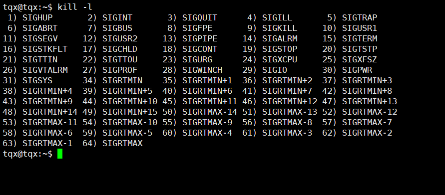
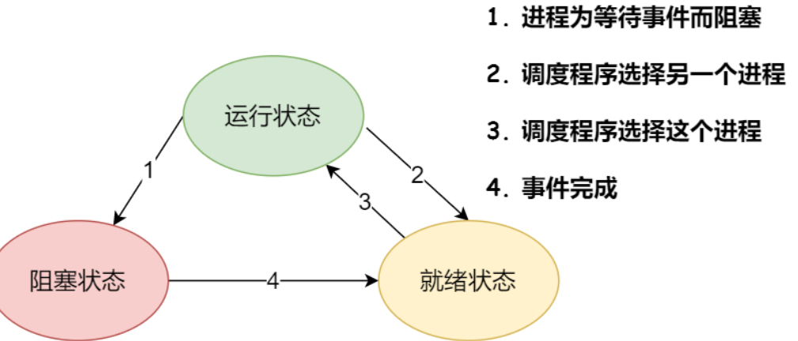
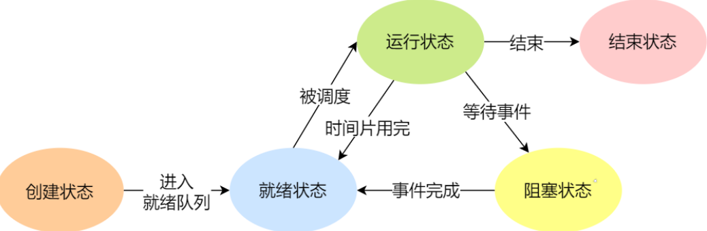
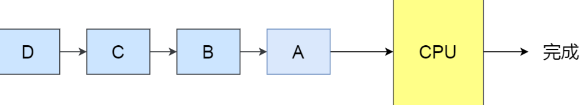

# 常用命令

### 中断

**软中断：** cat /proc/softirqs

**硬中断：** cat/proc/interrupts

### 启动任务时指定优先级

nice -n -3 /Task

### 查看当前使用端口号

netstate -anp 

### 信号

 kill -l

### 网络信息

#### ——socket信息

natstat 和ss 两个命令 natstat信息更加详细，但占用资源也大些

参数 

​	-n：不显示名字，而是以数字方式显示ip和端口号

​	-l：只显示LISTEN状态的socket

​	-p：显示进程信息

​	-t：只显示tcp连接

ss 命令输出的统计信息相对 netsat 较少， ss 只显示已经连接（estab）、关闭（closed）、孤儿（orphaned） socket 等简要统计。

netstat 则有更详细的网络协议栈信息，比如显示了 TCP 协议的主动连接（activeconnections openings）、被动连接（passive connection openings）、失败重试（failedconnection attempts）、发送（segments send out）和接收（segments received）的分段
数量等各种信息。

#### ——网络吞吐率和PPS

sar命令产看网络吞吐率和PPS，用法是给 sar 增加 -n 参数就可以查看网络的统计信息

#### ——连通性与延时

ping命令：  它是基于 ICMP 协议的，工作在网络层。

## 文件传输

scp [localfile] [remoteuser]@[remoteip]:[remotedir] 

# 查看栈的大小

ulimit -a  

修改用：ulimit -s

# 系统基础知识

## 并发、并行

1. 并发：对于单核GPU，可以让每一个Task执行一小段时间，时间到就切换到另一个任务，从宏观角度，一段时间内执行了多个任务。
2. 并行：对于多个GPU，多个Task可以同时被不同核心的CPU同时执行。

## 同步

**并发进程/线程在一些关键点上可能需要互相等待与互通消息，这种相互制约的等待与互通信息称为进程/线程同步。**

## 进程状态

1. 运行状态

2. 就绪状态

3. 阻塞状态

4. 

   额外两个状态： 组建状态、结束状态

   

   

 挂起状态：额外描述进程是否占用实际物理内存空间的情况。阻塞挂起状态，进程在外存（硬盘）并等待某个事件的出现；就绪挂起状态，进程在外存（硬盘），但只要进入内存，即可立即运行；

## PCB(进程控制块)

PCB是进程存在的唯一标识符，包括以下信息：

1. 进程描述信息：

   进程标识符：标识各个进程，每个进程都有且只有一个标识符；

   用户标识符：进程归属的用户，用户标识符主要为共享和保护服务；

2. 进程控制和管理信息：

   进程当前状态，如 new、ready、running、waiting 或 blocked 等；
   进程优先级：进程抢占 CPU 时的优先级

3. 资源分配清单：

   有关内存地址空间或虚拟地址空间的信息，所打开?件的列表和所使用的 I/O 设备信息。

4. CPU 相关信息：

   CPU 中各个寄存器的值，当进程被切换时，CPU 的状态信息都会被保存在相应的 PCB中，以便进程重新执行时，能从断点处继续执行。

## 进程与线程

### 线程

线程优点：

1. 一个进程可以有多个线程
2. 各个线程之间可以并发执行
3. 各个线程之间可以共享地址空间和文件等资源

线程缺点：当进程中一个线程崩溃时，会导致其所属进程的所有线程崩溃

线程三种实现方式：

1. 用户线程、
2. 内核线程、
3. 轻量级进程：Ligbt-weight process, LWP）是内核支持的用户线程，一个进程可以有一个或多个LWP，每个LWP是和内核线程一堆u一映射的，即LWP都是由一个内核线程支持。LWP 只能由内核管理并像普通进程一样被调度。LWP与普通进程的区别也在于它只有一个最小的执行上下文和调度程序所
   需的统计信息

### 进程与线程的比较

1. 进程时资源（包括内存、打开的文件等）分配的单位，线程时CPU调度的单元。
2. 进程拥有完整的资源平台，而线程只独享必不可少的资源，如寄存器和栈。
3. 线程同样具有就绪、阻塞、zhix三种基本状态，同样具有状态之间的转换关系。
4. 线程能够减少并发执行dekjian和shijiankaixiao；

## 操作系统调度机制

### 进程调度算法

**调度原则：**

**原则一：**由于I/O时间导致CPU空闲时，调度程序需要从就绪队列中选择一个进程来运行，以提高**CPU利用率**（确保CPU始终处于繁忙状态）。

**原则二：**调度程序要权衡长惹怒和短任务进程的运行完成数量，以提高**系统的吞吐率**（单位时间内CPU完成进程的数量）。

**原则三：**尽量避免进程时间很长而运行时间很短，这样会导致**周转时间**（进程运行和阻塞时间的总和）长。

**原则四：**要考虑就绪队列中进程的**等待时间**（处于就绪队列的时间）。使处于就绪队列的进程不要等待太久。

**原则五：**要考虑<u>交互式比较强的应用</u>的**响应时间**（用户提交到请求第一次产生响应所花费的时间），<u>如鼠标、键盘</u>。

进程调度算法也称 CPU 调度算法，毕竟进程是由 CPU 调度的。不同调度算法适用的场景使不同的。

什么时候会发生 CPU 调度呢？通常有以下情况：
1. 当进程从运行状态转到等待状态；
2. 当进程从运行状态转到就绪状态；
3. 当进程从等待状态转到就绪状态；（优先级高的情况，抢占正在运行的进程）
4. 当进程从运行状态转到终止状态；

选择下一个时间片运行的进程是在操作系统中完成的，通常成为**调度程序**。

在进程的什么周期中，当进程冲一个运行状态到另一个运行状态变的时候，就会触发一次**调度**。如，从就绪态->运行态、从运行态->阻塞态、从运行态->结束态。

另外，如果硬件时钟提供某个频率的周期性中断，那么可以根据如何处理时钟中断，把调度算法分为两类：

**非抢占式调度算法：**挑选一个进程，直到改进程运行至被阻塞，或改进程退出，才会调用另外一个进程。也就是说不会理会时钟中断。（1和4）

**抢占式调度算法：**挑选一个进程然后让该进程只运?某段时间，如果在该时段结束时，该进程仍然在运行时，则会把它挂起，接着调度程序从就绪队列挑选另外一个进程。这种抢占式调度处理，需要在时间间隔的末端发生**时钟中断**，以便把 CPU 控制返回给调度程序进程调度，也就是常说的**时间片机制**。（2和3）

**分类如下：**

1. 非抢占式**先来先服务（First Come First Seved, FCFS）**算法。每次从就绪队列选择最先进?队列的进程，然后一直运行，直到进程退出或被阻塞，才会继续从队列中选择第一个进程接着运行。FCF对长作业有利，适用于CPU繁忙作业的系统，不适用于I/O繁忙型作业的系统。

2. **最短作业优先（Shortest Job First， SJF）**调度算法优先选择运行时间最短的程序运行，利于提高系统吞吐量。

3. **高响应比优先（Highest Response Ratio Next, HRRN）**调度算法主要是权衡了短作业和长作业。每次进行进程调度时，先计算**响应比优先级**，然后把**响应比优先级**最高的进程投入运行，响应比优先级计算格式如下：
   $$
   优先权=（等待时间+要求服务时间）/要求服务时间
   $$
   
4. **时间片轮转（Round Robin，RR）**调度算法，每个进程被分配一个时间片（Quantum），运行改建成在改时间片内运行。如果时间片用完，进程还在运行，就把此进程从CPU中是否，爸爸CPU分给另一个进程；如果改进程在时间片结束前阻塞或结束，则CPU理解进行切换。时间片一般设为20ms~50ms。

5. **最高优先级（Highest Priority First， HPF）**调度算法从就绪序列中选择高优先级（可分为静态优先级——创建进程式确定——和动态优先级——随时间推移增加等待进程的优先级）的进程进行运行。该算法也分为**非抢占式**和抢占式两种处理高优先级的方法。可能回导致低优先级的进程永远不会执行。

6. **多级反馈队列（Multilevel Feedback Queue， MFQ）**调度算法是时间片轮转算法和最高优先级算法的综合和发展。

### 页面置换算法

**缺页异常（缺页中断）：**当CPU 访问的??不在物理内存时，便会产生一个缺页中断，请求操作系统将所缺页调入到物理内存。

找不到空闲页的话，就说明此时内存已满了，这时候，就需要「缺页置换算法」选择一个物理页，如果该物理页有被修改过（脏页），则把它换出到磁盘，然后把该被置换出去的?表项的状态改成「无效的」，最后把正在访问的页面装入到这个物理页中。

**分类：**

1. **最佳页面置换算法；**置换出在「未来」最长时间不访问的页面。但是实际系统中?法实现，因为程序访问??时是动态的，我们是无法预知每个页面在「下一次」访问前的等待时间。所以，最佳页面置换算法作用是为了衡量你的算法的效率，你的算法效率越接近该算法的效率，那么说明你的算法是高效的。
2. **先进先出置换算法：**选择在内存驻留时间很长的页面中进行置换
3. **最近最久未使用（LRU）置换算法：**选择最长时间没有被访问的页面进行置换。该算法即使很久没使用的页面很有可能在未来较长时间内也不会被使用。
4. **时钟页面置换算法：**把所有的页面都保存在一个雷士钟面的「环线链表」中，一个指针指向最老的页面。（访问位置时0就淘汰该页面，并把新页插入到这个位置，然后把表针前移一个位置；如果访问位置是1就清除访问位（访问位置为0），并把表针迁移一个位置，重复过程，直至道道一个访问位为0的页面为止。）
5. **最不常用（LFU）算法：**选择「访问次数」最少的页面，并将其淘汰。

### 磁盘调度算法

磁盘调度算法的?的很简单，就是为了提?磁盘的访问性能，一般是通过优化磁盘的访问请求顺序来做到的。

**分类：**

1. **先来先服务算法：**（First-Come，First-Served，FCFS），先到请求先被服务。
2. **最短寻道时间优先算法：**（Shortest Seek First，SSF），优先选择当前磁头位置所需寻道时间最短的请求。会产生饥饿——磁头一直在一小块区域移动。
3. **扫描算法：**为了防止这个问题—饥饿—，可以规定：磁头在一个方向上移动，访问所有未完成的请求，直到磁头到达该方向上的最后的磁道，才调换方向，这就是扫描（Scan）算法。
4. **循环扫描算法：**（Circular Scan, CSCAN）只有磁头朝某个特定方向移动时，才处理磁道访问请求，而返回时直接快速移动至最靠边缘的磁道，也就是复位磁头，这个过程是很快的，并且返回中途不处理任何请求，该算法的特点，就是磁道只响应一个方向上的请求。
5. **LOOK与C-LOOK算法：**优化的思路**就是磁头在移动到「最远的请求」位置，然后立即反向移动。**那针对 SCAN 算法的优化则叫 LOOK 算法，它的工作方式，磁头在每个方向上仅仅移动到最远的请求位置，然后立即反向移动，而不需要移动到磁盘的最始端或最末端，**反向移动的途中会响应请求**。而针 C-SCAN 算法的优化则叫 C-LOOK，它的工作方式，磁头在每个方向上仅仅移动到最远的请求位置，然后立即反向移动，而不需要移动到磁盘的最始端或最末端，反向移动的途中不会响应请求

## 进程间通信

1. 管道：分为有名管道和匿名管道。
2. 消息队列：是保存在内核中的链表。用户读取和写入过程会发生用户态与内核态之间的消息拷贝过程。通信不及时，发件大小有限制，类似email；
3. 共享内存：拿出一块虚拟地址，映射到相同的物理内存中。多进程同时修改内存引发问题
4. 信号量：表示资源的数量，避免多进程竞争共享资源，任意时刻只能被一个进程访问。本是上是一个整形计数器，主要用于实现进程间的互斥和同步，而不是由于缓存进程间的通信数据。有两个**原子操作**的系统调用函数来控制信号量P操作和V操作；初始值设置为1，实现临界区的互斥访问；初始值设为0，实现事件的同步访问。
5. 信号：**异常工作模式**需要用信号的方式通知进程。通过kill -l 命令查看各种信号。是进程间通信的**唯一异步通信机制**。可以在任何时候发送信号个某一个进程。分为执行默认操作、捕捉信号、忽略信号。
6. Socket：实现**跨网络与不同主机上的进程间进行通信**，也可以在相同主机上进程间进行通信。

## 原子操作

要么全部执行，要么都不执行，不能出现执行到一般的中间状态。

## 锁

**互斥锁：**对共享数据进行锁定，保证同一时刻只能有一个线程去操作。互斥锁加锁失败后会该线程**释放CPU**（该线程代码就会**阻塞**——系统内核实现睡眠状态——线程切换），给其他线程；

**自旋锁：**当获取不到锁时，线程一直while循环，不做任何事情，被称为*忙等待*,也叫**自旋锁**。自旋锁加锁失败后，线程会**忙等待**，直到拿到锁。

**读写锁：**它由「读锁」和「写锁」两部分构成，如果只读取共享资源用「读锁」加锁，如果要修改共享资源则用「写锁」加锁。

**乐观锁：**为多线程同时修改共享资源的概率?较?，于是很容易出现冲突，所以访问共享资源前，先要上锁。如互斥锁、自旋锁、读写锁。

**悲观锁：**它假定冲突的概率很低，**工作方式为**先修改完共享资源，再验证这段时间内有没有发?冲突，如果没有其他线程在修改资源，那么操作完成，如果发现有其他线程已经修改过这个资源，就放弃本次操作。**现乐观锁全程并没有加锁，所以它也叫无锁编程**。只有在冲突概率非常低，且加锁成本非常高的场景时，才考虑使?乐观锁

无等待锁：当没获取到锁的时候，把当前线程放入到锁的等待队列，然后执行调度程序，把CPU让给其他线程执行。

死锁：两个线程都在等待对方释放锁，在没有外力作用下，这些线程/进程会一直相互等待，就没办法继续运行，这种情况就是发生了**死锁**。满足条件：1.互斥条件（多线程不能同时持有相同资源），2.持有并等待条件（等待资源时，不会释放已持有资源），3.不可剥夺条件（自己使用完资源之前不能被其他线程获取），4.环路等待条件（两个或多个线程获取资源的顺序构成了环线链）。

## 网络性能指标

**带宽：**表示链路的最大传输速率，单位是b/s(比特/秒)，贷款越大，琪传输能力越强。

**延时：**表示请求数据包发送后，收到对端的响应，所需要的时间延时。

**吞吐率：**表示单位时间内**成功传输**的数据量，单位是b/s(比特/秒)或B/s(字节/秒)，吞吐受到带宽的限制，贷款越大，吞吐率上限才可能越高。

**PPS：**全称是Packet Per Second(包/秒)，表示以网络包为单位的传输速率，一般用来评估系统对网络的转发能力。

**网络的可用性：**表示网络能否正常通信；
		**并发连接数：**表示 TCP 连接数量；
		**丢包率：**表示所丢失数据包数量占所发送数据组的比率；
		**重传率：**表示重传输络包的比例；
