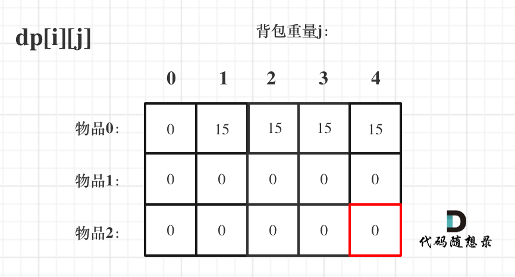

# 数据结构

## 链表

### 定义

```C++
// 单链表
struct ListNode{
    int val;
    ListNode *next;
    ListNode(int x):val(x), next(null)
}
```

```python
class ListNode:
    def __init__(self, val, next=None):
        self.value = val
        self.next = next
```

## 哈希表

| 集合               | 底层实现 | 是否有序 | 数值是否可以重复 | 能否可更改数值 | 查询效率 | 增删效率 |
| :----------------- | :------- | :------- | ---------------- | -------------- | -------- | -------- |
| std::set           | 红黑树   | 有序     | 否               | 否             | O(log n) | O(log n) |
| std::multiset      | 红黑树   | 有序     | 是               | 否             | O(log n) | O(log n) |
| std::unordered_set | 哈希表   | 无序     | 否               | 否             | O(1)     | O(1)     |

| 映射               | 底层实现 | 是否有序 | 数值是否可以重复 | 能否可更改数值 | 查询效率 | 增删效率 |
| ------------------ | -------- | -------- | ---------------- | -------------- | -------- | -------- |
| std::map           | 红黑树   | key有序  | key不可重复      | key不可修改    | O(log n) | O(log n) |
| std::multimap      | 红黑树   | key有序  | key可重复        | key不可修改    | O(log n) | O(log n) |
| std::unordered_set | 哈希表   | key无序  | key不可重复      | key不可修改    | O(1)     | O(1)     |


## 队列

#### 定义

```C++
// queue<Type, Container> (<数据类型，容器类型>）
// 初始化时必须要有数据类型，容器可省略，省略时则默认为deque 类型
// queue<int> q1;
// 用list容器实现的queue 
// queue＜char, list＜char＞＞q1；
// 用deque容器实现的queue 
// queue＜int, deque＜int＞＞q2；
// 注意：不能用vector容器初始化queue

queue<int> q;
q.push(1);	// 在队尾插入一个元素
q.pop();	// 将队列中最靠前的元素删除 无返回值
q.size()	// 返回队列中元素个数
q.empty()	// 队列为空，返回true， 非空，返回false。
q.front()	//  返回队列最前一个元素
q.back()  	//  返回队列最后一个元素

```


## 字符串

### 删除多余空格

```C++
void removeExtraSpace(string &s){  
    int slowIndex = 0, fastIndex = 0;  
    while(s.size()>0 && fastIndex < s.size() && s[fastIndex]==' '){  
        fastIndex++;  
    }  
    for(; fastIndex<s.size(); fastIndex++){  
        if(fastIndex-1>0 && s[fastIndex] == ' ' && s[fastIndex] == s[fastIndex-1]) continue;  
        else s[slowIndex++] = s[fastIndex];  
        }  
        if (slowIndex-1>0 && s[slowIndex-1] == ' ') {  
            s.resize(slowIndex - 1);  // 去掉字符串末尾的空格  
        }  
        else {    
            s.resize(slowIndex);    // 重新设置字符串大小  
        }  
}
```


## 二叉树

### 定义

```c++
struct TreeNode {
    int val;
    TreeNode *left;
    TreeNode *right;
    TreeNode(int x) : val(x), left(NULL), right(NULL) {}
};
```

其中，TreeNode(int x) : val(x), left(NULL), right(NULL) {}  是构造函数，C语言中的结构体(struct)是C++中类(class) 的祖先，所以C++结构体也右构造函数。

构造函数可以不写，但当new一个新节点是回比较麻烦。例如有构造函数，定义初始值为9的节点

```C++
TreeNode* a = new TreeNode(9);
```

没有构造函数时：

```C++
TreeNode* a = new TreeNode();
a->val = 9;
a->left = NULL;
a->right = NULL;
```

```python
class TreeNode():
    def __init__(self, value):
        self.value = value
        self.left = None
        self.right = None
```

### 基础知识

度：树中某个节点的孩子个数(二叉树最大度为2)

完全二叉树： 除底层节点没有填满外，其余每层节点数都达到最大值，并且最下层节点都集中在该层最左侧的位置。

二叉搜索树(Binary Search Tree, BST)：是一个**有序树**， 

1. 若左子树不为空，左子树节点的值都小于根节点的值。
2. 若右子树不为空，则右子树节点的值都大于根节点的值。

平衡二叉搜索树：空树，或左右子树高度差的绝对值不超过1.且左右子树都是平衡二叉树。

遍历方式：

1. 深度优先：前序遍历，中序遍历，后序遍历；（递归、迭代）

   

   **先(根)序遍历（根左右）：A B D H E I C F J K G**
   **中(根)序遍历（左根右）：D H B E I A J F K C G**
   **后(根)序遍历（左右根）：H D I E B J K F G C A**
2. 广度优先；（迭代）

### 递归遍历

用递归进行二叉树的前序遍历

```C++
class Solution{
public:
    void traversal(TreeNode *cur, vector<int>&vec){  // 1.确定递归参数和返回值
        if(cur==NULL) return; // 2.确定终止条件
        // 3.单层的递归逻辑
        vec.push_back(cur->val);  		// 中
        traversal(cur->left, vec);		// 左
        traversal(cur->right, vec); 	// 右  
    }
    vector<int> preorderTraversal(TreeNode*root){
        vector<int> result;
        traversal(root, result);
        return result;
    }
}
```

用递归进行二叉树的中序遍历

```C++
class Solution{
public:
    void traversal(TreeNode *cur, vector<int>&vec){  // 1.确定递归参数和返回值
        if(cur==NULL) return; // 2.确定终止条件
        // 3.单层的递归逻辑
        traversal(cur->left, vec);		// 左
        vec.push_back(cur->val);  		// 中
        traversal(cur->right, vec); 	// 右  
    }
    vector<int> inorderTraversal(TreeNode*root){
        vector<int> result;
        traversal(root, result);
        return result;
    }
}
```

用递归进行二叉树的后序遍历

```C++
class Solution{
public:
    void traversal(TreeNode *cur, vector<int>&vec){  // 1.确定递归参数和返回值
        if(cur==NULL) return; // 2.确定终止条件
        // 3.单层的递归逻辑
        traversal(cur->left, vec);		// 左
        traversal(cur->right, vec); 	// 右 
        vec.push_back(cur->val);  		// 中
    }
    vector<int> postorderTraversal(TreeNode*root){
        vector<int> result;
        traversal(root, result);
        return result;
    }
}
```

### 迭代（非递归）遍历


利用迭代进行二叉树前序遍历

```C++
// 为什么要先加入 右孩子，再加入左孩子呢？ 因为这样出栈的时候才是中左右的顺序。
class Solution{
public:
    vector<int>preorderTraversal(TreeNode*root){
        stack<TreeNode*> st;
        vector<int> result;
        if(root==NULL) rteurn result;
        st.push(root);
        while(!st.empty()){
            TreeNode*Node = st.top();  // 中
            st.pop();
            result.push_back(node->val);
            if(node->right) st.pust(node->right); // 右
            if(node->left) st.push(node->left);  // 左
        }
        return result;
    }
};
```

利用迭代进行二叉树中序遍历

```C++
class Solution{
public:
    vector<int> inorderTraversal(TreeNode*root){
        vector<int> result;
        stack<TreeNode*> st;
        TreeNode* cur = root;
        while(cur !=NULL || !st.empty()){
            if(cur!=NULL){
                st.push(cur);
                cur = cur->left;
            }else{
                cur = st.top();
                st.pop();
                result.push_back(cur->val);
                cur = cur->reight;
            }
        }
        return result;
    }
}
```

利用迭代进行二叉树后序遍历

```C++
class Solution{
public:
    vector<int>posteorderTraversal(TreeNode*root){
        stack<TreeNode*> st;
        vector<int> result;
        if(root==NULL) rteurn result;
        st.push(root);
        while(!st.empty()){
            TreeNode*Node = st.top();  // 中
            st.pop();
            result.push_back(node->val);
            if(node->left) st.push(node->left);  // 左
            if(node->right) st.pust(node->right); // 右
        }
        reverse(result.begin(), result.end());
        return result;
    }
};
```

### 二叉树层序遍历

```C++
class Solution {
public:
    vector<vector<int>> levelOrder(TreeNode* root) {
        queue<TreeNode*> que;
        if (root != NULL) que.push(root);
        vector<vector<int>> result;
        while (!que.empty()) {
            int size = que.size();
            vector<int> vec;
            // 这里一定要使用固定大小size，不要使用que.size()，因为que.size是不断变化的
            for (int i = 0; i < size; i++) {
                TreeNode* node = que.front();
                que.pop();
                vec.push_back(node->val);
                if (node->left) que.push(node->left);
                if (node->right) que.push(node->right);
            }
            result.push_back(vec);
        }
        return result;
    }
};
```

### 对称二叉树


**正是因为要遍历两棵树而且要比较内侧和外侧节点，所以准确的来说是一个树的遍历顺序是左右中，一个树的遍历顺序是右左中。**

### 二叉树节点的高度和深度

二叉树节点的深度：指**从根节点**到该节点的最长简单路径边的条数；

二叉树节点的高度：指**从该节点到**叶子节点的最长简单路径边的条数；


高度与深度的计算中：leetcode中是以节点为一度，维基百科是以边为一度，以leetcode为准


# 算法

## 递归

1. **确定递归函数的参数和返回值：**确定哪些参数是递归过程中需要处理的，那么就在*<u>递归函数里加上这个参数</u>*，并且还要*<u>明确每次递归的返回值</u>*是什么，进而*<u>确定递归函数的返回类型</u>*。
2. **确定终止条件：**写完了递归算法，运行的时候，经常回遇到栈溢出的错误，就是没有写终止条件或者终止条件错误，操作系统也是用一个栈的结构保存每一层递归的信息，如果递归没有终止，则操作系统的内存栈必然溢出。
3. **确定单层递归的逻辑：**确定每一层递归需要处理的信息。在这里也就会*<u>重复调用自己</u>*来实现递归的过程。

## 回溯

回溯法也可以叫做回溯搜索法，它是一种搜索的方式。**回溯函数也就是递归函数，指的都是一个函数。** 回溯的本质是穷举，穷举所有可能。如果想让回溯法高效一些，可以加一些剪枝的操作，但也改不了回溯法就是穷举的本质。

**回溯法解决的问题都可以抽象为树形结构， 集合的大小就构成了树的宽度，递归的深度，都构成的树的深度**。

```c++
// 模板
void backtracking(参数) {
    if (终止条件) {
        存放结果;
        return;
    }

    for (选择：本层集合中元素（树中节点孩子的数量就是集合的大小）) {
        处理节点;
        backtracking(路径，选择列表); // 递归
        回溯，撤销处理结果
    }
}
```


## 贪心

**贪心的本质是选择每一阶段的局部最优，从而达到全局最优**。

例如，有一堆钞票，你可以拿走十张，如果想达到最大的金额，你要怎么拿？指定每次拿最大的，最终结果就是拿走最大数额的钱。每次拿最大的就是局部最优，最后拿走最大数额的钱就是推出全局最优。再举一个例子如果是 有一堆盒子，你有一个背包体积为n，如何把背包尽可能装满，如果还每次选最大的盒子，就不行了。这时候就需要动态规划。

贪心算法一般分为如下四步：

1. 将问题分解为若干个子问题
2. 找出适合的贪心策略
3. 求解每一个子问题的最优解
4. 将局部最优解堆叠成全局最优解

## 动态规划

动态规划（Dynamic Programming， DP），如果某一问题有很多重叠子问题，使用动态规划是最有效的。

所有动态规划中每一个状态一定是由上一个状态推导出来的，**这一点区别于贪心**，贪心算法没有状态推导，而是从局部直接选最优。

### 动态规划解题五部曲

1. 确定dp数组以及其下表的含义
2. 确定递推公式
3. dp数组如何初始化
4. 确定遍历顺序
5. 举例推导dp数组

# 算法题

## 整数拆分

[力扣题目链接](https://leetcode.cn/problems/integer-break/)：给定一个正整数 `n` ，将其拆分为 `k` 个 **正整数** 的和（ `k >= 2` ），并使这些整数的乘积最大化。

返回 *你可以获得的最大乘积* 。

**解题思路：**

- 设奖整数n拆分为a个小数字：

$$
n = n_1+n_2+...+n_\alpha
$$

- 本题等价于求解

$$
max(n_1×n_2×...×n_\alpha)
$$

> 以下是数学推导过程

数学推导：
$$
\frac{n_1 + n_2 + ... + n_a} {\alpha} \geq \sqrt[\alpha]{n_1n_2...n_q}
$$

> **推论一：**若拆分的数量a确定，则拆分数字相等时，乘积最大

设将数字因子$x$等分为α个，即n=xα，则乘积为x^a^。观察以下公式，由于n为常数，因此当$x^\frac{1}{n}$取最大值时，乘积达到最大。
$$
x^\alpha = x ^\frac{n}{x} = (x ^\frac{1}{x})^n
$$
根据问题分析，可将问题转化为求y=x^1/x^的极大值，因此对x求导数。
$$
\\lny = \frac{1}{n}*lnx  
\\ \frac{1}{y}\hat{y} = \frac{1}{x^2} - \frac{1}{x^2}lnx = \frac{1-lnx}{x^2}
\\ \hat{y}=\frac{1-lnx}{x^2}x^\frac{1}{x}
$$
令$\hat{y}=0$,则$1-lnx = 0$,易得驻点为$x_0=e \approx2.7$；根据以下公式可知$x_0$为极大值点
$$
\hat{y} = \begin{cases} > 0，x \in[-\infty, e) \\ < 0， X\in (e, +\infty]\end{cases}
$$

- 由于因子$x$必须为整数，最洁净$e$的整数为2或3，如下式所示，代入$x=2$和$x=3$，得出$x=3$时乘积达到最大。

$$
y(3) = 3^\frac{1}{3} \approx1.44
\\ y(2) = 2^\frac{1}{2} \approx1.41
$$

- 口算对比方法：给两数字同取6次方，在对比。

$$
[y(3)]^6 = (3^ \frac{1}{3})^6 = 9
\\ [y[2]^6] =(2^\frac{1}{2})^6 = 8
$$

> **推论二：**将数字尽可能以因子3等分时，乘积最大。

拆分规则：

1. **最优： **3。把数字 n 可能拆为多个因子 3 ，余数可能为 0,1,2三种情况。
2. **次优：** 2。若余数为 2 ；则保留，不再拆为 1+1 。
3. **最差：** 1 。若余数为 1 ；则应把一份 $3+1$ 替换为$2+2$，因为 $2× 2 > 3 ×1$。

```c++
class Solution {
public:
    int integerBreak(int n) {
        if (n == 2) return 1;
        if (n == 3) return 2;
        if (n == 4) return 4;
        int result = 1;
        while (n > 4) {
            result *= 3;
            n -= 3;
        }
        result *= n;
        return result;
    }
};
```

动态规划：

```c++
class Solution {
public:
    int integerBreak(int n) {
        vector<int> dp(n + 1);
        dp[2] = 1;
        for (int i = 3; i <= n ; i++) {
            for (int j = 1; j < i - 1; j++) {
                dp[i] = max(dp[i], max((i - j) * j, dp[i - j] * j));
            }
        }
        return dp[n];
    }
};
```

## 背包问题


### 二维dp数组01背包

1. 确定dp数组以及下标的含义

   对于背包问题，有一种写法， 是使用二维数组，即**$dp[i][j]$表示从下标为[0-i]的物品里任意取，放进容量为j的背包，价值总和最大是多少**。

   

2. 确定递推公式

   - **不放物品i：**由$dp[i - 1][j]$推出，即背包容量为j，里面不放物品i的最大价值，此时$dp[i][j]$就是$dp[i - 1][j]$。(其实就是当物品i的重量大于背包j的重量时，物品i无法放进背包中，所以被背包内的价值依然和前面相同。)
   - **放物品i：**由$dp[i - 1][j - weight[i]]$推出，$dp[i - 1][j - weight[i]] $为背包容量为j - weight[i]的时候不放物品i的最大价值，那么$dp[i - 1][j - weight[i]] + value[i] $（物品i的价值），就是背包放物品i得到的最大价值

   所以递归公式： $dp[i][j] = max(dp[i - 1][j], dp[i - 1][j - weight[i]] + value[i])$;

3. dp数组如何初始化

   **关于初始化，一定要和dp数组的定义吻合，否则到递推公式的时候就会越来越乱**。

   首先从$dp[i][j]$的定义出发，如果背包容量j为0的话，即$dp[i][0]$，无论是选取哪些物品，背包价值总和一定为0。如图：

   

   在看其他情况。

   状态转移方程 $dp[i][j] = max(dp[i - 1][j], dp[i - 1][j - weight[i]] + value[i]);$ 可以看出$i$ 是由$ i-1$ 推导出来，那么i为0的时候就一定要初始化。

   $dp[0][j]$，即：$i$为$0$，存放编号0的物品的时候，各个容量的背包所能存放的最大价值。

   那么很明显当$ j < weight[0]$的时候，$dp[0][j]$ 应该是 $0$，因为背包容量比编号0的物品重量还小。

   当$j >= weight[0]$时，$dp[0][j] $应该是$value[0$]，因为背包容量放足够放编号0物品。

   此时dp数组初始化情况如图所示：

   

   $dp[0][j] $和$ dp[i][0] $都已经初始化了，那么其他下标应该初始化多少呢？

   其实从递归公式： $dp[i][j] = max(dp[i - 1][j], dp[i - 1][j - weight[i]] + value[i])$; 可以看出$dp[i][j] $是由左上方数值推导出来了，那么 其他下标初始为什么数值都可以，因为都会被覆盖。

   **初始-1，初始-2，初始100，都可以！**

   但只不过一开始就统一把dp数组统一初始为0，更方便一些。

   

4. 确定遍历顺序

   在如下图中，可以看出，有两个遍历的维度：物品与背包重量

   

   那么问题来了，**先遍历 物品还是先遍历背包重量呢？**

   **其实都可以！！ 但是先遍历物品更好理解**。

   ```c++
   // weight数组的大小 就是物品个数
   for(int i = 1; i < weight.size(); i++) { // 遍历物品
       for(int j = 0; j <= bagweight; j++) { // 遍历背包容量
           if (j < weight[i]) dp[i][j] = dp[i - 1][j]; 
           else dp[i][j] = max(dp[i - 1][j], dp[i - 1][j - weight[i]] + value[i]);
   
       }
   }
   ```

5. 举例推导dp数组

   来看一下对应的dp数组的数值，如图：

   

**二维dp数组01背包完整C++测试代码**

```c++
void test_2_wei_bag_problem1(){
    vector<int> weight = {1, 3, 4};
    vector<int> value = {15, 20, 30};
    int bagweight = 4;
    // 二维数组
    vector<vector<int>> dp(weight.size(), vector<int>(bagweight+1, 0));
    
    // 初始化
    for(int j = weight[0]; j<=bagweight; j++){
        dp[0][j] = value[0];
    }
    
    for (int i = 1; i<weight.size(); i++){
        for(int j = 1; j <= bagweight; j++){
            if(j<weight[i]) {
                dp[i][j] = dp[i-1][j];
            }else{
                dp[i][j] = max(dp[i-1][j], dp[i-1][j-weight[i]]+value[i]);
            }
        }
    }
    count <<dp[weight.size()-1][bagweight]<<endl;
}
int max(){
    test_2_wei_bag_problem1();
}
```

### 一维dp数组（滚动数组）

在使用二维数组的时候，递推公式：$dp[i][j] = max(dp[i - 1][j], dp[i - 1][j - weight[i]] + value[i])$;

**其实可以发现如果把$dp[i - 1]$那一层拷贝到$dp[i]$上，表达式完全可以是：$dp[i][j] = max(dp[i][j], dp[i][j - weight[i]] + value[i])$;**

**与其把$dp[i - 1]$这一层拷贝到$dp[i]$上，不如只用一个一维数组了**，只用dp[j]（一维数组，也可以理解是一个滚动数组）。

**$dp[i][j]$ 表示从下标为$[0-i]$的物品里任意取，放进容量为j的背包，价值总和最大是多少**。

1. 确定dp数组的定义

   在一位dp数组中$dp[j]$表示：容量为j的维保，所背的物品价值可以最大为$dp[j]$。

2. 一维dp数组的递推公式

   $dp[j]$可以通过$dp[j - weight[i]]$推导出来，$dp[j - weight[i]]$表示容量为$j - weight[i]$的背包所背的最大价值。

   $dp[j - weight[i]] + value[i] $表示 容量为 j - 物品i重量 的背包 加上 物品i的价值。（也就是容量为$j$的背包，放入物品$i$了之后的价值即：$dp[j]$）

   此时dp[j]有两个选择，一个是取自己$dp[j] $相当于 二维dp数组中的$dp[i-1][j]$，即不放物品i，一个是取$dp[j - weight[i]] + value[i]$，即放物品i，指定是取最大的，毕竟是求最大价值，

   所以递归公式为：

   ```c++
   dp[j] = max(dp[j], dp[j - weight[i]] + value[i]);
   ```

3. 一维dp数组如何初始化

   **关于初始化，一定要和dp数组的定义吻合，否则到递推公式的时候就会越来越乱**。

   $dp[j]$表示：容量为j的背包，所背的物品价值可以最大为$dp[j]$，那么$dp[0]$就应该是0，因为背包容量为0所背的物品的最大价值就是0。

   那么dp数组除了下标0的位置，初始为0，其他下标应该初始化多少呢？

   看一下递归公式：$dp[j] = max(dp[j], dp[j - weight[i]] + value[i])$;

   dp数组在推导的时候一定是取价值最大的数，如果题目给的价值都是正整数那么非0下标都初始化为0就可以了。

   **这样才能让dp数组在递归公式的过程中取的最大的价值，而不是被初始值覆盖了**。

   那么我假设物品价值都是大于0的，所以dp数组初始化的时候，都初始为0就可以了。

4. 一维dp数组遍历顺序

   代码如下：

   ```c++
   for(int i = 0; i < weight.size(); i++) { // 遍历物品
       for(int j = bagWeight; j >= weight[i]; j--) { // 遍历背包容量
           dp[j] = max(dp[j], dp[j - weight[i]] + value[i]);
       }
   }
   ```

   **这里大家发现和二维dp的写法中，遍历背包的顺序是不一样的！**

   二维dp遍历的时候，背包容量是从小到大，而一维dp遍历的时候，背包是从大到小。

   为什么呢？

   **倒序遍历是为了保证物品i只被放入一次！**。但如果一旦正序遍历了，那么物品0就会被重复加入多次！

5. 举例推导dp数组

   一维dp，分别用物品0，物品1，物品2 来遍历背包，最终得到结果如下：

   

**一维dp数组01背包完整C++测试代码**

```c++
void test_1_wei_bag_problem(){
    vector<int> weight = {1, 3, 4};
    vector<int> value = {15, 20, 30};
    int bagWeight = 4;
    // 初始化
    vector<int> dp(bagWeight+1, 0);
    for(int i = 0; i < weight.size(); i++){
        for(int j = bagWeight; i>=weight[i]; i--){
            dp[j] = max(dp[j], dp[j-weight[i]] + value[i]);
        }
    }
    cout << dp[bagWeight] << endl;
}
int main(){
    test_1_wei_bag_problem();
}
```

可以看出，一维dp 的01背包，要比二维简洁的多！ 初始化 和 遍历顺序相对简单了。

**所以我倾向于使用一维dp数组的写法，比较直观简洁，而且空间复杂度还降了一个数量级！**

### 完全背包

有N件物品和一个最多能背重量为W的背包。第i件物品的重量是weight[i]，得到的价值是value[i] 。**每件物品都有无限个（也就是可以放入背包多次）**，求解将哪些物品装入背包里物品价值总和最大。

**完全背包和01背包问题唯一不同的地方就是，每种物品有无限件**。

首先在回顾一下01背包的核心代码

```cpp
for(int i = 0; i < weight.size(); i++) { // 遍历物品
    for(int j = bagWeight; j >= weight[i]; j--) { // 遍历背包容量
        dp[j] = max(dp[j], dp[j - weight[i]] + value[i]);
    }
}
```

我们知道01背包内嵌的循环是从大到小遍历，为了保证每个物品仅被添加一次。

而完全背包的物品是可以添加多次的，所以要从小到大去遍历，即：

```cpp
// 先遍历背包，再遍历物品
for(int j = 0; j <= bagWeight; j++) { // 遍历背包容量
    for(int i = 0; i < weight.size(); i++) { // 遍历物品
        if (j - weight[i] >= 0) dp[j] = max(dp[j], dp[j - weight[i]] + value[i]);
    }
    cout << endl;
}
```

**如果求组合数就是外层for循环遍历物品，内层for遍历背包**。

**如果求排列数就是外层for遍历背包，内层for循环遍历物品**。

完整的C++测试代码如下：

```cpp
// 先遍历物品，在遍历背包
void test_CompletePack() {
    vector<int> weight = {1, 3, 4};
    vector<int> value = {15, 20, 30};
    int bagWeight = 4;
    vector<int> dp(bagWeight + 1, 0);
    for(int i = 0; i < weight.size(); i++) { // 遍历物品
        for(int j = weight[i]; j <= bagWeight; j++) { // 遍历背包容量
            dp[j] = max(dp[j], dp[j - weight[i]] + value[i]);
        }
    }
    cout << dp[bagWeight] << endl;
}
int main() {
    test_CompletePack();
}
```

```cpp
// 先遍历背包，再遍历物品
void test_CompletePack() {
    vector<int> weight = {1, 3, 4};
    vector<int> value = {15, 20, 30};
    int bagWeight = 4;

    vector<int> dp(bagWeight + 1, 0);

    for(int j = 0; j <= bagWeight; j++) { // 遍历背包容量
        for(int i = 0; i < weight.size(); i++) { // 遍历物品
            if (j - weight[i] >= 0) dp[j] = max(dp[j], dp[j - weight[i]] + value[i]);
        }
    }
    cout << dp[bagWeight] << endl;
}
int main() {
    test_CompletePack();
}
```

### 背包总结


1. 确定dp数组（dp table）以及下标的含义
2. 确定递推公式
3. dp数组如何初始化
4. 确定遍历顺序
5. 举例推导dp数组

**其实这五部里哪一步都很关键，但确定递推公式和确定遍历顺序都具有规律性和代表性，所以下面我从这两点来对背包问题做一做总结**。

#### 【背包递推公式】

- 问能否能装满背包（或者最多装多少）：$dp[j] = max(dp[j], dp[j - nums[i]] + nums[i])$; ，对应题目如下：

  - [动态规划：416.分割等和子集(opens new window)](https://programmercarl.com/0416.分割等和子集.html)

  - [动态规划：1049.最后一块石头的重量 II](https://programmercarl.com/1049.最后一块石头的重量II.html)

- 问装满背包有几种方法：$dp[j] += dp[j - nums[i]]$ ，对应题目如下：

  - [动态规划：494.目标和(opens new window)](https://programmercarl.com/0494.目标和.html)

  - [动态规划：518. 零钱兑换 II(opens new window)](https://programmercarl.com/0518.零钱兑换II.html)

  - [动态规划：377.组合总和Ⅳ(opens new window)](https://programmercarl.com/0377.组合总和Ⅳ.html)

  - [动态规划：70. 爬楼梯进阶版（完全背包）](https://programmercarl.com/0070.爬楼梯完全背包版本.html)

- 问背包装满最大价值：dp[j] = max(dp[j], dp[j - weight[i]] + value[i]); ，对应题目如下：

  - [动态规划：474.一和零(opens new window)](https://programmercarl.com/0474.一和零.html)

- 问装满背包所有物品的最小个数：dp[j] = min(dp[j - coins[i]] + 1, dp[j]); ，对应题目如下：

  - [动态规划：322.零钱兑换(opens new window)](https://programmercarl.com/0322.零钱兑换.html)

  - [动态规划：279.完全平方数](https://programmercarl.com/0279.完全平方数.html)

#### 【遍历顺序】

**01背包：**

1. 二维dp数组01背包先遍历物品或背包都是可以的，且第二层仓小到大遍历。
2. 一维dp数组01背包只能先遍历物品再遍历背包容量，且第二层从大到小遍历。

**完全背包：**

1. 纯万年泉背包先遍历物品/背包都可以，且第二层for循环从小到大遍历。
2. **如果求【组合数】就是外层遍历物品，内层遍历背包。**
3. **如果求【排列数】就是外层遍历背包， 内层遍历物品。**

相关题目如下：

- 求组合数：[动态规划：518.零钱兑换II(opens new window)](https://programmercarl.com/0518.零钱兑换II.html)
- 求排列数：[动态规划：377. 组合总和 Ⅳ (opens new window)](https://mp.weixin.qq.com/s/Iixw0nahJWQgbqVNk8k6gA)、[动态规划：70. 爬楼梯进阶版（完全背包）](https://programmercarl.com/0070.爬楼梯完全背包版本.html)

如果求最小数，那么两层for循环的先后顺序就无所谓了，相关题目如下：

- 求最小数：[动态规划：322. 零钱兑换 (opens new window)](https://programmercarl.com/0322.零钱兑换.html)、[动态规划：279.完全平方数](https://programmercarl.com/0279.完全平方数.html)

#### **【背包问题总结】**


## 股票问题总结


### 买股票的最佳时机

**股票只能买卖一次，获取最大利润**

#### **【贪心】**

取到左边最小值，取右边最大值，差值为最大利润，代码如下

```cpp
class Solution{
public:
    int maxProfit(vector<int>&prices){
        int low = INT_MAX;
        int res = 0;
        for(int i = 0; i<prices.size(); i++){
            low = min(low, prices[i]);
            res = max(res, prices[i]-low);
        }
        return res;
    }
}
```

#### 【动规】

##### 
