# 深度学习基础

## 1*1卷积

最早出现在Network in Network， 两点贡献：

- MLpconv，即引入1*1卷积

传统的CNN的一层卷积相当于一个线性操作，如下图 a，所以只提取了线性特征，隐含了假设特征是线性可分的，实际却并非如此，NIN 中引入 下图 b 中的 mlpconv layer，实质是像素级的全连接层，等价于 1x1 卷积，在其后跟 ReLU激活函数，引入更多的非线性元素。

- 将分类的全连接层用global average pooling代替。

全连接容易产生过拟合，减弱了网络的泛化能力。

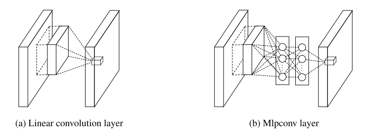

此后GoogLeNet的Inception结构中延用了1*1卷积，如下图

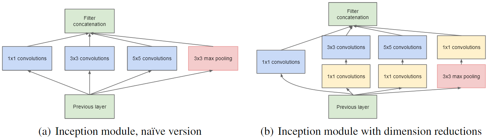

### 1*1卷积的作用

1. 减低维度或上升维度

   在网络中增加1*1卷积，使得网络更深，**通过在3×3或5×5卷积前，用1×1卷积降低维度，没有增加权重参数的负担**。

2. 跨通道信息交互（cross-channel correlations and spatial correlations）

   1x1卷积核，从图像处理的角度，乍一看也没有意义，在网络中，**这样的降维和升维的操作其实是 channel 间信息的线性组合变化。**

   **补充：**cross-channel correlation 和 spatial correlation的学习可以进行解耦。1x1的卷积相当于学习了feature maps之间的cross-channel correlation。实验证明了这种解耦可以在不损害模型表达能力的情况下大大减少参数数量和计算量。**但是需要注意的是，1x1 的卷积层后面加上一个 normal 的卷积层，这种解耦合并不彻底，正常卷积层仍然存在对部分的 cross-channel correlation 的学习。**之后就有了 depth-wise seperable convolution(后面记录 MobileNet 后，在这添加链接)。在 depth-wise seperable convolution中，1x1 的卷积层是将每一个 channel 分为一组，那么就不存在对cross-channel correlation的学习了，就实现了对cross-channel correlation和spatial correlation的彻底解耦合。这种完全解耦的方式虽然可以大大降低参数数量和计算量，但是正如在 mobile net 中所看到的，性能会受到很大的损失。

3. 增加非线性特性

   1x1卷积核，可以在保持 feature maps size不变的（即不损失分辨率）的前提下大幅增加非线性特性（**利用后接的非线性激活函数**）。

**总结**
1x1 卷积在图像处理的角度，乍一看好像没什么意义，但在 CNN 网络中，能实现降维，减少 weights 参数数量，能够实现升维，来拓宽 feature maps，在不改变 feature maps 的 size 的前提下，实现各通道之间的线性组合，实际上是通道像素之间的线性组合，后接非线性的激活函数，增加更多样的非线性特征。这就是为什么 GoogLeNet 用 1x1 卷积来降维，减少了计算量，但模型效果却没有降低，此外网络深度更深。可以说 1x1 卷积很 nice.

## CV中的Attention

#### Non-local Attention

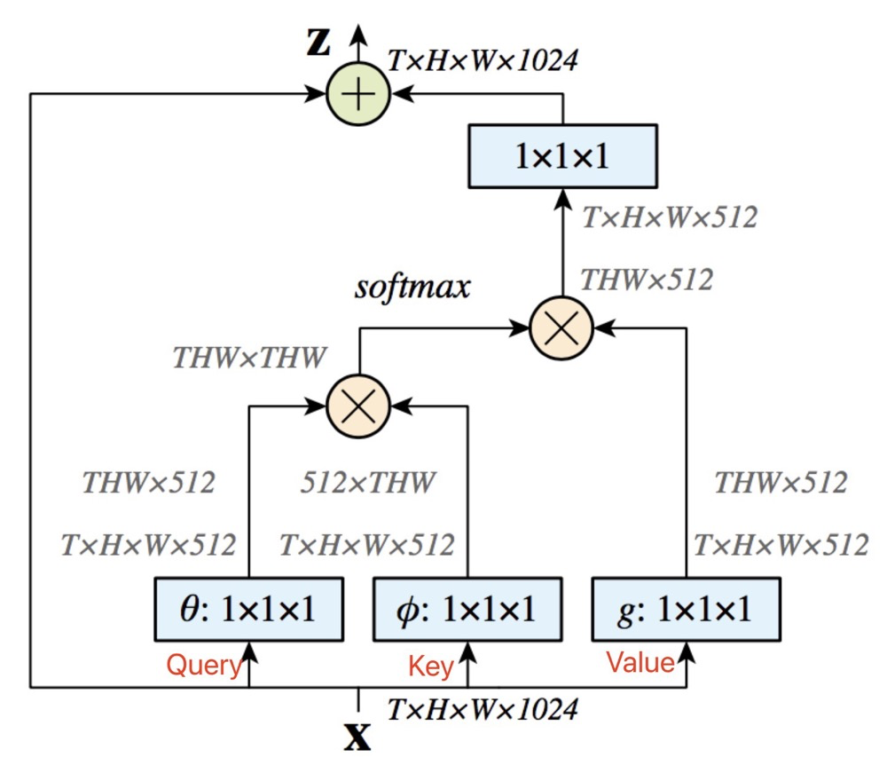

#### CBAM

CBAM由Channel Attention和Spatial Attention组合而成。

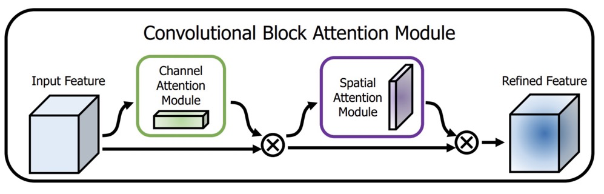

其中**Channel Attention，主要是从$C×W×W$的维度，学习到一个$C×1×1$的权重矩阵。**

论文原图如下：

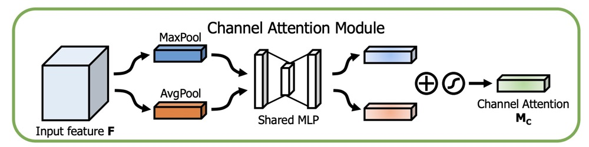

```python
class ChannelAttentionModule(nn.Module):
    def __init__(self, channel, reduction=16):
        super(ChannelAttentionModule, self).__init__()
        mid_channel = channel // reduction
        self.avg_pool = nn.AdaptiveAvgPool2d(1)
        self.max_pool = nn.AdaptiveMaxPool2d(1)
		
        # 共享MLP权重
        self.shared_MLP = nn.Sequential(
            nn.Linear(in_features=channel, out_features=mid_channel),
            nn.ReLU(inplace=True),
            nn.Linear(in_features=mid_channel, out_features=channel)
        )
        self.sigmoid = nn.Sigmoid()

    def forward(self, x):
        avgout = self.shared_MLP(self.avg_pool(x).view(x.size(0),-1)).unsqueeze(2).unsqueeze(3)
        maxout = self.shared_MLP(self.max_pool(x).view(x.size(0),-1)).unsqueeze(2).unsqueeze(3)
        return self.sigmoid(avgout + maxout)
```

对于$Spatial$ $Attention$，如图所示：


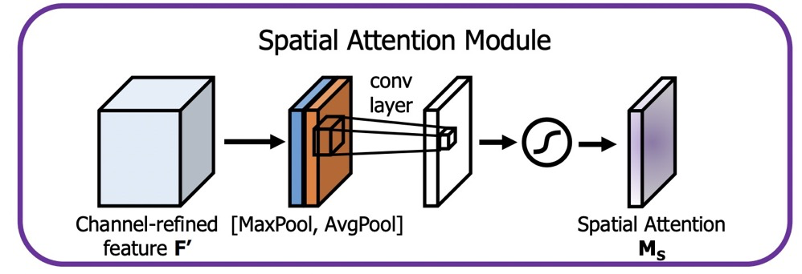

参考代码如下

```python
class SpatialAttentionModule(nn.Module):
    def __init__(self):
        super(SpatialAttentionModule, self).__init__()
        self.conv2d = nn.Conv2d(in_channels=2, out_channels=1, kernel_size=7, stride=1, padding=3)
        self.sigmoid = nn.Sigmoid()

    def forward(self, x):
        avgout = torch.mean(x, dim=1, keepdim=True)
        maxout, _ = torch.max(x, dim=1, keepdim=True)
        out = torch.cat([avgout, maxout], dim=1)
        out = self.sigmoid(self.conv2d(out))
        return out
```

#### cgnl

论文分析了下如$Spatial$ $Attention$与$Channel$ $Attention$均不能很好的描述特征之间的关系，这里比较极端得生成了N * 1 * 1 * 1的$MASK$.

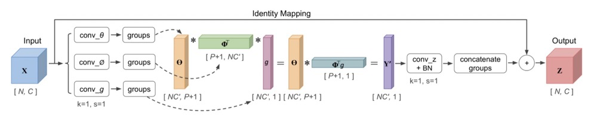

Attention 代码：

```python
def kernel(self, t, p, g, b, c, h, w):
        """The linear kernel (dot production).
        Args:
            t: output of conv theata
            p: output of conv phi
            g: output of conv g
            b: batch size
            c: channels number
            h: height of featuremaps
            w: width of featuremaps
        """
        t = t.view(b, 1, c * h * w)
        p = p.view(b, 1, c * h * w)
        g = g.view(b, c * h * w, 1)

        att = torch.bmm(p, g)

        if self.use_scale:
            att = att.div((c*h*w)**0.5)

        x = torch.bmm(att, t)
        x = x.view(b, c, h, w)

        return x
```

### Cross-layer non-local

论文中分析了，同样的层之间进行 $Attention$计算，感受野重复，会造成冗余，如左边的部分图，而右边的图表示不同层间的感受野不同，计算全局 $Attention$也会关注到更多的区域。


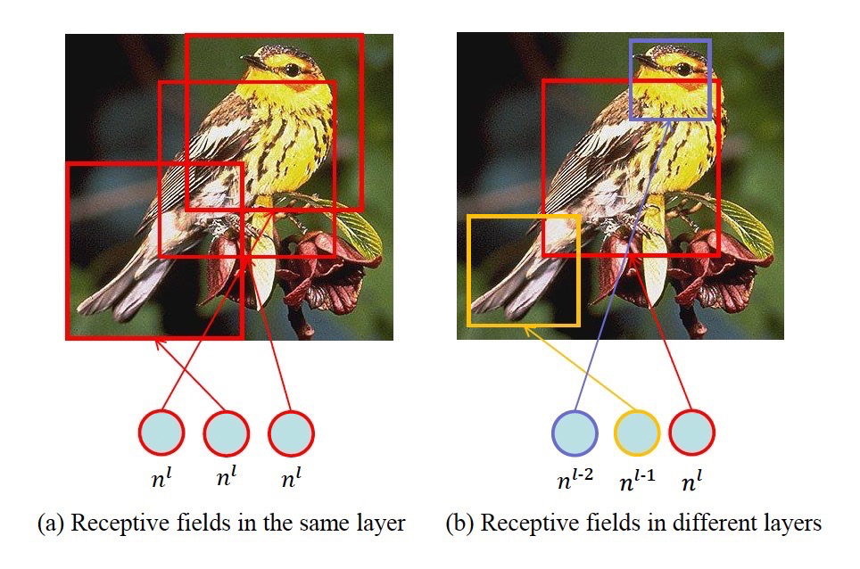

这里采用跨层之间的 $Attention$生成。

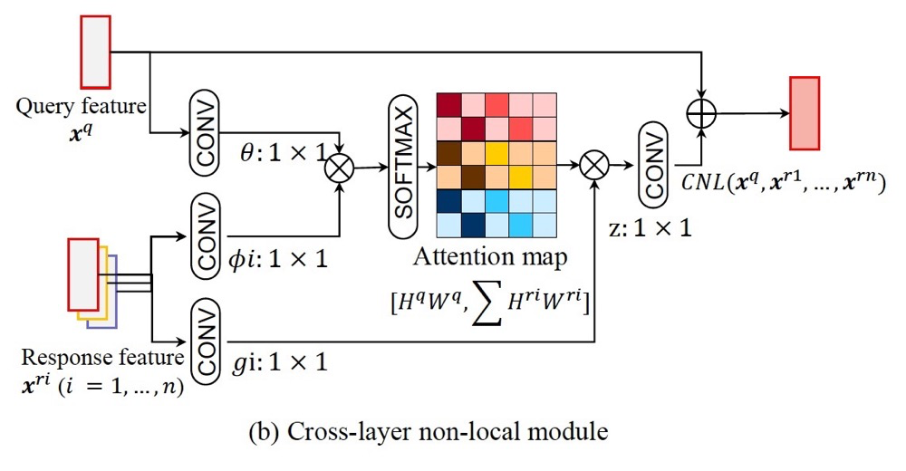

代码

```python
# query : N, C1, H1, W1
# key: N, C2, H2, W2
# value: N, C2, H2, W2
# 首先，需要使用1 x 1 卷积，使得通道数相同
q = query_conv(query) # N, C, H1, W1
k = key_conv(key) # N, C, H2, W2
v = value_conv(value) # N, C, H2, W2
att = nn.softmax(torch.bmm(q.view(N, C, H1*W1).permute(0, 1, 2), k.view(N, C, H2 * W2))) # (N, H1*W1, H2*W2)
out = att * value.view(N, C2, H2*W2).permute(0, 1, 2) #(N, H1 * W1, C)
out = out.view(N, C1, H1, W1)
```

## DenseNet

### 简介

之前的网络都是通过加深（比如`ResNet`，解决梯度消失），或加宽（GooleNet的Inception）网络，DenseNet从 `feature`入手，通过对 `feature`的的极致利用达到更好的效果和更少的参数.

DenseNet由以下**优点**：

- **采用密集链接方式**，DenseNet提升了梯度的反向传播，使得网络容易训练。
- **参数更小且计算高效**，通过concat特征来实现短路连接，实现了特征重用，并且采用较小的growth rate，每个层所独有的特征图是比较小的；
- **由于特征复用，最后的分类器使用了低级特征。**

为了解决随着网络深度的增加，网络梯度消失的问题，在`ResNet`网络 之后，科研界把研究重心放在通过更有效的跳跃连接的方法上。`DenseNet`系列网络延续这个思路，并做到了一个极致，就是直接将所有层都连接起来。`DenseNet`层连接方法示意图如图所示。

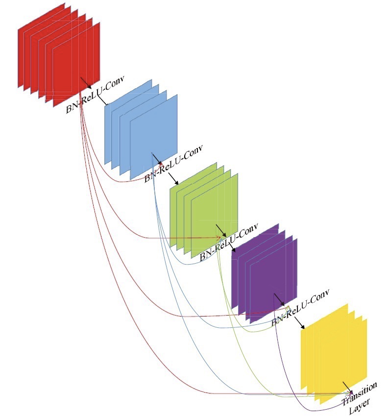

`VGG`系列网络，如果有 $L$层，则就会有 $L$个连接，而在 `DenseNet`网络中，有 $L$层，则会有 $\frac{L(L+1)}{2}$ 个连接，**即每一层的输入来自该层前面所有层的输出叠加。**

`DenseNet`系列网络中的`Dense Block` 中每个卷积层输出的`feature map`的数量都很小，而不是像其他网络那样几百上千的数量，`Dense Block` 输出的 `feature map` 数量一般在 $100$以下。

`DenseNet` 中每个层都直接和损失函数的梯度和原始输入信息相连接，这样可以更好地提升网络的性能。论文中还提到`Dense Connection`具有正则化的效果，所以对过拟合有一定的抑制作用，理由是`DenseNet`的参数量相比之前的网络大大减少，所以会类似正则化的作用，减轻过拟合现象。

论文中给出的带有三个`Dense Block` 的`DenseNet` 结构图如下图所示，其中 **pooling**层减少了特征的尺寸。同时，每个 **Block**都需要维度上对其

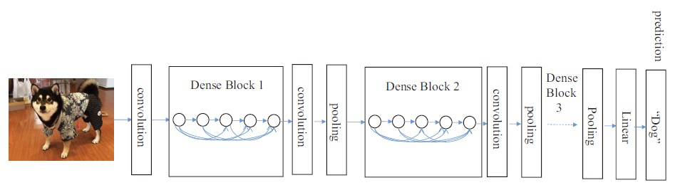

其中 $x_{l}$是需要将 $x_{0}, x_{1},…x_{l-1}$的特征中进行通道 concatenation，就是在通道那一个维度进行合并处理。
$$
x_l = H_l([x_{0}, x_{1}, ...,x_{l-1}])
$$
`DenseNet` 具有比传统卷积网络更少的参数，因为它不需要重新学习多余的`feature map`。传统的前馈神经网络可以视作在层与层之间传递状态的 算法，每一层接收前一层的状态，然后将新的状态传递给下一层。这会改变状态，但是也传递了需要保留的信息。`ResNet`通过恒等映射来直接传递 需要保留的信息，因此层之间只需要传递状态的变化。`DenseNet` 会将所有层的状态全部保存到集体知识中，同时每一层增加很少数量的`feature map` 到网络的集中知识中。

### 网络细节

从上图我们可以知道，**DenseNet**主要是由**DenseBlock**，**BottleNeck**与**Transition**层组成。

其中**DenseBlock**长下面这样：

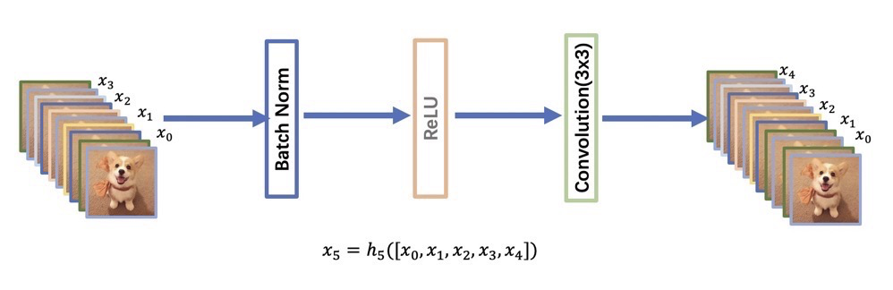

在DenseBlock中，各个层的特征图大小一致，可以在channel维度上连接。DenseBlock中的非线性组合函数 $H(\cdot)$采用的是**BN+ReLU+3x3 Conv**的结构，所有DenseBlock中各个层卷积之后均输出 $k$ 个特征图，即得到的特征图的channel数为 $k$，或者说采用 $k$ 个卷积核。 其中，$k$ 在DenseNet称为growth rate，这是一个超参数。一般情况下使用较小的$k$（比如12），就可以得到较佳的性能。假定输入层的特征图的channel数为 $k_{0}$ ，那么 $l$层的channel为 $k_0 + k(l-1)$

因为随着**DenseNet**不断加深，后面的输入层就是变得很大，在**DenseNet**中，我们使用了**BottleNeck**来减少计算量，其中主要就是加入了**1 x 1**卷积。如即**BN+ReLU+1x1 Conv+BN+ReLU+3x3 Conv**，称为DenseNet-B结构。其中1x1 Conv得到 $4k$个特征图它起到的作用是降低特征数量，从而提升计算效率。

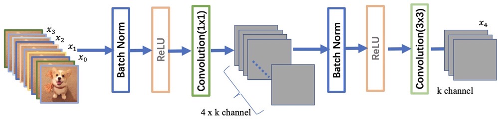

对于**Transition**层，它主要是连接两个相邻的DenseBlock，并且降低特征图大小。Transition层包括一个1x1的卷积和2x2的AvgPooling，结构为**BN+ReLU+1x1 Conv+2x2 AvgPooling**。另外，Transition层可以起到压缩模型的作用。假定Transition的上接DenseBlock得到的特征图channels数为 $m$，Transition层可以产生  $\lfloor\theta m\rfloor$个特征（通过卷积层），其中 $\theta \in(0,1]$ 是压缩系数（compression rate）。当 $\theta=1$ 时，特征个数经过Transition层没有变化，即无压缩，而当压缩系数小于1时，这种结构称为**DenseNet-C**，文中使用 $\theta=0.5$ 。对于使用 bottleneck层的DenseBlock结构和压缩系数小于1的Transition组合结构称为**DenseNet-BC**。

### 代码

```python
class _DenseLayer(nn.Sequential):
      def __init__(self, num_input_features, growth_rate, bn_size, drop_rate):
            super(_DenseLayer, self).__init__()
            self.add_module("norm1", nn.BatchNorm2d(num_input_features))
            self.add_module("relu1", nn.ReLU(inplace=True))
            self.add_module("conv1", nn.Conv2d(num_input_features, bn_size*growth_rate,
                                               kernel_size=1, stride=1, bias=False))
            self.add_module("norm2", nn.BatchNorm2d(bn_size*growth_rate))
            self.add_module("relu2", nn.ReLU(inplace=True))
            self.add_module("conv2", nn.Conv2d(bn_size*growth_rate, growth_rate,
                                               kernel_size=3, stride=1, padding=1, bias=False))
            self.drop_rate = drop_rate
     def forward(self, x):
        new_features = super(_DenseLayer, self).forward(x)
        if self.drop_rate > 0:
            new_features = F.dropout(new_features, p=self.drop_rate, training=self.training)
        return torch.cat([x, new_features], 1)
```

再实现`DenseBlock`模块，内部是密集连接方式（输入特征数线性增长）：

```python
class _DenseBlock(nn.Sequential):
    """DenseBlock"""
    def __init__(self, num_layers, num_input_features, bn_size, growth_rate, drop_rate):
        super(_DenseBlock, self).__init__()
        for i in range(num_layers):
            layer = _DenseLayer(num_input_features+i*growth_rate, growth_rate, bn_size,
                                drop_rate)
            self.add_module("denselayer%d" % (i+1,), layer)
```

此外，我们实现`Transition`层，它主要是一个卷积层和一个池化层：

```python
class _Transition(nn.Sequential):
    """Transition layer between two adjacent DenseBlock"""
    def __init__(self, num_input_feature, num_output_features):
        super(_Transition, self).__init__()
        self.add_module("norm", nn.BatchNorm2d(num_input_feature))
        self.add_module("relu", nn.ReLU(inplace=True))
        self.add_module("conv", nn.Conv2d(num_input_feature, num_output_features,
                                          kernel_size=1, stride=1, bias=False))
        self.add_module("pool", nn.AvgPool2d(2, stride=2))
```

最后，整个`DenseNet`网络代码：

```python
class DenseNet(nn.Module):
    "DenseNet-BC model"
    def __init__(self, growth_rate=32, block_config=(6, 12, 24, 16), num_init_features=64,
                 bn_size=4, compression_rate=0.5, drop_rate=0, num_classes=1000):
        """
        :param growth_rate: (int) number of filters used in DenseLayer, `k` in the paper
        :param block_config: (list of 4 ints) number of layers in each DenseBlock
        :param num_init_features: (int) number of filters in the first Conv2d
        :param bn_size: (int) the factor using in the bottleneck layer
        :param compression_rate: (float) the compression rate used in Transition Layer
        :param drop_rate: (float) the drop rate after each DenseLayer
        :param num_classes: (int) number of classes for classification
        """
        super(DenseNet, self).__init__()
        # first Conv2d
        self.features = nn.Sequential(OrderedDict([
            ("conv0", nn.Conv2d(3, num_init_features, kernel_size=7, stride=2, padding=3, bias=False)),
            ("norm0", nn.BatchNorm2d(num_init_features)),
            ("relu0", nn.ReLU(inplace=True)),
            ("pool0", nn.MaxPool2d(3, stride=2, padding=1))
        ]))
 
        # DenseBlock
        num_features = num_init_features
        for i, num_layers in enumerate(block_config):
            block = _DenseBlock(num_layers, num_features, bn_size, growth_rate, drop_rate)
            self.features.add_module("denseblock%d" % (i + 1), block)
            num_features += num_layers*growth_rate
            if i != len(block_config) - 1:
                transition = _Transition(num_features, int(num_features*compression_rate))
                self.features.add_module("transition%d" % (i + 1), transition)
                num_features = int(num_features * compression_rate)
 
        # final bn+ReLU
        self.features.add_module("norm5", nn.BatchNorm2d(num_features))
        self.features.add_module("relu5", nn.ReLU(inplace=True))
 
        # classification layer
        self.classifier = nn.Linear(num_features, num_classes)
 
        # params initialization
        for m in self.modules():
            if isinstance(m, nn.Conv2d):
                nn.init.kaiming_normal_(m.weight)
            elif isinstance(m, nn.BatchNorm2d):
                nn.init.constant_(m.bias, 0)
                nn.init.constant_(m.weight, 1)
            elif isinstance(m, nn.Linear):
                nn.init.constant_(m.bias, 0)
 
    def forward(self, x):
        features = self.features(x)
        out = F.avg_pool2d(features, 7, stride=1).view(features.size(0), -1)
        out = self.classifier(out)
        return out
```

## L1与L2正则

正则化( $Regularization$) 是机器学习中**对原始损失函数引入惩罚项**，以防止过拟合或提高模型泛化性能的一类方法的统称。所谓惩罚是指对损失函数中的某些参数做一些限制。此时目标函数变成了**原始损失函数+惩罚项**，常用的正则项一般有两种，英文称作       $l_{1}−norm$和 $l_{2}−norm$，中文称作 $L1$正则化和 $L2$正则化，或者 $L1$范数和 $L2$范数（实际是 $L2$范数的平方）。

对于线性回归模型，使用$L1$正则化的模型叫做 $Lasso$回归，使用 $L2$正则化的模型叫做 $Ridge$回归（岭回归）。

### L1正则化

假设带有 $L1$正则化的目标函数为：  $$J=J_0 + ||W||_1 = J_0 + \alpha\sum|w|\ \ \ \ \ \ \ \ \ (1)$$

其中， $J_0$为原始的损失函数， $\alpha \sum |w|$为L1正则化项， $\alpha$为正则化系数， $w$ 表示特征的系数（x的参数），可以看到正则化项是对系数做了限制。L1正则化是指权值向量$w$中各个元素的绝对值之和，通常表示为$||w||_1$

 $L1$范数**符合拉普拉斯分布**，**是不完全可微的**。表现在图像上会有很多角出现。这些角和目标函数的接触机会远大于其他部分。就会**造成最优值出现在坐标轴上**，因此就会**导致某一维的权重为 $0$** ，产生**稀疏权重矩阵**，进而防止过拟合。

 $L1$正则化项相当于对原始损失函数 $J_0$做了一个约束。我们令 $L = \alpha\sum|w|$，那么整个目标函数可以写成：  $$ J= J_0 + L \ \ \ \ \ (2) $$

我们的目的就是求出在约束条件 $L$下，$J_0$取最小值的解。为了方便理解，我们考虑二维的情况，此时 $L = |w_1| + |w_2|$

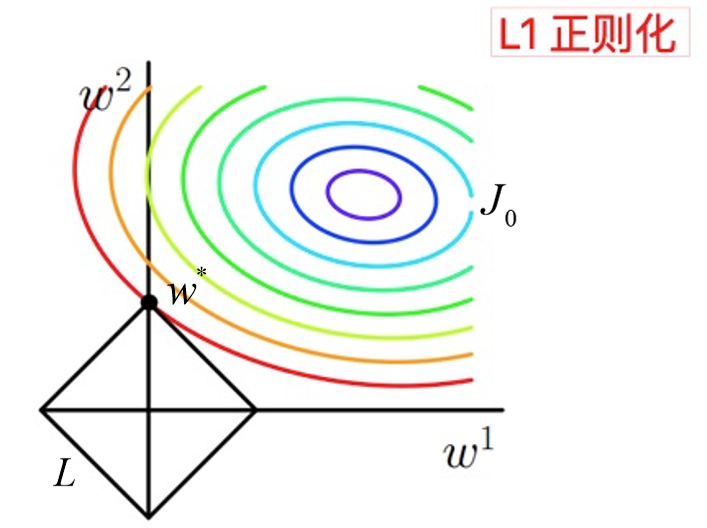

图中等高线是  $J_0$ 的等高线，黑色菱形是  $L$ 函数的图形。图中当等高线  $J_0$ 与  $L$ 图形首次相交的地方就是最优解。上图中  $J_0$ 与   $L$ 在一个顶点处相交，这个顶点就是最优解  $w^∗$。

**拓展到多维**， $L$ 函数就会有很多突出的角（二维情况下四个，多维情况下更多）， $J_0$ 与这些角接触的概率远大于与  $L$ 其它部位接触的概率（这是很直觉的想象，突出的角比直线的边离等值线更近），而在这些角的位置上使很多权重为`0`。所以在最优解处， $L1$正则化就可以产生稀疏模型，进而可以用于特征选择。

 **$\alpha$正则化系数，可以控制  $L$ 图形的大小， $\alpha$越小， $L$ 图形越大， $\alpha$越大， $L$ 图形越小。**

**$L1$正则化对所有参数的惩罚力度都一样，可以让一部分权重变为 $0$，去除某些特征（权重为0则等效于去除），因此产生稀疏模型。**

**那么稀疏模型有什么好处呢？**

稀疏化正则化项一个最重要的优势就在于 **实现特征的自动选择**。所谓稀疏性，说白了就是模型的很多参数是0。通常机器学习中特征数量很多，例如文本处理时，如果将一个词组 （$term$）作为一个特征，那么特征数量会达到上万个 （$bigram$）。但是只有少数特征对该模型有贡献，绝大部分特征是没有贡献的。

在最小化目标函数时，需要考虑这些额外的特征，虽然能获得更小的训练误差，但在预测阶段，模型会考虑这些无用的特征，从而可能干扰模型的正确预测。有过拟合的嫌疑。如果通过稀疏化正则化项得到一个稀疏模型，很多参数是 $0$，此时我们就可以只关注系数是非零值的特征。这相当于 **对模型进行了一次特征选择，只留下一些比较重要的特征**，提高模型的泛化能力，降低过拟合的可能。这就是稀疏模型与特征选择的关系。

### L2正则化

假设带有$L2$正则化的目标函数为： $$ J = J_0 + ||w||^2_2 = J_0+\alpha \sum w^2 \ \ \ \ \ \ \ \ \ (3) $$ 同$L1$正则化，$w$ 表示特征的系数（$x$的参数），可以看到正则化项是对系数做了限制。$L2$正则化是指权值向量$w$中各个元素的平方和然后再求平方根（可以看到$Ridge$回归的$L2$正则化项有平方符号），通常表示为$||w||_2$

$L2$范数**符合高斯分布，是完全可微的**。和$L1$相比，图像上为一个⚪。一般最优值不会在坐标轴上出现。在最小化正则项时，参数不断趋向于$0$，但并不是$0$。

相比于$L1$正则化，$L2$正则化的函数 $L$ 与 $J_0$ 第一次相交的地方出现在具有稀疏性的位置的概率就变得非常小了。这就从直观上来解释了为什么$L1$正则化能产生稀疏性，而$L2$正则化不能产生稀疏性的原因了。

$L2$正则化的作用：主要是**为了防止过拟合**。

拟合过程中通常都倾向于让权值尽可能小，**最后构造一个所有参数都比较小的模型**。因为一般认为参**数值小的模型比较简单，泛化能力强，**能适应不同的数据集，也在一定程度上避免了过拟合现象。可以设想一下对于一个线性回归方程，若参数很大，那么只要数据偏移一点点，就会对结果造成很大的影响；但如果参数足够小，数据偏移得多一点也不会对结果造成什么影响，专业一点的说法是抗扰动能力强。

越是复杂的模型，越是尝试对所有样本进行拟合，包括异常点。这就会造成在较小的区间中产生较大的波动，这个较大的波动也会反映在这个区间的导数比较大。只有越大的参数才可能产生较大的导数。因此参数越小，模型就越简单。

**为什么$L2$正则化能够得到值很小的参数？？？**

我们通过线性回归，来看一下$L2$正则化解决过拟合问题。

假设要求解的参数为$\theta$，$h_{\theta}(x)$ 是假设函数。线性回归一般使用平方差损失函数。单个样本的平方差是$h_{\theta}(x) - y)^2$，如果考虑所有样本，损失函数是对每个样本的平方差求和，假设有 $m$ 个样本，线性回归的损失函数如下， $$ J(\theta) = \frac{1}{2m} \sum^m_{i=1} (h_{\theta}(x^{(i)}) - y^{(i)})^2 \ \ \ \ \ \ \ \ (4) $$

其梯度下降算法公式为： $$ \theta_j = \theta_j - \alpha \frac{1}{m}[\sum_{i=1}^m(h_{\theta}(x^{(i)}-y^{(i)})x_j^{(i)}] \ \ \ \ \ \ \ \ (5) $$

加入$L2$正则化后，其损失函数为 $$ J(\theta) = \frac{1}{2}\sum^m_{i=1}[(h_{\theta}(x^{(i)}) - y^{(i)})^2 + \lambda\sum^m_{i=1}\theta_j^2] \ \ \ \ \ \ \ \ (6) $$ 其梯度下降算法公式为： $$ \theta_j = \theta_j - (\alpha \frac{1}{m}[\sum_{i=1}^m(h_{\theta}(x^{(i)}-y^{(i)})x_j^{(i)}] + \lambda \theta_j)=\theta_j(1-\alpha\frac{\lambda}{m}) - (\alpha \frac{1}{m}\sum_{i=1}^m(h_{\theta}(x^{(i)}-y^{(i)})x_j^{(i)}) \ \ \ \ \ \ \ \ (7) $$ 可以看到，由于学习率 $\alpha > 0, \lambda >0$，且这两个值一般都是很小的正数，所以 $0< 1-\alpha\frac{\lambda}{m} < 1$，所以每次 $\theta$ 在更新的时候都会减小，$\lambda$ 越大，衰减的越快，这也是L2正则化可以获得更小的权重值的原因。

正如在线性回归中的应用，$L2$正则化就是在损失函数中加入一个$L2$范数和一个超参数$\lambda$，$L2$范数用 $||w||^2$ 这种符号表示，它的意思是对于向量 $w$ 中的各个数先求平方再加和。线性回归中加入的对于 $\theta_j$ 求平方和就是一个L2范数。超参数$\lambda$ 则用于控制参数惩罚的程度。

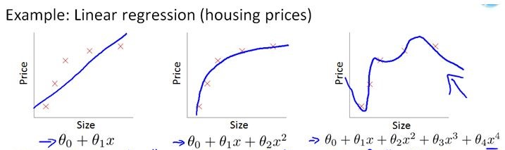

将上述公式分为两部分，左边部分即为原始的损失函数，右边部分为$L2$正则化项（注意：正则化项中不包含$\theta_0$）。$\lambda$ 为超参数，是人为设定的。为了最小化整个损失函数，那么就要减小 $\theta_1$ ~ $\theta_n$ 的值。对于上图中的那种过拟合状态，加入正则项后，$\theta_1$ ~ $\theta_n$减小，也就是使得权重衰减，这样就会降低高阶项对于整个函数的影响，使得估计函数变得比较平滑。

可以想象一种极端的情况，如果$\lambda$ 为无穷大，那么 $\theta_1$ ~ $\theta_n$ 趋近于0，那么整个式子就只剩一个$\theta_0$，为一条和y轴垂直的直线，这种状态为严重的欠拟合状态。可以看到，当$\lambda$为0时，即为原来的状态，此时过拟合。所以会有一个恰当的$\lambda$使得模型处于既不过拟合又不欠拟合的状态。

在未加入$L2$正则化发生过拟合时，拟合函数需要顾忌每一个点，最终形成的拟合函数波动很大，在某些很小的区间里，函数值的变化很剧烈，也就是某些 $w$ 值非常大。为此，$L2$ 正则化的加入惩罚了权重变大的趋势,逼迫所有 $w$ 尽可能趋向零但不为零（$L2$正则化的导数趋于零），导致权重较为平滑。

### 直观理解为什么$L1$正则更稀疏，$L2$正则权重接近于0.

假设只有一个参数为$w$，损失函数为$L(w)$，分别加上$L1$正则项和$L2$正则项后有：

$$ J_{L1}(w)=L(w) +\lambda|w| \\ J_{L2}(w)=L(w)+\lambda w^{2} $$ 这里，假设$L(w)$在0处的导数值为$d_{0}$，即： $$ \left.\frac{\partial L(w)}{\partial w}\right|*{w=0}=d*{0} $$ 这时，可以推导使用$L1$正则和$L2$正则时的导数。

当引入$L2$正则项，在$0$处的导数：$\left.\frac{\partial J_{L 2}(w)}{\partial w}\right|*{w=0}=d*{0}+2 \times \lambda \times w=d_{0}$

引入$L1$正则项，在$0$处的导数： $$ \begin{array}{l} \left.\frac{\partial J_{L 1}(w)}{\partial w}\right|*{w=0^{-}}=d*{0}-\lambda \ \left.\frac{\partial J_{L 1}(w)}{\partial w}\right|*{w=0^{+}}=d*{0}+\lambda \end{array} $$ 可见，引入$L2$正则时，损失函数在0处的导数仍是$d_{0}$ ，无变化。

而引入$L1$正则后，损失函数在$0$处的导数有一个突变。从$d_{0}-\lambda$到$d_{0}+\lambda$。若$d_{0}-\lambda$与$d_{0}+\lambda$异号，则在$0$处会是一个极小值点。因此，优化时，很可能优化到该极小值点上，即$w=0$处。

当然，这里只解释了有一个参数的情况，如果有更多的参数，也是类似的。因此，用L1正则更容易产生稀疏解。

## add和concat

特征融合目前有两种常用的方式，一种是$add$操作，这种操作广泛运用于$ResNet$与$FPN$中。一种是$Concat$操作，这种操作最广泛的运用就是$UNet$，$DenseNet$等网络中。如下图所示：

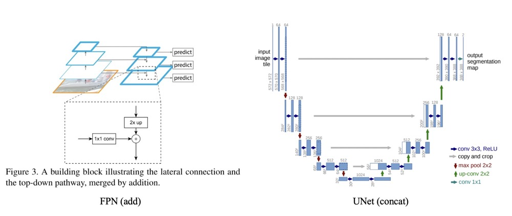

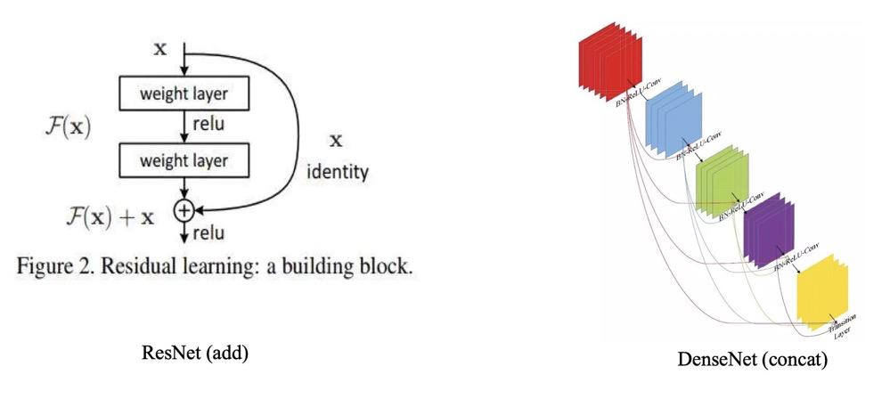

也有如 $HRNet$这样的，**多分辨率之间使用$add$形式**的特征融合。

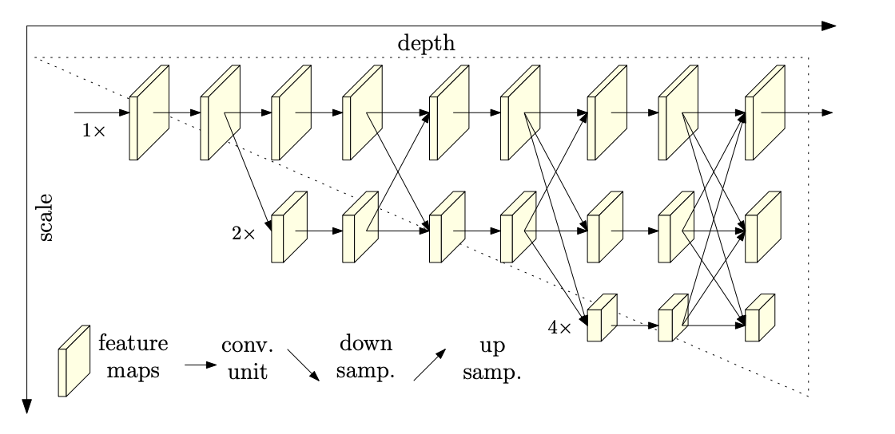

**【联系】**

add 和  $concat$ 形式都可以理解为**整合多路分支$feature$ map 的信息**，只不过 $concat$ 比较直观(**同时利用不同层的信息**)，而 $add$ 理解起来比较生涩(**为什么两个分支的信息可以相加？**)。$concat$ 操作时时将通道数增加，$add$ 是特征图相加，通道数不变。

对于两路通入而言，其大小($H, W$ )是一样的。假设两路输入的通道分别为$X_{1}, X_{2}, … X_{c}$， $Y_{1}, Y_{2},…Y_{n}$。**对于$Concat$的操作，通道数相同且后面带卷积的话，$add$等价于$concat$之后对应通道共享同一个卷积核。**

当我们需要聚合的两个分支的 $Feature$叫做 $X$与 $Y$的时候，我们可以使用 $Concat$, 概括为： $$ Z_{out}=\sum_{i=1}^{c} X_{i} * K_{i}+\sum_{i=1}^{c} Y_{i} * K_{i+c} $$

对于$add$的操纵，可以概括为： $$ Z_{\text {add }}=\sum_{i=1}^{c}\left(X_{i}+Y_{i}\right) * K_{i}=\sum_{i=1}^{c} X_{i} * K_{i}+\sum_{i=1}^{c} Y_{i} * K_{i} $$ 因此，采用$add$操作，我们相当于加入一种先验。当两个分支的特征信息比较相似，可以用$add$来代替$concat$，这样可以更节省参数量。

**【区别】**

- 对于$Concat$操作而言，通道数的合并，也就是说描述图像本身的特征增加了，而每一特征下的信息是没有增加。
- 对于$add$层更像是信息之间的叠加。这里有个先验，$add$前后的$tensor$语义是相似的。

## 简单阐述一下BP的过程？

### 基本概念

BP(Back Propogation)算法是一种最有效的学习方法，主要特点是**信号前向传递，而误差后向传播**，通过不断调节网络权重值，使得网络的最终输出与期望输出尽可能接近，以达到训练的目的。前向过程中通过与正确标签计算损失，反向传递损失，更新参数，优化至最后的参数。


在这里，$w$的值就是我们需要更新的目标，但是我们只有一些$x$与跟它对应的真实$y=f(x)$的值，所以呢？我们需要使用这两个值来计算$w$的值了，整个问题就转变成了下面的优化问题了，也就是我们需要求函数的最小值。
$$
J{(\omega)} = \min_{\omega} \sum_{x} \|f_{w}{x}-y \|^2
$$
记为损失函数，目的是求得 $ \omega$使得 $ J{\omega}$最小。在实际中，这类问题有一个经典的方法叫做梯度下降法。意思是我们先使用一个随机生成的$w$，然后使用下面的公式不断更新$w$的值，最终逼近真实效果。
$$
\omega^+ = \omega - \eta *\frac{\partial J(\omega)}{\partial \omega}
$$


这里$w$ 是一个随机初始化的权重，$\frac{\partial J(\omega)}{\partial w}$是表示当前误差对权重$w$的梯度。$\eta$是表示的学习率，通常不会很大，都是0.01以下的值，用来控制更新的步长。

### 链式求导

若$y=g(x)$, $z=f(y)$,那么$z=h(x)$,其中 $h=f \circ g$。其中$\frac{d y}{d x}=g^{\prime}(x), \frac{d z}{d y}=f^{\prime}(y)$。

当我们需要求$z$对$x$的导数$\frac{d z}{d x}$就需要使用链式求导了。根据我们之前学过的知识：
$$
\dot h =  \frac{\partial z}{\partial x} = \frac{\partial z}{\partial y} * \frac{\partial y}{\partial x}
$$
这里说的都还是以单变量作为例子，实际中，多维变量就是变成了求偏导数了。
