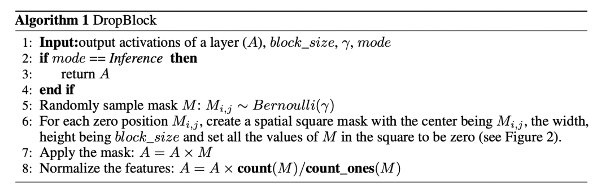

# 深度学习基础

## CNN

- 局部连接：不是全连接，而是使用size相对input小的kernel在局部感受视野内进行连接（点积运算）
- 权值共享：在一个卷积核运算中，每次都运算一个感受视野，通过滑动遍历的把整个输入都卷积完成，而不是每移动一次就更换卷积核参数

两者目的都是减少参数。通过局部感受视野，通过卷积操作获取高阶特征，能达到比较好的效果。

### **计算方式**

如下图：

卷积（卷积核与感受视野的点积）与池化示意图：


- **池化的意义**

  1.特征不变形：池化操作是模型更加关注是否存在某些特征而不是特征具体的位置。

　　2.特征降维：池化相当于在空间范围内做了维度约减，从而使模型可以抽取更加广范围的特征。同时减小了下一层的输入大小，进而减少计算量和参数个数。

　　3.在一定程度上防止过拟合，更方便优化。

- **卷积、池化后图像大小计算**
  $$
  out(N_{i}, C_{out_{j}}) = bias(C_{out_{j}}) + \sum_{k=0}^{C_{in}-1}weight(C_{out_{j}}, K) * input(N_{i}, K)
  $$
  $ input(N, C_{in}, H_{in}, W_{in})$

  $ output(N, C_{out}, H_{out}, W_{out}) $

  
  $$
  H_{out} = [\frac{H_{in}+2\times padding[0]-dilation[0]\times(kernel_size[0]-1)}{stride[0]} + 1 ]\\
  W_{out} = [\frac{W_{in} + 2 \times padding[0]-dilation[1]\times(kernel_size[1]-1)}{stride[1]}+1]
  $$

- **感受野计算**


### 	Conv与BN的融合过程

卷积层的计算公式为 $Y=WX + B$,假设batchnorm的均值与方差分别的 是$\mu$和  σ2。线性变换的参数为 $\gamma$和 $\beta$。求合并后的卷积操作中的 $W_{merged}$和 $B_{merged}$。

**卷积计算公式**
$$
Y=WX + B\\
$$


**BN计算公式**
$$
\eta = \frac{1}{m} \sum_{i=1}^{m} x_{i} \\
\delta^2 = \frac{1}{m} \sum_{i=1}^{m}(x_{i}-\eta)^2\\
x_{i} = \frac{x_{i}-\eta}{\sqrt{\delta^2+\epsilon}}\\
y_{i} = \gamma * x_{i} + \beta \\
$$

$$

$$

**推出：**
$$
Y = \gamma* \frac {(W*X+B)-\eta}{\sqrt{\delta^2+\epsilon}} + \beta
$$
**合并得：**
$$
Y = \frac{\gamma * W}{\sqrt{\delta^2 + \epsilon}} *X + \frac{\gamma*(B-\eta)}{\sqrt{\delta^2+\epsilon}} + \beta
$$

$$
\alpha = \frac{\gamma}{\sqrt{\delta^2 + \epsilon}} \\
W_{merged} = W*\alpha\\
B_{merage} = (B-\eta)*\alpha + \beta
$$


## 1*1卷积

最早出现在Network in Network， 两点贡献：

- MLpconv，即引入1*1卷积

传统的CNN的一层卷积相当于一个线性操作，如下图 a，所以只提取了线性特征，隐含了假设特征是线性可分的，实际却并非如此，NIN 中引入 下图 b 中的 mlpconv layer，实质是像素级的全连接层，等价于 1x1 卷积，在其后跟 ReLU激活函数，引入更多的非线性元素。

- 将分类的全连接层用global average pooling代替。

全连接容易产生过拟合，减弱了网络的泛化能力。


此后GoogLeNet的Inception结构中延用了1*1卷积，如下图


### 1*1卷积的作用

1. 减低维度或上升维度

   在网络中增加1*1卷积，使得网络更深，**通过在3×3或5×5卷积前，用1×1卷积降低维度，没有增加权重参数的负担**。

2. 跨通道信息交互（cross-channel correlations and spatial correlations）

   1x1卷积核，从图像处理的角度，乍一看也没有意义，在网络中，**这样的降维和升维的操作其实是 channel 间信息的线性组合变化。**

   **补充：**cross-channel correlation 和 spatial correlation的学习可以进行解耦。1x1的卷积相当于学习了feature maps之间的cross-channel correlation。实验证明了这种解耦可以在不损害模型表达能力的情况下大大减少参数数量和计算量。**但是需要注意的是，1x1 的卷积层后面加上一个 normal 的卷积层，这种解耦合并不彻底，正常卷积层仍然存在对部分的 cross-channel correlation 的学习。**之后就有了 depth-wise seperable convolution(后面记录 MobileNet 后，在这添加链接)。在 depth-wise seperable convolution中，1x1 的卷积层是将每一个 channel 分为一组，那么就不存在对cross-channel correlation的学习了，就实现了对cross-channel correlation和spatial correlation的彻底解耦合。这种完全解耦的方式虽然可以大大降低参数数量和计算量，但是正如在 mobile net 中所看到的，性能会受到很大的损失。

3. 增加非线性特性

   1x1卷积核，可以在保持 feature maps size不变的（即不损失分辨率）的前提下大幅增加非线性特性（**利用后接的非线性激活函数**）。

**总结**
1x1 卷积在图像处理的角度，乍一看好像没什么意义，但在 CNN 网络中，能实现降维，减少 weights 参数数量，能够实现升维，来拓宽 feature maps，在不改变 feature maps 的 size 的前提下，实现各通道之间的线性组合，实际上是通道像素之间的线性组合，后接非线性的激活函数，增加更多样的非线性特征。这就是为什么 GoogLeNet 用 1x1 卷积来降维，减少了计算量，但模型效果却没有降低，此外网络深度更深。可以说 1x1 卷积很 nice.

## CV中的Attention

#### Non-local Attention


#### CBAM

CBAM由Channel Attention和Spatial Attention组合而成。


其中**Channel Attention，主要是从$C×W×W$的维度，学习到一个$C×1×1$的权重矩阵。**

论文原图如下：


```python
class ChannelAttentionModule(nn.Module):
    def __init__(self, channel, reduction=16):
        super(ChannelAttentionModule, self).__init__()
        mid_channel = channel // reduction
        self.avg_pool = nn.AdaptiveAvgPool2d(1)
        self.max_pool = nn.AdaptiveMaxPool2d(1)
		
        # 共享MLP权重
        self.shared_MLP = nn.Sequential(
            nn.Linear(in_features=channel, out_features=mid_channel),
            nn.ReLU(inplace=True),
            nn.Linear(in_features=mid_channel, out_features=channel)
        )
        self.sigmoid = nn.Sigmoid()

    def forward(self, x):
        avgout = self.shared_MLP(self.avg_pool(x).view(x.size(0),-1)).unsqueeze(2).unsqueeze(3)
        maxout = self.shared_MLP(self.max_pool(x).view(x.size(0),-1)).unsqueeze(2).unsqueeze(3)
        return self.sigmoid(avgout + maxout)
```

对于$Spatial$ $Attention$，如图所示：


参考代码如下

```python
class SpatialAttentionModule(nn.Module):
    def __init__(self):
        super(SpatialAttentionModule, self).__init__()
        self.conv2d = nn.Conv2d(in_channels=2, out_channels=1, kernel_size=7, stride=1, padding=3)
        self.sigmoid = nn.Sigmoid()

    def forward(self, x):
        avgout = torch.mean(x, dim=1, keepdim=True)
        maxout, _ = torch.max(x, dim=1, keepdim=True)
        out = torch.cat([avgout, maxout], dim=1)
        out = self.sigmoid(self.conv2d(out))
        return out
```

#### cgnl

论文分析了下如$Spatial$ $Attention$与$Channel$ $Attention$均不能很好的描述特征之间的关系，这里比较极端得生成了N * 1 * 1 * 1的$MASK$.


Attention 代码：

```python
def kernel(self, t, p, g, b, c, h, w):
        """The linear kernel (dot production).
        Args:
            t: output of conv theata
            p: output of conv phi
            g: output of conv g
            b: batch size
            c: channels number
            h: height of featuremaps
            w: width of featuremaps
        """
        t = t.view(b, 1, c * h * w)
        p = p.view(b, 1, c * h * w)
        g = g.view(b, c * h * w, 1)

        att = torch.bmm(p, g)

        if self.use_scale:
            att = att.div((c*h*w)**0.5)

        x = torch.bmm(att, t)
        x = x.view(b, c, h, w)

        return x
```

### Cross-layer non-local

论文中分析了，同样的层之间进行 $Attention$计算，感受野重复，会造成冗余，如左边的部分图，而右边的图表示不同层间的感受野不同，计算全局 $Attention$也会关注到更多的区域。


这里采用跨层之间的 $Attention$生成。


代码

```python
# query : N, C1, H1, W1
# key: N, C2, H2, W2
# value: N, C2, H2, W2
# 首先，需要使用1 x 1 卷积，使得通道数相同
q = query_conv(query) # N, C, H1, W1
k = key_conv(key) # N, C, H2, W2
v = value_conv(value) # N, C, H2, W2
att = nn.softmax(torch.bmm(q.view(N, C, H1*W1).permute(0, 1, 2), k.view(N, C, H2 * W2))) # (N, H1*W1, H2*W2)
out = att * value.view(N, C2, H2*W2).permute(0, 1, 2) #(N, H1 * W1, C)
out = out.view(N, C1, H1, W1)
```

## DenseNet

### 简介

之前的网络都是通过加深（比如`ResNet`，解决梯度消失），或加宽（GooleNet的Inception）网络，DenseNet从 `feature`入手，通过对 `feature`的的极致利用达到更好的效果和更少的参数.

DenseNet由以下**优点**：

- **采用密集链接方式**，DenseNet提升了梯度的反向传播，使得网络容易训练。
- **参数更小且计算高效**，通过concat特征来实现短路连接，实现了特征重用，并且采用较小的growth rate，每个层所独有的特征图是比较小的；
- **由于特征复用，最后的分类器使用了低级特征。**

为了解决随着网络深度的增加，网络梯度消失的问题，在`ResNet`网络 之后，科研界把研究重心放在通过更有效的跳跃连接的方法上。`DenseNet`系列网络延续这个思路，并做到了一个极致，就是直接将所有层都连接起来。`DenseNet`层连接方法示意图如图所示。


`VGG`系列网络，如果有 $L$层，则就会有 $L$个连接，而在 `DenseNet`网络中，有 $L$层，则会有 $\frac{L(L+1)}{2}$ 个连接，**即每一层的输入来自该层前面所有层的输出叠加。**

`DenseNet`系列网络中的`Dense Block` 中每个卷积层输出的`feature map`的数量都很小，而不是像其他网络那样几百上千的数量，`Dense Block` 输出的 `feature map` 数量一般在 $100$以下。

`DenseNet` 中每个层都直接和损失函数的梯度和原始输入信息相连接，这样可以更好地提升网络的性能。论文中还提到`Dense Connection`具有正则化的效果，所以对过拟合有一定的抑制作用，理由是`DenseNet`的参数量相比之前的网络大大减少，所以会类似正则化的作用，减轻过拟合现象。

论文中给出的带有三个`Dense Block` 的`DenseNet` 结构图如下图所示，其中 **pooling**层减少了特征的尺寸。同时，每个 **Block**都需要维度上对其


其中 $x_{l}$是需要将 $x_{0}, x_{1},…x_{l-1}$的特征中进行通道 concatenation，就是在通道那一个维度进行合并处理。
$$
x_l = H_l([x_{0}, x_{1}, ...,x_{l-1}])
$$
`DenseNet` 具有比传统卷积网络更少的参数，因为它不需要重新学习多余的`feature map`。传统的前馈神经网络可以视作在层与层之间传递状态的 算法，每一层接收前一层的状态，然后将新的状态传递给下一层。这会改变状态，但是也传递了需要保留的信息。`ResNet`通过恒等映射来直接传递 需要保留的信息，因此层之间只需要传递状态的变化。`DenseNet` 会将所有层的状态全部保存到集体知识中，同时每一层增加很少数量的`feature map` 到网络的集中知识中。

### 网络细节

从上图我们可以知道，**DenseNet**主要是由**DenseBlock**，**BottleNeck**与**Transition**层组成。

其中**DenseBlock**长下面这样：


在DenseBlock中，各个层的特征图大小一致，可以在channel维度上连接。DenseBlock中的非线性组合函数 $H(\cdot)$采用的是**BN+ReLU+3x3 Conv**的结构，所有DenseBlock中各个层卷积之后均输出 $k$ 个特征图，即得到的特征图的channel数为 $k$，或者说采用 $k$ 个卷积核。 其中，$k$ 在DenseNet称为growth rate，这是一个超参数。一般情况下使用较小的$k$（比如12），就可以得到较佳的性能。假定输入层的特征图的channel数为 $k_{0}$ ，那么 $l$层的channel为 $k_0 + k(l-1)$

因为随着**DenseNet**不断加深，后面的输入层就是变得很大，在**DenseNet**中，我们使用了**BottleNeck**来减少计算量，其中主要就是加入了**1 x 1**卷积。如即**BN+ReLU+1x1 Conv+BN+ReLU+3x3 Conv**，称为DenseNet-B结构。其中1x1 Conv得到 $4k$个特征图它起到的作用是降低特征数量，从而提升计算效率。


对于**Transition**层，它主要是连接两个相邻的DenseBlock，并且降低特征图大小。Transition层包括一个1x1的卷积和2x2的AvgPooling，结构为**BN+ReLU+1x1 Conv+2x2 AvgPooling**。另外，Transition层可以起到压缩模型的作用。假定Transition的上接DenseBlock得到的特征图channels数为 $m$，Transition层可以产生  $\lfloor\theta m\rfloor$个特征（通过卷积层），其中 $\theta \in(0,1]$ 是压缩系数（compression rate）。当 $\theta=1$ 时，特征个数经过Transition层没有变化，即无压缩，而当压缩系数小于1时，这种结构称为**DenseNet-C**，文中使用 $\theta=0.5$ 。对于使用 bottleneck层的DenseBlock结构和压缩系数小于1的Transition组合结构称为**DenseNet-BC**。

### 代码

```python
class _DenseLayer(nn.Sequential):
      def __init__(self, num_input_features, growth_rate, bn_size, drop_rate):
            super(_DenseLayer, self).__init__()
            self.add_module("norm1", nn.BatchNorm2d(num_input_features))
            self.add_module("relu1", nn.ReLU(inplace=True))
            self.add_module("conv1", nn.Conv2d(num_input_features, bn_size*growth_rate,
                                               kernel_size=1, stride=1, bias=False))
            self.add_module("norm2", nn.BatchNorm2d(bn_size*growth_rate))
            self.add_module("relu2", nn.ReLU(inplace=True))
            self.add_module("conv2", nn.Conv2d(bn_size*growth_rate, growth_rate,
                                               kernel_size=3, stride=1, padding=1, bias=False))
            self.drop_rate = drop_rate
     def forward(self, x):
        new_features = super(_DenseLayer, self).forward(x)
        if self.drop_rate > 0:
            new_features = F.dropout(new_features, p=self.drop_rate, training=self.training)
        return torch.cat([x, new_features], 1)
```

再实现`DenseBlock`模块，内部是密集连接方式（输入特征数线性增长）：

```python
class _DenseBlock(nn.Sequential):
    """DenseBlock"""
    def __init__(self, num_layers, num_input_features, bn_size, growth_rate, drop_rate):
        super(_DenseBlock, self).__init__()
        for i in range(num_layers):
            layer = _DenseLayer(num_input_features+i*growth_rate, growth_rate, bn_size,
                                drop_rate)
            self.add_module("denselayer%d" % (i+1,), layer)
```

此外，我们实现`Transition`层，它主要是一个卷积层和一个池化层：

```python
class _Transition(nn.Sequential):
    """Transition layer between two adjacent DenseBlock"""
    def __init__(self, num_input_feature, num_output_features):
        super(_Transition, self).__init__()
        self.add_module("norm", nn.BatchNorm2d(num_input_feature))
        self.add_module("relu", nn.ReLU(inplace=True))
        self.add_module("conv", nn.Conv2d(num_input_feature, num_output_features,
                                          kernel_size=1, stride=1, bias=False))
        self.add_module("pool", nn.AvgPool2d(2, stride=2))
```

最后，整个`DenseNet`网络代码：

```python
class DenseNet(nn.Module):
    "DenseNet-BC model"
    def __init__(self, growth_rate=32, block_config=(6, 12, 24, 16), num_init_features=64,
                 bn_size=4, compression_rate=0.5, drop_rate=0, num_classes=1000):
        """
        :param growth_rate: (int) number of filters used in DenseLayer, `k` in the paper
        :param block_config: (list of 4 ints) number of layers in each DenseBlock
        :param num_init_features: (int) number of filters in the first Conv2d
        :param bn_size: (int) the factor using in the bottleneck layer
        :param compression_rate: (float) the compression rate used in Transition Layer
        :param drop_rate: (float) the drop rate after each DenseLayer
        :param num_classes: (int) number of classes for classification
        """
        super(DenseNet, self).__init__()
        # first Conv2d
        self.features = nn.Sequential(OrderedDict([
            ("conv0", nn.Conv2d(3, num_init_features, kernel_size=7, stride=2, padding=3, bias=False)),
            ("norm0", nn.BatchNorm2d(num_init_features)),
            ("relu0", nn.ReLU(inplace=True)),
            ("pool0", nn.MaxPool2d(3, stride=2, padding=1))
        ]))
 
        # DenseBlock
        num_features = num_init_features
        for i, num_layers in enumerate(block_config):
            block = _DenseBlock(num_layers, num_features, bn_size, growth_rate, drop_rate)
            self.features.add_module("denseblock%d" % (i + 1), block)
            num_features += num_layers*growth_rate
            if i != len(block_config) - 1:
                transition = _Transition(num_features, int(num_features*compression_rate))
                self.features.add_module("transition%d" % (i + 1), transition)
                num_features = int(num_features * compression_rate)
 
        # final bn+ReLU
        self.features.add_module("norm5", nn.BatchNorm2d(num_features))
        self.features.add_module("relu5", nn.ReLU(inplace=True))
 
        # classification layer
        self.classifier = nn.Linear(num_features, num_classes)
 
        # params initialization
        for m in self.modules():
            if isinstance(m, nn.Conv2d):
                nn.init.kaiming_normal_(m.weight)
            elif isinstance(m, nn.BatchNorm2d):
                nn.init.constant_(m.bias, 0)
                nn.init.constant_(m.weight, 1)
            elif isinstance(m, nn.Linear):
                nn.init.constant_(m.bias, 0)
 
    def forward(self, x):
        features = self.features(x)
        out = F.avg_pool2d(features, 7, stride=1).view(features.size(0), -1)
        out = self.classifier(out)
        return out
```

## L1与L2正则

正则化( $Regularization$) 是机器学习中**对原始损失函数引入惩罚项**，以防止过拟合或提高模型泛化性能的一类方法的统称。所谓惩罚是指对损失函数中的某些参数做一些限制。此时目标函数变成了**原始损失函数+惩罚项**，常用的正则项一般有两种，英文称作       $l_{1}−norm$和 $l_{2}−norm$，中文称作 $L1$正则化和 $L2$正则化，或者 $L1$范数和 $L2$范数（实际是 $L2$范数的平方）。

对于线性回归模型，使用$L1$正则化的模型叫做 $Lasso$回归，使用 $L2$正则化的模型叫做 $Ridge$回归（岭回归）。

### L1正则化

假设带有 $L1$正则化的目标函数为：  $$J=J_0 + ||W||_1 = J_0 + \alpha\sum|w|\ \ \ \ \ \ \ \ \ (1)$$

其中， $J_0$为原始的损失函数， $\alpha \sum |w|$为L1正则化项， $\alpha$为正则化系数， $w$ 表示特征的系数（x的参数），可以看到正则化项是对系数做了限制。L1正则化是指权值向量$w$中各个元素的绝对值之和，通常表示为$||w||_1$

 $L1$范数**符合拉普拉斯分布**，**是不完全可微的**。表现在图像上会有很多角出现。这些角和目标函数的接触机会远大于其他部分。就会**造成最优值出现在坐标轴上**，因此就会**导致某一维的权重为 $0$** ，产生**稀疏权重矩阵**，进而防止过拟合。

 $L1$正则化项相当于对原始损失函数 $J_0$做了一个约束。我们令 $L = \alpha\sum|w|$，那么整个目标函数可以写成：  $$ J= J_0 + L \ \ \ \ \ (2) $$

我们的目的就是求出在约束条件 $L$下，$J_0$取最小值的解。为了方便理解，我们考虑二维的情况，此时 $L = |w_1| + |w_2|$


图中等高线是  $J_0$ 的等高线，黑色菱形是  $L$ 函数的图形。图中当等高线  $J_0$ 与  $L$ 图形首次相交的地方就是最优解。上图中  $J_0$ 与   $L$ 在一个顶点处相交，这个顶点就是最优解  $w^∗$。

**拓展到多维**， $L$ 函数就会有很多突出的角（二维情况下四个，多维情况下更多）， $J_0$ 与这些角接触的概率远大于与  $L$ 其它部位接触的概率（这是很直觉的想象，突出的角比直线的边离等值线更近），而在这些角的位置上使很多权重为`0`。所以在最优解处， $L1$正则化就可以产生稀疏模型，进而可以用于特征选择。

 **$\alpha$正则化系数，可以控制  $L$ 图形的大小， $\alpha$越小， $L$ 图形越大， $\alpha$越大， $L$ 图形越小。**

**$L1$正则化对所有参数的惩罚力度都一样，可以让一部分权重变为 $0$，去除某些特征（权重为0则等效于去除），因此产生稀疏模型。**

**那么稀疏模型有什么好处呢？**

稀疏化正则化项一个最重要的优势就在于 **实现特征的自动选择**。所谓稀疏性，说白了就是模型的很多参数是0。通常机器学习中特征数量很多，例如文本处理时，如果将一个词组 （$term$）作为一个特征，那么特征数量会达到上万个 （$bigram$）。但是只有少数特征对该模型有贡献，绝大部分特征是没有贡献的。

在最小化目标函数时，需要考虑这些额外的特征，虽然能获得更小的训练误差，但在预测阶段，模型会考虑这些无用的特征，从而可能干扰模型的正确预测。有过拟合的嫌疑。如果通过稀疏化正则化项得到一个稀疏模型，很多参数是 $0$，此时我们就可以只关注系数是非零值的特征。这相当于 **对模型进行了一次特征选择，只留下一些比较重要的特征**，提高模型的泛化能力，降低过拟合的可能。这就是稀疏模型与特征选择的关系。

### L2正则化

假设带有$L2$正则化的目标函数为： $$ J = J_0 + ||w||^2_2 = J_0+\alpha \sum w^2 \ \ \ \ \ \ \ \ \ (3) $$ 同$L1$正则化，$w$ 表示特征的系数（$x$的参数），可以看到正则化项是对系数做了限制。$L2$正则化是指权值向量$w$中各个元素的平方和然后再求平方根（可以看到$Ridge$回归的$L2$正则化项有平方符号），通常表示为$||w||_2$

$L2$范数**符合高斯分布，是完全可微的**。和$L1$相比，图像上为一个⚪。一般最优值不会在坐标轴上出现。在最小化正则项时，参数不断趋向于$0$，但并不是$0$。

相比于$L1$正则化，$L2$正则化的函数 $L$ 与 $J_0$ 第一次相交的地方出现在具有稀疏性的位置的概率就变得非常小了。这就从直观上来解释了为什么$L1$正则化能产生稀疏性，而$L2$正则化不能产生稀疏性的原因了。

$L2$正则化的作用：主要是**为了防止过拟合**。

拟合过程中通常都倾向于让权值尽可能小，**最后构造一个所有参数都比较小的模型**。因为一般认为参**数值小的模型比较简单，泛化能力强，**能适应不同的数据集，也在一定程度上避免了过拟合现象。可以设想一下对于一个线性回归方程，若参数很大，那么只要数据偏移一点点，就会对结果造成很大的影响；但如果参数足够小，数据偏移得多一点也不会对结果造成什么影响，专业一点的说法是抗扰动能力强。

越是复杂的模型，越是尝试对所有样本进行拟合，包括异常点。这就会造成在较小的区间中产生较大的波动，这个较大的波动也会反映在这个区间的导数比较大。只有越大的参数才可能产生较大的导数。因此参数越小，模型就越简单。

**为什么$L2$正则化能够得到值很小的参数？？？**

我们通过线性回归，来看一下$L2$正则化解决过拟合问题。

假设要求解的参数为$\theta$，$h_{\theta}(x)$ 是假设函数。线性回归一般使用平方差损失函数。单个样本的平方差是$h_{\theta}(x) - y)^2$，如果考虑所有样本，损失函数是对每个样本的平方差求和，假设有 $m$ 个样本，线性回归的损失函数如下， $$ J(\theta) = \frac{1}{2m} \sum^m_{i=1} (h_{\theta}(x^{(i)}) - y^{(i)})^2 \ \ \ \ \ \ \ \ (4) $$

其梯度下降算法公式为： $$ \theta_j = \theta_j - \alpha \frac{1}{m}[\sum_{i=1}^m(h_{\theta}(x^{(i)}-y^{(i)})x_j^{(i)}] \ \ \ \ \ \ \ \ (5) $$

加入$L2$正则化后，其损失函数为 $$ J(\theta) = \frac{1}{2}\sum^m_{i=1}[(h_{\theta}(x^{(i)}) - y^{(i)})^2 + \lambda\sum^m_{i=1}\theta_j^2] \ \ \ \ \ \ \ \ (6) $$ 其梯度下降算法公式为： $$ \theta_j = \theta_j - (\alpha \frac{1}{m}[\sum_{i=1}^m(h_{\theta}(x^{(i)}-y^{(i)})x_j^{(i)}] + \lambda \theta_j)=\theta_j(1-\alpha\frac{\lambda}{m}) - (\alpha \frac{1}{m}\sum_{i=1}^m(h_{\theta}(x^{(i)}-y^{(i)})x_j^{(i)}) \ \ \ \ \ \ \ \ (7) $$ 可以看到，由于学习率 $\alpha > 0, \lambda >0$，且这两个值一般都是很小的正数，所以 $0< 1-\alpha\frac{\lambda}{m} < 1$，所以每次 $\theta$ 在更新的时候都会减小，$\lambda$ 越大，衰减的越快，这也是L2正则化可以获得更小的权重值的原因。

正如在线性回归中的应用，$L2$正则化就是在损失函数中加入一个$L2$范数和一个超参数$\lambda$，$L2$范数用 $||w||^2$ 这种符号表示，它的意思是对于向量 $w$ 中的各个数先求平方再加和。线性回归中加入的对于 $\theta_j$ 求平方和就是一个L2范数。超参数$\lambda$ 则用于控制参数惩罚的程度。


将上述公式分为两部分，左边部分即为原始的损失函数，右边部分为$L2$正则化项（注意：正则化项中不包含$\theta_0$）。$\lambda$ 为超参数，是人为设定的。为了最小化整个损失函数，那么就要减小 $\theta_1$ ~ $\theta_n$ 的值。对于上图中的那种过拟合状态，加入正则项后，$\theta_1$ ~ $\theta_n$减小，也就是使得权重衰减，这样就会降低高阶项对于整个函数的影响，使得估计函数变得比较平滑。

可以想象一种极端的情况，如果$\lambda$ 为无穷大，那么 $\theta_1$ ~ $\theta_n$ 趋近于0，那么整个式子就只剩一个$\theta_0$，为一条和y轴垂直的直线，这种状态为严重的欠拟合状态。可以看到，当$\lambda$为0时，即为原来的状态，此时过拟合。所以会有一个恰当的$\lambda$使得模型处于既不过拟合又不欠拟合的状态。

在未加入$L2$正则化发生过拟合时，拟合函数需要顾忌每一个点，最终形成的拟合函数波动很大，在某些很小的区间里，函数值的变化很剧烈，也就是某些 $w$ 值非常大。为此，$L2$ 正则化的加入惩罚了权重变大的趋势,逼迫所有 $w$ 尽可能趋向零但不为零（$L2$正则化的导数趋于零），导致权重较为平滑。

### 直观理解为什么$L1$正则更稀疏，$L2$正则权重接近于0.

假设只有一个参数为$w$，损失函数为$L(w)$，分别加上$L1$正则项和$L2$正则项后有：

$$ J_{L1}(w)=L(w) +\lambda|w| \\ J_{L2}(w)=L(w)+\lambda w^{2} $$ 这里，假设$L(w)$在0处的导数值为$d_{0}$，即： $$ \left.\frac{\partial L(w)}{\partial w}\right|*{w=0}=d*{0} $$ 这时，可以推导使用$L1$正则和$L2$正则时的导数。

当引入$L2$正则项，在$0$处的导数：$\left.\frac{\partial J_{L 2}(w)}{\partial w}\right|*{w=0}=d*{0}+2 \times \lambda \times w=d_{0}$

引入$L1$正则项，在$0$处的导数： $$ \begin{array}{l} \left.\frac{\partial J_{L 1}(w)}{\partial w}\right|*{w=0^{-}}=d*{0}-\lambda \ \left.\frac{\partial J_{L 1}(w)}{\partial w}\right|*{w=0^{+}}=d*{0}+\lambda \end{array} $$ 可见，引入$L2$正则时，损失函数在0处的导数仍是$d_{0}$ ，无变化。

而引入$L1$正则后，损失函数在$0$处的导数有一个突变。从$d_{0}-\lambda$到$d_{0}+\lambda$。若$d_{0}-\lambda$与$d_{0}+\lambda$异号，则在$0$处会是一个极小值点。因此，优化时，很可能优化到该极小值点上，即$w=0$处。

当然，这里只解释了有一个参数的情况，如果有更多的参数，也是类似的。因此，用L1正则更容易产生稀疏解。

## add和concat

特征融合目前有两种常用的方式，一种是$add$操作，这种操作广泛运用于$ResNet$与$FPN$中。一种是$Concat$操作，这种操作最广泛的运用就是$UNet$，$DenseNet$等网络中。如下图所示：


也有如 $HRNet$这样的，**多分辨率之间使用$add$形式**的特征融合。


**【联系】**

add 和  $concat$ 形式都可以理解为**整合多路分支$feature$ map 的信息**，只不过 $concat$ 比较直观(**同时利用不同层的信息**)，而 $add$ 理解起来比较生涩(**为什么两个分支的信息可以相加？**)。$concat$ 操作时时将通道数增加，$add$ 是特征图相加，通道数不变。

对于两路通入而言，其大小($H, W$ )是一样的。假设两路输入的通道分别为$X_{1}, X_{2}, … X_{c}$， $Y_{1}, Y_{2},…Y_{n}$。**对于$Concat$的操作，通道数相同且后面带卷积的话，$add$等价于$concat$之后对应通道共享同一个卷积核。**

当我们需要聚合的两个分支的 $Feature$叫做 $X$与 $Y$的时候，我们可以使用 $Concat$, 概括为： $$ Z_{out}=\sum_{i=1}^{c} X_{i} * K_{i}+\sum_{i=1}^{c} Y_{i} * K_{i+c} $$

对于$add$的操纵，可以概括为： $$ Z_{\text {add }}=\sum_{i=1}^{c}\left(X_{i}+Y_{i}\right) * K_{i}=\sum_{i=1}^{c} X_{i} * K_{i}+\sum_{i=1}^{c} Y_{i} * K_{i} $$ 因此，采用$add$操作，我们相当于加入一种先验。当两个分支的特征信息比较相似，可以用$add$来代替$concat$，这样可以更节省参数量。

**【区别】**

- 对于$Concat$操作而言，通道数的合并，也就是说描述图像本身的特征增加了，而每一特征下的信息是没有增加。
- 对于$add$层更像是信息之间的叠加。这里有个先验，$add$前后的$tensor$语义是相似的。

## 简单阐述一下BP的过程？

### 基本概念

BP(Back Propogation)算法是一种最有效的学习方法，主要特点是**信号前向传递，而误差后向传播**，通过不断调节网络权重值，使得网络的最终输出与期望输出尽可能接近，以达到训练的目的。前向过程中通过与正确标签计算损失，反向传递损失，更新参数，优化至最后的参数。


在这里，$w$的值就是我们需要更新的目标，但是我们只有一些$x$与跟它对应的真实$y=f(x)$的值，所以呢？我们需要使用这两个值来计算$w$的值了，整个问题就转变成了下面的优化问题了，也就是我们需要求函数的最小值。
$$
J{(\omega)} = \min_{\omega} \sum_{x} \|f_{w}{x}-y \|^2
$$
记为损失函数，目的是求得 $ \omega$使得 $ J{\omega}$最小。在实际中，这类问题有一个经典的方法叫做梯度下降法。意思是我们先使用一个随机生成的$w$，然后使用下面的公式不断更新$w$的值，最终逼近真实效果。
$$
\omega^+ = \omega - \eta *\frac{\partial J(\omega)}{\partial \omega}
$$


这里$w$ 是一个随机初始化的权重，$\frac{\partial J(\omega)}{\partial w}$是表示当前误差对权重$w$的梯度。$\eta$是表示的学习率，通常不会很大，都是0.01以下的值，用来控制更新的步长。

### 链式求导

若$y=g(x)$, $z=f(y)$,那么$z=h(x)$,其中 $h=f \circ g$。其中$\frac{d y}{d x}=g^{\prime}(x), \frac{d z}{d y}=f^{\prime}(y)$。

当我们需要求$z$对$x$的导数$\frac{d z}{d x}$就需要使用链式求导了。根据我们之前学过的知识：
$$
\dot h =  \frac{\partial z}{\partial x} = \frac{\partial z}{\partial y} * \frac{\partial y}{\partial x}
$$
这里说的都还是以单变量作为例子，实际中，多维变量就是变成了求偏导数了。

## Dropout

目前来说， $Dropout$有两种。第一种就是传统的 $Dropout$方案。另一种，就是我们的吴恩达老师所讲的 $Inverted Dropout$了。 这两种方案本质上没什么区别，在实现的过程中是有区别的，接下来我们会详细进行比较。

这里先给出其数学公式：

$Training$ $Phase$ : $$ \mathbf{y}=f(\mathbf{W} \mathbf{x}) \circ \mathbf{m}, \quad m_{i} \sim \operatorname{Bernoulli}(p)$$        $Testing$ $Phase$ : $$ \mathbf{y}=(1-p) f(\mathbf{W} \mathbf{x}) $$


概括来说：**Dropout提供了一种有效地近似组合*<u>指数级</u>*  的不同经典网络架构的方法。**

将$Dropout$应用到神经网络中，相当于从该网络中采样一些子网络。这些子网络由所有在$Dropout$操作后存活下来的单元节点组成。如果一个神经网络有$n$个节点，则能够产生$2^{n}$中可能的子网络。在测试阶段，我们**不是直接将这些指数级的子网络显式的取平均预测，而是采用一种近似的方法：仅使用单个神经网络，该网络的权重是先前训练的网络权重乘以失活概率$p$。**这样做可以使得在训练阶段隐藏层的期望输出（在随机丢弃神经元的分布）同测试阶段是一致的。这样可以使得这$2^{n}$个网络可以共享权重。

### **【Inverted Dropout】**

先看下 $Inverted Dropout$的实现代码，假设，我们的输入是$x$，$p$表示随机丢弃的概率, $1-p$表示的是神经元保存的概率。则$Inverted$ $Dropout$的实现过程如下代码所示：

```python
import numpy as np
def dropout(x, p):
    if p < 0. or p >1.
        # 边界条件，在写代码的时候，一定要仔细！！！p为随机丢弃的概率
        raise Exception("The p must be in interval [0, 1]")
    retain_prob =1. -p
    #我们通过binomial函数，生成与x一样的维数向量。
    # binomial函数就像抛硬币一样，每个神经元扔一次，所以n=1
    # sample为生成的一个0与1构成的mask,0表示抛弃，1表示保留
    sample =np.random.binomial(n=1, p=retain_prob, size=x.shape)
    x *= sample # 与0相乘，表示将该神经元Drop掉
    x /= retain_prob
    return x
```

**这里解释下，为什么在后面还需要进行 x/=retain_prob 的操作？**

假设该层是输入，它的期望是$a$，在不使用$Dropout$的时候，它的期望依旧是$a$。如果该层进行了$Dropout$, 相当于有$p$的概率被丢弃，$1-p$的概率被保留，则此层的期望为$(1-p) * a * 1+ p * a * 0 = (1-p) * a$,为了保证输入与输出的期望一致，我们需要进行代码中$x /= retain_prob$这一步。

### **【传统Dropout】**

对于传统的$Dropout$，在训练的时候，我们不需要进行$x /= retain_prob$的这一步，直接进行神经元$Drop$操作。此时，假设输入$x$的期望是$a$，则此时的输出期望为$(1-p)*a$。我们在测试的时候，整个神经元是保留的，因此输出期望为$a$。为了让输入与输出的期望一致，则在测试的阶段，需要乘以$(1-p)$,使其期望值保持$(1-p)*a$。

传统的dropout和Inverted-dropout虽然在具体实现步骤上有一些不同，但从数学原理上来看，其正则化功能是相同的，那么为什么现在大家都用Inverted-dropout了呢？主要是有两点原因：

- 测试阶段的模型性能很重要，特别是对于上线的产品，模型已经训练好了，只要执行测试阶段的推断过程，那对于用户来说，推断越快用户体验就越好了，而Inverted-dropout把保持期望一致的关键步骤转移到了训练阶段，节省了测试阶段的步骤，提升了速度。

- dropout方法里的 $p$是一个可能需要调节的超参数，用Inverted-dropout的情况下，当你要改变 $p$ 的时候，只需要修改训练阶段的代码，而测试阶段的推断代码没有用到 $p$ ，就不需要修改了，降低了写错代码的概率。

### **DropConnect**

$DropOut$的出发点是直接干掉部分神经元节点，那与神经元节点相连接的是啥？是网络权重呀！我们能不能不干掉神经元，我们把网络权值干掉部分呢？$DropConnect$干掉的就是网络权重。

这里先给出数学定义：

$Training$ $Phase$ : $$ \mathbf{y}=f((\mathbf{W} \circ \mathbf{M}) \mathbf{x}), \quad M_{i, j} \sim \operatorname{Bernoulli}(p) $$ $Testing$


其中具体的方案图就如下所示：


这里给出一个**Github**上面针对卷积核的2D **DropConnect**操作。

```python
import torch
import torch.nn as nn
import torch.nn.functional as F
from torch.nn.modules.conv import _ConvNd,_pair

class DropConnectConv2D(_ConvNd):
    def __init__(self, in_channels, out_channels, kernel_size, stride=1,
                 padding=0, dilation=1, groups=1,
                 bias=True, padding_mode='zeros', p=0.5):
        kernel_size = _pair(kernel_size)
        stride = _pair(stride)
        padding = _pair(padding)
        dilation = _pair(dilation)
        super(DropConnectConv2D, self).__init__(
            in_channels, out_channels, kernel_size, stride, padding, dilation,
            False, _pair(0), groups, bias, padding_mode)
        self.dropout = nn.Dropout(p)
        self.p = p

    def _conv_forward(self, input, weight):
        if self.padding_mode != 'zeros':
            return F.conv2d(F.pad(input, self._reversed_padding_repeated_twice, mode=self.padding_mode),
                            weight, self.bias, self.stride,
                            _pair(0), self.dilation, self.groups)
        return F.conv2d(input, weight, self.bias, self.stride,
                        self.padding, self.dilation, self.groups)

    def forward(self, input):
        return self._conv_forward(input, self.dropout(self.weight) * self.p)

if __name__=='__main__':
    conv = DropConnectConv2D(1,1,3,1,bias=False).train()
    conv.weight.data = torch.ones_like(conv.weight)

    a = torch.ones([1,1,3,3])
    print(a)
    print(conv(a))
```

上面的代码，我们其实只需要主要看下$self.dropout(self.weight) * self.p$这么一部分代码。

如果使用**TF**的伪代码，也非常好理解了：

```python
def dropconnect(W, p):
    M_vector = tf.multinomial(tf.log([[1-p, p]]), np.prod(W_shape))
    M = tf.reshape(M_vector, W_shape)
    M = tf.cast(M, tf.float32)
    return M * W
```

$DropConnect$在进行$inference$时，需要对每个权重都进行$sample$，所以$DropConnect$速度会慢些。

在$DropConnect$论文中，作者认为$Dropout$是$2^{|m|}$个模型的平均，而$DropConnect$是$2^{|M|}$个模型的平均（$m$是向量，$M$是矩阵，取模表示矩阵或向量中对应元素的个数），从这点上来说，$DropConnect$模型平均能力更强（因为$|M|$>$|m|$)。 当然分析了很多理论，实际上还是$Dropout$使用的更多～。

### **Spatial Dropout**

$Spatial$ $Dropout$目前主要也是分为$1D$, $2D$, $3D$的版本。先看下论文中$Spatial$ $Dropout$的示意图：


上图左边是传统$Dropout$示意图，右边是$Spatial$ $Dropout$的示意图。

我们以$Spatial$ $Dropout$ $1d$来举例，它是一个文本，其维度($samples$,$sequence_length$,$embedding_dim$)。其中，

- sequencelength表示句子的长短。
- embeddingdim表示词向量的纬度。


当使用$dropout$技术时，普通的$dropout$会随机独立地将部分元素置零，而$Spatial$ $Dropout1D$会随机地对某个特定的纬度全部置零。因此$Spatial$ $Dropout$ $1D$需要指定$Dropout$维度，即对应dropout函数中的参数noise_shape。如下图所示：


图中，左边表示的是普通$Dropout$, 右边是$Spatial Dropout 1d$。 $noise_shape$是一个一维张量,就是一个一维数组，长度必须跟$inputs.shape$一样，而且，$noise_shape$的元素，只能是$1$或者$inputs.shape$里面对应的元素。

实际中，哪个轴为$1$，哪个轴就会被一致的$dropout$。 因此，从上图中，我们想要实现$Spatial$ $Dropout$ $1D$，$noise_shape$应为($input_shape[0]$, $1$, $input_shape[2]$)

```python
import torch.nn as nn
from itertools import repeat
class Spatial_Dropout(nn.Module):
   def __init__(self,drop_prob):

       super(Spatial_Dropout,self).__init__()
       self.drop_prob = drop_prob

   def forward(self,inputs):
       output = inputs.clone()
       if not self.training or self.drop_prob == 0:
           return inputs
       else:
           noise = self._make_noise(inputs)
           if self.drop_prob == 1:
               noise.fill_(0)
           else:
               noise.bernoulli_(1 - self.drop_prob).div_(1 - self.drop_prob)
           noise = noise.expand_as(inputs)
           output.mul_(noise)
       return output

   def _make_noise(self,input):
       return input.new().resize_(input.size(0),*repeat(1, input.dim() - 2),input.size(2)) #默认沿着中间所有的shape
```

### **Stochastic Depth**

 Stochastic Depth是采取类似于$Dropout$的思路，在$ResNet$块上随机进行对模块的删除，进而提高对模型的泛化能力。

如图所示，为$Stochastic$ $Depth$的具体做法。 


用数学化的语言来表示下该过程就是：

若网络总共有 $L$ 个$block$，我们给每个$block$都加上了一个概率$p_{l}$ 。

在训练时： 根据$p_{l}$ 用一个$bernoulli$随机变量生成每个$block$的激活状态 $b_{l}$，最终把$ResNet$的$bottleneck$ $block$，从$H_{l}=\operatorname{ReL} U\left(f_{l}\left(H_{l-1}\right)+idtentity\left(H_{l-1}\right)\right)$调整成了$H_{l}=\operatorname{ReLU}\left(b_{l} f_{l}\left(H_{l-1}\right)+idtentity\left(H_{l-1}\right)\right)$。

其中，当$b_{l}=0$时，表明这个$block$未被激活，此时$H_{l}=\operatorname{ReL} U\left(identity\left(H_{l-1}\right)\right)$。特别地是。其中$p_{l}$是从$p_{0}=1$线性衰减到$p_{L}=0.5$，即$p_{l}=1-\frac{l}{L}\left(1-p_{L}\right)$。

在预测的时候：

$block$被定义为： $H_{l}^{T e s t}=\operatorname{ReL} U\left(p_{l} f_{l}\left(H_{l-1}^{\text {Test }}\right)+identity\left(H_{l-1}^{\text {Test }}\right)\right)$。**相当于将$p_{l}$与该层的残差做了一个权值融合了。**

**个人觉得这样$Drop$有以下两个好处**：

- 这种引入随机变量的设计有效的克服了过拟合使模型有了更好的泛化能力。这种$Drop$的方式，本质上一种模型融合的方案。由于训练时模型的深度随机，预测时模型的深度确定，事实上是在测试时把不同深度的模型融合了起来。
- 以往的$Dropout$或者$DropConnect$都主要是在全连接层进行，这里是对整个网络进行$Drop$的。

```python
class BottleNeck(nn.Module):
    def __init__(self, in_channels, out_channels, stride):
        super(BottleNeck, self).__init__()
        self.conv1 = nn.Sequential(
            nn.Conv2d(in_channels=in_channels, out_channels=out_channels, kernel_size=1),
            nn.BatchNorm2d(out_channels),
            nn.ReLU(inplace=True)
        )
        self.conv2 = nn.Sequential(
            nn.Conv2d(in_channels=out_channels, out_channels=out_channels, kernel_size=3, stride=stride, padding=1),
            nn.BatchNorm2d(out_channels),
            nn.ReLU(inplace=True)
        )
        self.conv3 = nn.Sequential(
            nn.Conv2d(in_channels=out_channels, out_channels=(out_channels * 4), kernel_size=1),
            nn.BatchNorm2d((out_channels * 4)),
            nn.ReLU(inplace=True)
        )
        self.relu = nn.ReLU(inplace=True)
        self.downsample = nn.Sequential(
            nn.Conv2d(in_channels=in_channels, out_channels=(out_channels * 4), kernel_size=1, stride=stride),
            nn.BatchNorm2d((out_channels * 4))
        )

    def forward(self, x, active):      
        if self.training:
            if active == 1:
                print("active")
                identity = x
                identity = self.downsample(identity)
                x = self.conv1(x)
                x = self.conv2(x)
                x = self.conv3(x)
                x = x + identity
                x = self.relu(x)
                return(x)
            else:
                print("inactive")
                x = self.downsample(x)
                x = self.relu(x)
                return(x)
        else:
            identity = x
            identity = self.downsample(identity)
            x = self.conv1(x)
            x = self.conv2(x)
            x = self.conv3(x)
            x = self.prob * x + identity
            x = self.relu(x)
            return(x)
```

### **Cutout**

目前为主，丢的主要是权重，或者是丢的是神经元。这里开始，我们要**丢的是是网络的输入**，当然网络输入不仅仅可以丢，也可以**添加噪声($Cutmix$等)**，这个是后面要做的内容。当然，还有一些对于输入图像进行$Drop$的操作(如$random$ $erase$)，

**先看看$Cutout$的做法：**

图像上进行随机位置和一定大小的$patch$进行$0-mask$裁剪。一开始使用裁剪上采样等变换出复杂轮廓的$patch$，后来发现简单的固定像素$patch$就可以达到不错的效果，所以直接采用正方形$patch$。

通过$patch$的遮盖可以让网络学习到遮挡的特征。$Cutout$不仅能够让模型学习到如何辨别他们，同时还能更好地结合上下文从而关注一些局部次要的特征。

$Cutout$的效果图如下所示：


参考代码如下：

```python
import torch
import numpy as np
 
 
class Cutout(object):
    """Randomly mask out one or more patches from an image.
    Args:
        n_holes (int): Number of patches to cut out of each image.
        length (int): The length (in pixels) of each square patch.
    """
    def __init__(self, n_holes, length):
        self.n_holes = n_holes
        self.length = length
 
    def __call__(self, img):
        """
        Args:
            img (Tensor): Tensor image of size (C, H, W).
        Returns:
            Tensor: Image with n_holes of dimension length x length cut out of it.
        """
        h = img.size(1)
        w = img.size(2)
 
        mask = np.ones((h, w), np.float32)
 
        for n in range(self.n_holes):
            y = np.random.randint(h)  # 返回随机数/数组(整数)
            x = np.random.randint(w)
 
            y1 = np.clip(y - self.length // 2, 0, h) #截取函数
            y2 = np.clip(y + self.length // 2, 0, h) #用于截取数组中小于或者大于某值的部分，
            x1 = np.clip(x - self.length // 2, 0, w) #并使得被截取的部分等于固定的值
            x2 = np.clip(x + self.length // 2, 0, w)
 
            mask[y1: y2, x1: x2] = 0.
 
        mask = torch.from_numpy(mask)   #数组转换成张量，且二者共享内存，对张量进行修改比如重新赋值，那么原始数组也会相应发生改变
        mask = mask.expand_as(img)  #把一个tensor变成和函数括号内一样形状的tensor
        img = img * mask
        return img
```

$Cutout$有两个超参，不同的任务，可以自己调调实验下效果。

### **DropBlock**

首先直观的从图片中看下$DropBlock$的具体做法： 


其中(b)表示的是随机$Dropout$的效果，(c)为$Drop$掉相邻的一整片区域，即按$Spatial$块随机扔。

其论文中的算法伪代码如下：



其中这个$\gamma$的值，是依赖于$keep_prob$的值的。其计算过程如下： $\gamma = \frac{1-keep_prob}{block_size^{2}}\frac{feat_size^{2}}{(feat_size-block_size+1)^{2}}$

$keep_prob$可以解释为传统的$dropout$保留激活单元的概率， 则有效的区域为$(feat_size - block_size + 1)^{2}$ ,$feat_size$ 为$feature$ $map$的$size$. 实际上$DropBlock$中的$dropblock$可能存在重叠的区域, 因此上述的公式仅仅只是一个估计. 实验中$keep_prob$设置为0.75~0.95, 并以此计算$\gamma$的值。

```python
#!/usr/bin/env python
# -*- coding:utf8 -*-
import torch
import torch.nn.functional as F
from torch import nn
 
 
class Drop(nn.Module):
    def __init__(self, drop_prob=0.1, block_size=7):
        super(Drop, self).__init__()
 
        self.drop_prob = drop_prob
        self.block_size = block_size
 
    def forward(self, x):
        if self.drop_prob == 0:
            return x
        # 设置gamma,比gamma小的设置为1,大于gamma的为0,对应第五步
        # 这样计算可以得到丢弃的比率的随机点个数
        gamma = self.drop_prob / (self.block_size**2)
        mask = (torch.rand(x.shape[0], *x.shape[2:]) < gamma).float()
 
        mask = mask.to(x.device)
 
        # compute block mask
        block_mask = self._compute_block_mask(mask)
        # apply block mask,为算法图的第六步
        out = x * block_mask[:, None, :, :]
        # Normalize the features,对应第七步
        out = out * block_mask.numel() / block_mask.sum()
        return out
 
    def _compute_block_mask(self, mask):
        # 取最大值,这样就能够取出一个block的块大小的1作为drop,当然需要翻转大小,使得1为0,0为1
        block_mask = F.max_pool2d(input=mask[:, None, :, :],
                                  kernel_size=(self.block_size,
                                               self.block_size),
                                  stride=(1, 1),
                                  padding=self.block_size // 2)
        if self.block_size % 2 == 0:
            # 如果block大小是2的话,会边界会多出1,要去掉才能输出与原图一样大小.
            block_mask = block_mask[:, :, :-1, :-1]
        block_mask = 1 - block_mask.squeeze(1)
        return block_mask
```

**主要作用在全连接网络的$Dropout$，作用在$Channel$层面的$Spatial$ $Dropout$,作用在$Layer$层面的$Stochastic$ $Dropout$，作用在$Feature$ $map$层面的$DropBlock$，作用在输入层面的$Cutout$等方式**。

### **Dropout与BN不和谐共处**

```python
nn.BatchNorm2d(self, num_features, eps=1e-5, momentum=0.1, affine=True, track_running_stats=True)
```

- num_features:输入数据的通道数，归一化时需要的均值和方差是在每个通道中计算的
- eps: 滑动平均的参数，用来计算$running_mean$和$running_var$
- affine:是否进行仿射变换，即缩放操作
- track_running_stats:是否记录训练阶段的均值和方差，即running_mean和running_var

对于$BN$层的状态，包含了$5$个参数：

- weight:缩放操作的 γ。
- bias: 缩放操作的$\beta$
- running_mean: 训练阶段统计的均值，在测试的时候可以用到
- running_var: 训练阶段统计的方差，测试的阶段用
- num_batches_tracked，训练阶段的batch的数目，如果没有指定momentum，则用它来计算running_mean和running_var。一般momentum默认值为0.1，所以这个属性暂时没用。

假设我们的输入$tensor$的维度是$(4,3,2,2)$,那么我们我们在做$BN$的时候，我们在$channel$维度中“抽”出来一个通道的数据，则其维度为$(4,1,2,2)$。我们需要对这$16$个数据求均值$\mu$跟方差$\sigma$，并用求得的均值与方差归一化，再缩放数据，得到$BN$层的输出。

我们需要用滑动平均公式来更新$running_mean$与$running_var$，$momentum$默认为0.1.
$$
running_mean = (1-momentum) * running_mean + momentum * \mu
$$


**Dropout在网络测试的时候神经元会产生“variance shift”，即“方差偏移”**。试想若有图一中的神经响应$X$，当网络从训练转为测试时，$Dropout$ 可以通过其随机失活保留率（即 $p$）来缩放响应，并在学习中改变神经元的方差，而 $BN$ 仍然维持 $X$ 的统计滑动方差($running_var$)。这种方差不匹配可能导致数值不稳定。而随着网络越来越深，最终预测的数值偏差可能会累计，从而降低系统的性能。事实上，如果没有 $Dropout$，那么实际前馈中的神经元方差将与 $BN$ 所累计的滑动方差非常接近，这也保证了其较高的测试准确率。

下面有张图，也比较清楚的反映了，$Dropout$与$BN$在一起使用存在的问题：


那么怎么解决这样的**variance shift**的问题呢？有两种方案：

- 在$BN$之后，连接一个$Dropout$。
- 修改 Dropout 的公式让它对方差并不那么敏感。有工作是进一步拓展了高斯$Dropout$(即不是满足伯努利分布，而是Mask满足高斯分布)，提出了一个均匀分布$Dropout$，这样做带来了一个好处就是这个形式的$Dropout$（又称为$“Uout”$）对方差的偏移的敏感度降低了，总得来说就是整体方差偏地没有那么厉害了。而实验结果也是第二种整体上比第一个方案好，显得更加稳定。

## 更大的Bach_size

### 使用Trick，节省显寸

- 使用inplace操作，比如relu激活函数，我们可以使用inplace=True
- 每次循环结束时候，我们可以手动删除loss，但是这样的操作，效果有限。
- 使用float16混合精度计算，据有关人士测试过，使用apex，能够节省将近50%的显存，但是还是要小心mean与sum会溢出的操作。
- **训练过程中的显存占用包括前向与反向所保存的值，所以在我们不需要bp的forward的时候，我们可以使用torch.no_grad()。**
- torch.cuda.empty_cache() 这是del的进阶版，使用nvidia-smi 会发现显存有明显的变化。但是训练时最大的显存占用似乎没变。大家可以试试。
- 如使用将batchsize=32这样的操作，分成两份，进行forward，再进行backward，不过这样会影响batchnorm与batchsize相关的层。yolo系列cfg文件里面有一个参数就是将batchsize分成几个sub batchsize的。
- 使用pooling，减小特征图的size，如使用GAP等来代替FC等。
- optimizer的变换使用，理论上，显寸占用情况 sgd<momentum<adam，可以从计算公式中看出有额外的中间变量。

## 标签平滑（label smoothing）

标签平滑采用如下思路：**在训练时即假设标签可能存在错误，避免“过分”相信训练样本的标签。当目标函数为交叉熵时，这一思想有非常简单的实现，称为标签平滑（ $Label smoothing$）。**

在每次迭代时，并不直接将( ${x_i},{y_i}$)放入训练集，而是设置一个错误率 $ \epsilon$，以 1-$\epsilon$ 的概率将(${x_i},{y_i}$)代入训练，以 $\epsilon$ 的概率将(${x_i},1-{y_i}$)代入训练。

## Normalization

### 数据归一化

**主要且常用**的归一化操作有**BN，LN，IN，GN**，示意图如图所示。


```python
def Layernorm(x, gamma, beta):
    # x_shape:[B, C, H, W]
    results = 0.
    eps = 1e-5
    x_mean = np.mean(x, axis=(1, 2, 3), keepdims=True)
    x_var = np.var(x, axis=(1, 2, 3), keepdims=True)
    x_normalized = (x - x_mean) / np.sqrt(x_var + eps)
    results = gamma * x_normalized + beta
    return results
```

```python
def Instancenorm(x, gamma, beta):
    # x_shape:[B, C, H, W]
    results = 0.
    eps = 1e-5
    x_mean = np.mean(x, axis=(2, 3), keepdims=True)
    x_var = np.var(x, axis=(2, 3), keepdims=True)
    x_normalized = (x - x_mean) / np.sqrt(x_var + eps)
    results = gamma * x_normalized + beta
    return results
```

```python
def GroupNorm(x, gamma, beta, G=16):

    # x_shape:[B, C, H, W]
    # gamma， beta, scale, offset : [1, c, 1, 1]
    # G: num of groups for GN
    results = 0.
    eps = 1e-5
    x = np.reshape(x, (x.shape[0], G, x.shape[1]/G, x.shape[2], x.shape[3]))

    x_mean = np.mean(x, axis=(2, 3, 4), keepdims=True)
    x_var = np.var(x, axis=(2, 3, 4), keepdims=True)
    x_normalized = (x - x_mean) / np.sqrt(x_var + eps)
    results = gamma * x_normalized + beta
    return results
```

## Reparameter

### 网络结构中的重参数技巧

**卷积层+BN层融合**

卷积层公式为：  $$ \operatorname{Conv}(x)=W(x)+b $$ 而BN层公式为：  $$ B N(x)=\gamma * \frac{(x-\text { mean })}{\sqrt{\text { var }}}+\beta $$ 然后我们将卷积层结果带入到BN公式中：    $$ B N(\operatorname{Conv}(x))=\gamma * \frac{W(x)+b-\text { mean }}{\sqrt{v a r}}+\beta $$ 进一步化简为  $$ B N(\operatorname{Conv}(x))=\frac{\gamma * W(x)}{\sqrt{v a r}}+\left(\frac{\gamma *(b-m e a n)}{\sqrt{v a r}}+\beta\right) $$ 这其实就是一个卷积层, 只不过权盖考虑了BN的参数。

令：  $$ \begin{array}{c} W_{\text {fused }}=\frac{\gamma * W}{\sqrt{v a r}} \ B_{\text {fused }}=\frac{\gamma *(b-\text { mean })}{\sqrt{v a r}}+\beta \end{array} $$ 最终的融合结果即为：  $$ B N(\operatorname{Conv}(x))=W_{\text {fused }}(x)+B_{\text {fused }} $$

- **RepVGG**


**$RepVGG$ 中主要的改进点包括：**

- 在 VGG 网络的 Block 块中加入了 Identity 和残差分支，相当于把 ResNet 网络中的精华应用 到 VGG 网络中;
- 模型推理阶段，通过 $O_{p}$ 融合策略将所有的网络层都转换为 Conv 3 * 3，便于模型的部署与加速。
- 网络训练和网络推理阶段使用不同的网络架构，训练阶段更关注精度，推理阶段更关注速度。


上图展示了模型推理阶段的重参数化过程，其实就是一个 $O_{p}$融合和 $O_{p}$替换的过程。图 A 从结构化的角度展示了整个重参数化流程， 图 B 从模型参数的角度展示了整个重参数化流程。整个重参数化步骤如下所示：

- 首先将残差块中的卷积层和BN层进行融合。途中第一个蓝色箭头上方，完成了几组卷积与$BN$的融合。包括执行$Conv$ 3 * 3+$BN$层的融合，图中的黑色矩形框中执行$Conv$ 1 * 1+$BN$层的融合，图中的黄色矩形框中执行$Conv$ 3 * 3(卷积核设置为全1)+$BN$层的融合
  融合的公式为：$\mathrm{W}*{i, \mathrm{i}, \mathrm{i}, \mathrm{i}}^{\prime}=\frac{\gamma*{i}}{\sigma_{i}} \mathrm{~W}*{i, \mathrm{r}, \mathrm{i}, \mathrm{i}}, \quad \mathbf{b}*{i}^{\prime}=-\frac{\boldsymbol{\mu}*{i} \gamma*{i}}{\boldsymbol{\sigma}*{i}}+\boldsymbol{\beta}*{i}$。

其中 $W_{i}$表示转换前的卷积层参数,  $\mu_{i}$ 表示BN层的均值, $\sigma_{i}$ 表示BN层的方差, $\gamma_{i}$ 和 $\beta_{i}$ 分别表示BN层的尺店因子和偏移因 子, $W^{i}$和b'分别表示融合之后的卷积的权重和偏置。

- 将融合后的卷积层转换为$Conv$ $3$ * $3$，即将具体不同卷积核的卷积均转换为具有$3$ * $3$大小的卷积核的卷积。 由于整个残差块中可能包含$Conv$ $1$ * $1$分支和$Identity$两种分支。对于$Conv$ $1$ * $1$分支而言，整个转换过程就是利用$3$ * $3$的卷积核替换$1$ * $1$的卷积核，即将$1$ * $1$卷积核中的数值移动到$3$ * $3$卷积核的中心点即可；对于$Identity$分支 而言，该分支并没有改变输入的特征映射的数值，那么我们可以设置一个$3$ * $3$的卷积核，将所有的$9$个位置处的权重值都设置为1，那么它与输入的特征映射相乘之后，保持了原来的数值。合并残差分支中的$Conv$ $3$ * $3$。 即将所有分支的权重$W$和偏置$B$叠加起来，从而获得一个融合之后的$Conv$ $3$ * $3$网络层。
- 合并残差分支中的$Conv$ $3$ * $3$。 即将所有分支的权重$W$和偏置$B$叠加起来，从而获得一个融合之后的$Conv$ $3$ * $3$网络层。

```python
def _fuse_bn_tensor(self, branch):
      if branch is None:
          return 0, 0
      if isinstance(branch, nn.Sequential):
          kernel = branch.conv.weight
          running_mean = branch.bn.running_mean
          running_var = branch.bn.running_var
          gamma = branch.bn.weight
          beta = branch.bn.bias
          eps = branch.bn.eps
      else:
          ...
      std = (running_var + eps).sqrt()
      t = (gamma / std).reshape(-1, 1, 1, 1)
      return kernel * t, beta - running_mean * gamma / std
```

## ResNet

### 1、ResNet解决了什么问题？

- 梯度消失与梯度爆炸：因为很深的网络，选择了不合适的激活函数，在很深的网络中进行梯度反传，梯度在链式法则中就会变成0或者无穷大，导致系统不能收敛。然而梯度弥散（消失）/爆炸在很大程度上被合适的激活函数(**ReLU**)、牛逼的网络初始化(**Kaiming初始化**`、`**BN**等Tricks)处理了。
- 

**ResNet本身是一种拟合残差的结果，让网络学习任务更简单，可以有效地解决梯度弥散的问题。**

**ResNet**网络变种包括**ResNet V1**、**ResNet V2**、**ResNext**`以及**Res2Net**网络等。

### 2、ResNet网络结构与其性能优异的原因

ResNet残差块的结构如图所示。

]

`ResNet`网络的优点有：

- 引入跳跃连接，允许数据直接流向任何后续项。
- 引入残差网络，可以使得网络层数非常深，可以达到`1000`层以上。

同样，`ResNet`网络的设计技巧有：

- 理论上较深的模型不应该比和它对应的较浅的模型更差，较深的模型可以理解为是先构建较浅的模型，然后添加很多恒等映射的网络层。
- 实际上我们较深的模型后面添加的不是恒等映射，是一些非线性层，所有网络退化问题可以看成是通过多个非线性层来近似恒等映射是困难的。解决网络退化问题的方法就是让网络学习残差。

通过分析`ResNet`网络可以知道，**`ResNet`可以被看做许多路径的集合，**通过研究`ResNet`的梯度流表明，**网络训练期间只有短路径才会产生梯度流，深的路径不是必须的，通过破坏性试验可以知道，路径之间是相互依赖的，这些路径类似集成模型，**其预测准确率平滑地与有效路径的数量有关。

由于`ResNet`网络中存在很多`short cut`，所以`ResNet`又可以被视为很多路径的集合网络。相关实验表明，在`ResNet`网络训练期间，**只有短路径才会产生梯度流动，说明深的路径不是必须的。**通过破坏网络中某些`short cut`实验可以看出，在**随机破坏了`ResNet`网络中的某些`short cut`后，网络依然可以训练，说明在网络中，即使这些路径是共同训练的，它们也是相互独立，不相互依赖的，可以将这些路径理解为集成模型，**这也是理解`ResNet`网络的性能较好的一个方向。

### 3、ResNetv2

于主干以及分支网络的各种设计：


- （a）原始ResNet模块， $f(X) = ReLU(Z)$
- （b）将BN移动到了addition之后，  $f(X) = ReLU(BN(Z))$
- （c）将RELU移动到addition之前，$f(X)=X$
- （d）将ReLU移动到残差块之前，$f(X)=X$
- （e）将BN和ReLU移动到残差块之前，$f(X) = X$

在图中，BN会改变数据的分布，ReLU会改变值的大小，上面五个图都是work的，但是第五个图效果最好，具体效果如下：


具体效果为什么第五个好呢？先看下面的梯度求导吧！

### 4. ResNet的梯度公式推导

ResNet公式
$$
y_{l} = h(x_{l})+F(x_{l}, \omega_{l})
$$
简化，令indentity分支为$h(x_{l}) = x_{l}$
$$
X_{l+1} = X_{l} + F(X_{l}, \omega_{l})
$$

递归计算
$$
X_{l+2} = X_{l+1} + F(X_{l+1}, \omega_{l+1}) = X_{l} + F(X_{l+1}, \omega_{l+1})
$$
不失一般性有
$$
X_{L} = X_{l} + \sum_{i=l}^{L-1}F(X_{i}, \omega_{i})
$$
链式求导有：
$$
\frac{\partial loss}{\partial X_l} = \frac{\partial loss}{\partial X_{L}}*\frac{\partial X_{L}}{\partial X_{l}} = \frac{\partial loss}{\partial X_{L}}*(1+\frac{\partial \sum_{i=l}^{L-1} F({X_{i}, \omega_{i})}}{\partial X_{l}})
$$
而  $\frac{\partial{loss}}{\partial{X_{l}}}$  不会恒为-1

从上式我们可以看到，`ResNet`有效得防止了：“当权重很小时，梯度消失的问题”。同时，上式中的优秀特点只有在假设$h(X_{l})=X_{l}$成立时才有效。所以，ResNet需要尽量保证亮点：

- 不要轻易改变identity分支的值。
- **addition之后不再接受改变信息分布的层。**

因此，在上面五组实验中，第五个(图e)效果最好的原因是：1) 反向传播基本符合假设，信息传递无阻碍；2）BN层作为pre-activation，起到了正则化的作用。

对于图(b),是因为BN在addition之后会改变分布，影响传递，出现训练初期误差下降缓慢的问题！

对于图(c),是因为这样做导致了Residual的分支的分布为负，影响了模型的表达能力。

对图(d),与图(a)在网络上相当于是等价的，指标也基本相同。


## Softmax与Sigmoid有哪些区别与联系？


#### 1、Sigmoid函数

Sigmoid函数也叫 $Logistic$函数，将输入值压缩到 $(0, 1)$区间之中，其函数表达式为 ：
$$
Sigmoid(x)=\frac{1}{1+e^{-x}}
$$


函数图像如下：


其导数为：
$$
Sigmoid^{\prime}(x) = Sigmoid(x)*(x-Sigmoid(x))
$$
梯度的导数图像为：.png)

对于Sigmoid函数，其优点为：

- Sigmoid函数输出在（0， 1）之间，通常作为二分类方案，其输出范围有限，可以用作输出层，优化稳定。
- Sigmoid函数是一个连续函数，方便后续求导。

其缺点为：

- 从函数的导函数可以得到，其值范围为(0, 0.25)，存在梯度消失的问题。
- 不是**零均值函数**，导后一层是警员将上一层得到的非零均值的信号作为输入，从而对梯度产生影响。
- Sigmoid函数是一个指数函数的激活函数，计算量较大

#### Softmax函数

 $Softmax$函数又称归一化指数函数，函数表达式为：  $$ y_{i}=\operatorname{Softmax}(x_{i})=\frac{e^{x_{i}}}{\sum_{j=1}^{n} e^{x_{j}}} $$ 其中， $i \in [1, n]$。$\sum_{i} y_{i}=1$。如网络输出为$[-20, 10, 30]$，则经过 $Softmax$层之后，输出为 $[1.9287e-22, 2.0612e-09, 1.0000e+00]$。

针对 $Softmax$函数的反向传播，这里给出手撕反传的推导过程，主要是分两种情况：
$$
\frac{\partial{y_i}}{\partial{x_j}} = \{ \begin{array}{rcl} {y_i - y_i*y_i} & i=j \\ {-y_i*y_j} &i \neq j\end{array}
$$
因此，不失一般性，扩展成矩阵形式则为：

  $\frac{\partial Y}{\partial X}=\operatorname{diag}(Y)-Y^{T} \cdot Y$   (当Y的shape为 $(1, \mathrm{n})$ 时)。

**softmax参考代码**

```python
import numpy as np
def softmax( f ):
    # 为了防止数值溢出，我们将数值进行下处理
    # f： 输入值
    f -= np.max(f) # f becomes [-666, -333, 0]
    return np.exp(f) / np.sum(np.exp(f))  
```

然而，这种代码就存在一个数值不稳定的情况， 如：

```python
x = np.array([5, 1, 10000, 6])
print(softmax(x))
#[0.0,  0.0, nan,  0.0]
```

根据公式，可以修改成： $S_{i}=\frac{e^{i-c}}{\sum_{j}e^{j-c}}$。代码因此修改成：

```python
def softmax(x):
    max_x = np.max(x) # 最大值
    exp_x = np.exp(x - max_x)
    sum_exp_x = np.sum(exp_x)
    sm_x = exp_x/sum_exp_x
    return sm_x
print(softmax(x))
#[0., 0., 1., 0.]
```

softmax可以直接与交叉熵损失函数结合在一起用，训练一个分类网络模型。它的特点就是**优化类间的距离非常棒，但是优化类内距离时比较弱**。

### 2、Sotfmax loss

其公式修改成了： 
$$
f(z_{k})=\frac{e^{z_{k}/T}}{\sum_{j}e^{z_{j}/T}} 
$$
 这个公式主要是用在知识蒸馏中，知识蒸馏就是用一个大模型来先学习，再将学习到的知识，“转”给一个更小的模型。如下图所示：


$T$ 就是一个调节参数，设置为$1$， 那就是 $Softmax；T$的数值越大则所有类的分布越'软'（平缓)。

一个简单的知识蒸馏的形式是：用复杂模型得到的“软目标”为目标（在 $softmax$中$T$较大），用“转化”训练集训练小模型。训练小模型时T不变仍然较大，训练完之后T改为$1$。

当正确的标签是所有的或部分的传输集时，这个方法可以通过训练被蒸馏的模型产生正确的标签。

一种方法是使用正确的标签来修改软目标，但是我们发现更好的方法是简单地使用两个不同目标函数的加权平均值。第一个目标函数是带有软目标的交叉熵，这种交叉熵是在蒸馏模型的$softmax$中使用相同的$T$计算的，用于从繁琐的模型中生成软目标。第二个目标函数是带有正确标签的交叉熵。这是在蒸馏模型的$softmax$中使用完全相同的逻辑，但在$T=1$下计算。我们发现，在第二个目标函数中，使用一个较低权重的条件，得到了最好的结果。由于软目标尺度所产生的梯度的大小为$\frac{1}{T^{2}}$，所以在使用硬的和软的目标时将它们乘以$T^{2}$是很重要的。这确保了在使用$T$时，硬和软目标的相对贡献基本保持不变。

- **T参数是什么？有什么作用？**

T参数为了对应蒸馏的概念，在论文中叫的是$Temperature$。$T$越高对应的分布概率越平缓,如上图所示。

**为什么要使得分布概率变平缓**？网上的一些例子是：**假设你是每次都是进行负重登山，虽然过程很辛苦，但是当有一天你取下负重，正常的登山的时候，你就会变得非常轻松，可以比别人登得高登得远。** 在这里$T$就是这个负重包，我们知道对于一个复杂网络来说往往能够得到很好的分类效果，错误的概率比正确的概率会小很多很多，但是对于一个小网络来说它是无法学成这个效果的。我们为了去帮助小网络进行学习，就在小网络的$softmax$加一个$T$参数，加上这个$T$参数以后错误分类再经过$softmax$以后输出会变大（$softmax$中指数函数的单增特性，这里不做具体解释），同样的正确分类会变小。这就人为的加大了训练的难度，一旦将$T$重新设置为$1$，分类结果会非常的接近于大网络的分类效果。

- **Soft target（“软目标”）是什么？**

soft就是对应的带有$T$的目标，是要尽量的接近于大网络加入$T$后的分布概率。

- **hard target（“硬目标”）是什么？**

hard就是正常网络训练的目标，是要尽量的完成正确的分类。

### 3、Large Margin Softmax loss


如图，上面一行表示$training$ set，下面一行表示$testing$ set。每一行的第一个都是传统的$softmax$，后面$3$个是不同参数的$L-softmax$，看**看类间和类内距离的差距！**softmax loss擅长于学习类间的信息，因为它采用了类间竞争机制，它只关心对于正确标签预测概率的准确性，忽略了其他非正确标签的差异，导致学习到的特征比较散。而$large$-$margin$ softmax loss则类内更加紧凑。接下来，我们分析下，这是为啥呢？

对于$Softmax$ Loss的公式如下： $$ L = \frac{1}{N}\sum_{i}L_{i}=\frac{1}{N}\sum_{i}-log(\frac{e^{f_{y_{i}}}}{\sum_{j}e^{f_{j}}}) $$

## 深度学习各类优化器

### 优化算法设计原理

深度学习中的优化算法采用的原理是梯度下降法，即最小化目标函数 $ J(\theta) $，最优化的求解过程，首先求解目标函数的梯度 $ \nabla J(\theta) $，然后将参数 $ \theta $ 向负梯度方向更新，$ \theta_{t}=\theta_{t-1}-\eta\nabla J(\theta) $， $ \eta $ 为学习率，表明梯度更新的步伐的大小，最优化的过程依赖的算法称为优化器，可以看出深度学习优化器的两个核心是梯度与学习率，前者决定参数更新的方向，后者决定参数的更新程度。

我们定义 θ 为待优化的参数，$ J(\theta) $ 为目标函数，初始学习率为 $ \eta $。再进行一次梯度下降过程中优化算法的执行框架如下：

1. 计算目标函数关于当前参数的梯度：
   $$
   g_{t} = \bigtriangledown J(\theta _{t})
   $$

2. 根据需要计算历史梯度的一阶和二阶动量：
   $$
   m_t = \phi(g_1, g_2, \cdots, g_{t})  \\
   V_t = \Psi(g_1, g_2, \cdots, g_{t})
   $$
   
3. 计算当前时刻的下降梯度：
   $$
   p = \eta \frac{m_{t}}{\sqrt{V_{t}}}(自适应优化器) \\
   p = \eta * g_{t}(非自适应优化器)
   $$
   
4. 进行梯度下降更新
   $$
   \theta_{t+1} =\theta_{t}-p
   $$
   

对于各类优化器而言， 步骤3、4都是一样，差别主要在1、2，

## 网络模型训练技巧

1. 使用更大的 batch size。使用更大的 batch size 可以加快训练的进度。但是对于凸优化问题，收敛速度会随着 batch size 的增加而降低。所以在相同的 epoch 下，使用更大的 batch size 可能会导致验证集的 acc更低。所以可以使用以下技巧来解决问题。
   - 使用更大的学习率，例如，当我们选择初始学习率为 0.1， batch size 为 256，当将 batch size 增大至 b 时，需要将初始学习率增加至 0.1 * b / 256
   -  learning rate warm up。选择前 n 个 epoch 进行 warm up, 在这 n 个 epoch 中线性地增加学习率至初始学习率, 在正常地进行 decay。
   - zero γ 。在 residual block 中的 BN 中, 首先进行标准化输入 x, 得 到 x^, 再进行线性变化: γx^+β, 其中 γ 和 β 都是可以学习的参数, 其 值被初始化为 1 和 0 , 而在这里, γ 被初始化为 0 。
   -  no bias decay。为了避免过拟合, 对于权重 weight 和 bias, 通常会 使用 weight decay。但是在这里, 仅对 weight 使用 decay, 而不对 bias 进行 decay。
2. 更低的数值精度
3. cosine learning rate decay 将学习率随着 epoch 的增大而不断衰减。 $$ \eta_{t}=\frac{1}{2}\left(1+\cos \left(\frac{t \pi}{T}\right)\right) \eta $$
4. label smoothing
5. knowledge distillation
6. 数据增强 mixup 、cutout、random erase data augmentation。

## 算法指标汇总

### 常见机器学习分类指标

**【常用指标】**

1. acc

   <table>
       <tr>
           <td></td>
           <td> 预测为正样本</td>
           <td> 预测为负样本</td>
       </tr>
        <tr>
           <td> 标签为正样本</td>
           <td> TP</td>
           <td> FN</td>
       </tr>
       <tr>
           <td> 标签为负样本</td>
           <td> FP</td>
           <td> TN</td>
       </tr>
   $$
   accuracy = \frac{TP+TN}{TP+TN+FP+FN}
   $$

   accuracy指的是正确预测的样本数占总预测样本数的比值，它不考虑预测的样本是正例还是负例,**考虑的是全部样本**。

2. precision（查准率）
   $$
   precision = \frac{TP}{TP+FP}
   $$
   **precision**指的是正确预测的正样本数占所有预测为正样本的数量的比值，也就是说所有预测为正样本的样本中有多少是真正的正样本。从这我们可以看出，**precision**只**关注预测为正样本**的部分，

3. recall（召回率）
   $$
   recall = \frac{TP}{TP+FN}
   $$
   它指的是正确预测的正样本数占真实正样本总数的比值，**也就是我能从这些样本中能够正确找出多少个正样本**。

4. F-score
   $$
   F_{score} = \frac{2}{\frac{1}{precision}+\frac{1}{recall}}
   $$
   **F-score**相当于**precision**和**recall**的调和平均，用意是要参考两个指标。从公式我们可以看出，**recall**和**precision**任何一个数值减小，**F-score**都会减小，反之，亦然。

5. specificity
   $$
   \text { specificity }=\frac{T N}{T N+F P} 
   $$
   指的是**正确预测的负样本数占真实负样本总数的比值**，也就是**我能从这些样本中能够正确找出多少个负样本**。

6. sensitivity（TPR）
   $$
   sensitivity = \frac{TP}{TP+FN} = recall
   $$
   

7. P-R曲线

   我们将纵轴设置为**precison**，横轴设置成**recall**，改变阈值就能获得一系列的**pair**并绘制出曲线。对于不同的模型在相同数据集上的预测效果，我们可以画出一系列的PR曲线。一般来说如果一个曲线完全“包围”另一个曲线，我们可以认为该模型的分类效果要好于对比模型。

   

8. 
